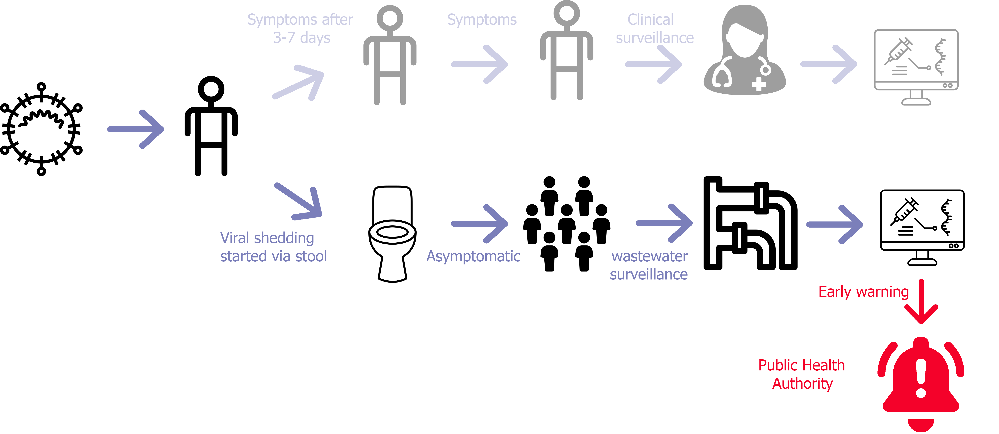
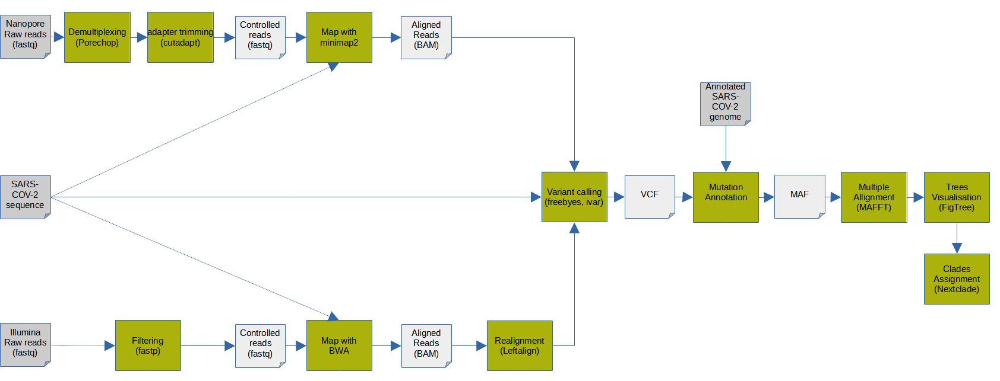
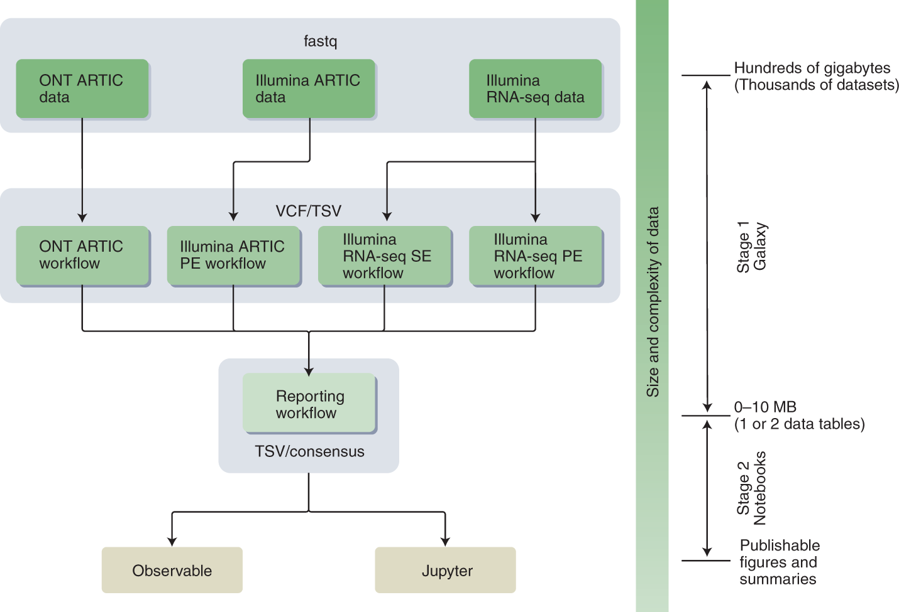
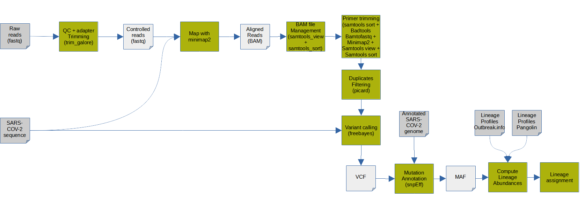
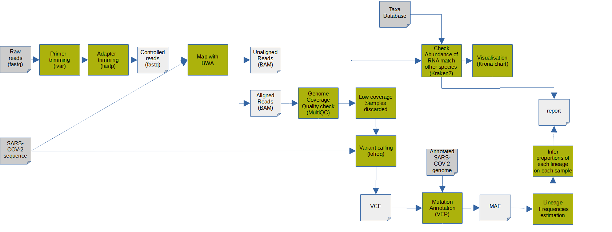

# Introduction

Millions of people have been affected by the COVID-19 pandemic after the first report of SARS-CoV-2 in Wuhan, China. During the COVID-19 pandemic, wastewater surveillance has received extensive public attention as passive monitoring system that complements clinical and genomic surveillance:

1. The wastewater methods allow the **detection of outbreaks before the first positive clinical** tests are reported.

   Based on the first cases of SARS-CoV-2 wastewater surveillance, it has been found () that virus RNA is detected in sewage even when COVID-19 prevalence is low, and that the correlation between concentration in sewage and reported COVID-19 prevalence indicates that sewage surveillance can be used as a sensitive tool to monitor viral circulation in the population.

2. Wastewater surveillance is **more economical** than clinical testing since it can screen large numbers of people with just a few samples and does not need clinician involvement.
3. Using the wastewater surveillance of SARS-CoV-2 method, data can be collected from people who do not have access to healthcare or in places, so-called "sequencing deserts", around the world where sequencing capacity is limited.

   Among such "sequencing deserts", new, potentially dangerous variants, like Omicron, are able to emerge and spread undetected. There is a risk that new variants or subvariants will emerge until representative samples are sufficiently sequenced. Wastewater surveillance is one of the opportunities for covering "sequencing deserts" for surveillance of variants of SARS-CoV-2. As a result, a very close to a real-time overview of disease prevalence could be provided since it was proved () successful enough in revealing infection dynamics earlier than clinical testing.

The wastewater surveillance methods are a good solution for enabling early, economical, and efficient detection so that public-health measures can be implemented as soon as they are necessary.



Various wastewater tracking projects have been then implemented in countries like [Estonia](https://www.terviseamet.ee/et/reoveeseire-kaardirakendus), [Greece](http://trams.chem.uoa.gr/covid-19/), and [Canada](https://cwn-rce.ca/covid-19-wastewater-coalition/covid-19-wastewater-coalition-maps/). [COVIDPoops19](https://www.arcgis.com/apps/dashboards/c778145ea5bb4daeb58d31afee389082), a dashboard developed by Colleen Naughton and colleagues at the University of California (UC), Merced, shows monitoring projects for SARS-CoV-2 have sprung up in at least 70 countries since then (). By October 2021, the European Union recommended that all member countries establish monitoring systems for SARS-CoV-2. 26 of 27 countries have adopted this recommendation. In the United States, the National Wastewater Surveillance System includes 400 sites in 19 states. In the U.S., on 2 March 2022, President Joe Biden's administration said the monitoring system would be part of efforts to detect new variants as the Centers for Disease Control and Prevention added a national dashboard of wastewater data.

## Methods to detect SARS-CoV-2 in wastewater samples

The tracking projects have been possible thanks to several methods and protocols, developed to detect SARS-CoV-2 in wastewater samples.

> <details-title>SARS-CoV-2 library preparation approaches and sequencing techniques</details-title>
>
> Library preparation | Shotgun metatranscriptomics | Amplicon based | Hybrid capture-enrichment | Direct RNA sequencing
> --- | --- | --- | --- | ---
> Target | SARS-Cov-2, host microbiota, host reponse to infection | SARS-Cov-2 | SARS-Cov-2 SARS-Cov-2, host transcriptome, epitranscriptomics
> Co-infection detection | Yes | No | No/Yes (depending on gene panel) | Yes
> Accuracy in SNV identification | High | High | Moderate | Moderate
> Sample type | Patient specimens, environmental samples | Patient speciments, environmental samples | Patient speciments | Viral cell cultures
> Cost | High | Low | Moderate | High
>
>
> Sequencing techniques | Nanopore | Illumina
> --- | --- | ---
> Accuracy | 92-97% | 99%
> Read length | Long | Short
> Time | Real time | 4-56h
> Cost | $7-100 | $5-150
{: .details}

**Two sequencing platforms (Illumina and Oxford Nanopore)** in combination with **2 established library preparation (ampliconic and metatranscriptomic)** strategies are predominantly used to generate SARS-CoV-2 sequence data:


## Bioinformatics pipelines for SARS-CoV-2 wastewater data

However, data alone do not equal knowledge: they need to be analyzed, using bioinformatics pipelines. Tools can differ from one pipeline to another. But the main steps, in general, are more or less the same:

1. **Pre-processing**, including
   1. **Quality control** of the sequencing data
   2. **Triming**: primer with ARTIC protocol, adapter with Illumina
   3. **Decontamination** to remove reads from the human genome
2. **Mapping** to SARS-CoV-2 reference sequence and **mapping processing** to clean mapping data
3. **Variant calling** SARS-CoV-2 variants
4. SARS-CoV-2 **lineage abundance computation**

![Here is simplified process of bioinformatics steps used to analyze sequenced data for sars-cov-2 surveillance. Tools can differ from one pipeline to another. But the main steps, in general, are more or less the same. Raw data are sequencing data. Then, primer trimming is a specific step for ampliconic datasets. The auxiliary file is used for this step - a BED file specifying the primers used during amplification. Variant calling should be run where variants from sequence data are identified. Variant calling step is followed by mutation annotation. The data is not changed; here, only format is changed to be more readable](./images/sars-surveillance-bioinf-last.png "Main steps to be done for bioinformatics of SARS-CoV-2 surveillance.")

Approaches specifically developed for wastewater are either individual tools that require data preprocessing and/or need to be plugged into pipelines before they can be used, or independent pipelines that do all the analysis from raw data to determining lineages and their abundances.

> <details-title>Bioinformatics methods to detect SARS-CoV-2 in wastewater samples</details-title>
>
> #### Individual tools
>
> Name | Goal | Input | Output | Available in Galaxy
> --- | --- | --- | --- | ---
> Freyja () | Recover relative lineage abundances from mixed SARS-CoV-2 samples from a sequencing dataset (BAM aligned to the Hu-1 reference) | Variant call and sequencing depth information | TSV file that includes the lineages present, their corresponding abundances, and summarization by constellation | Yes
> COJAC () | Analyzing co-occurrence of mutations on amplicons | BAM/CRAM/SAM and BED file describing the amplified regions | Total count of amplicons carrying the sites of interest, amplicons carrying mutations on all site of interest, amplicons where one mutation is missing, fraction (ratio of number of all amplicons carrying mutations on all sites of interest to total number of amplicons carrying cites of interest) | Yes
> LCS () | Lineage decomposition for SARS-CoV-2 pooled samples | Variant-groups definitions, raw-fastq files pooled samples, fasta file of the primers used | Lineage decomposition outputs for SARS-CoV-2 pooled samples, plots  | No
> Kallisto () | Quantifying abundances of transcripts from RNA-Seq data, or more generally of target sequences using high-throughput sequencing reads | FASTQ (single-end paired-end reads) | Abundance estimates, bootstrap estimates, and transcript length information length | Yes
> Alcov () | Abundance learning for SARS-CoV-2 variants. | BAM file of reads aligned to the SARS-CoV-2 reference genome | Number of reads with and without each mutation in each sample, heatmap showing the frequencies for all samples, mutations, read depth for each amplicon, plots of amplicon GC content against amplicon depth
> SAM refiner () | Gathering variant information from a SAM formatted files | SAM formatted files generated from sequencing mapping programs such as Bowtie2 or MiniMap2, FASTA formatted file for a reference sequence | Unique sequences, statistics about removed chimera, covariant deconvolution output | No
>
> #### Standalone pipelines
>
> Name | Goal | External tools used | Input | Output
> --- | --- | --- | --- | ---
>  | Estimating the relative proportions of SARS-CoV-2 strains from wastewater samples | Bowtie2 v2.4.5 | FASTA file; MSA FASTA of SARS-CoV-2 reference strains | Estimated proportion of candidate strains, barplot with only those strains with an estimated proportion larger than 1%
> [Gromstole](https://github.com/PoonLab/gromstole) | To estimate the relative frequencies of different SARS-CoV-2 lineages | Minimap2 v2.24, Cutadapt v4.0 | Paired-end reads in separate FASTQ/FASTA files, NC043312.fa as a reference genome | Counts of each mutation of the lineages, coverage at every position on the reference genome, estimate of the proportion (including 95% confidence interval);
> AG () | Analyzing the within-sample genetic diversity of SARS-CoV-2 in Wastewater samples | Trim Galore v0.6.7, Minimap2 v2.24, SAMtools v2.0.4, iVar v1.3.1, BEDTools v2.27, Picard v2.18, FreeBayes v1.1.0.46, SnpEff v4.3 | Paired-end .fastq files for each sample | Tabular files with scanned variants, common depth report
> Lineagespot () | Identify SARS-CoV-2 related mutations based on a single (or a list) of variant(s) file(s) (i.e., variant calling format). | Trim Galore v0.6.7, FastQC v0.73, Minimap2 v2.24, SAMtools v2, BEDTools v2, Picard v2.18, FreeBayes v1.1, SnpEff v4.3 | Raw fastq FASTQ files, anf for further analysis - VCF and file containing all lineage-assignment rules, as retrieved from the pangolin tool repository | VCF, MAF files, report about lineage abundances
> PiGx () | Analyzing data from sequenced wastewater samples and identifying given lineages of SARS-CoV-2 | iVar v1.3.1, Fastp v0.23.2, BWA v0.7.17.2, MultiQC v1.11, LoFreq v2.1.5, VEP, Kraken2 v2.1.1, Krona v2.7.1 | Raw reads and the additional information about used primers and adapters | VCF, visualization of the development of virus over time, variants report, taxonomic classification
> Cowwid () | Surveillance of SARS-CoV-2 genomic variants in wastewater | V-pipe v2.99.2, FastQC v0.73, PRINSEQ v0.20.4, VICUNA, BWA-MEM v0.7.17, ShoRAH, COJAC v0.2 | TSV table of the samples, YAML with definition of the variants, BED with amplicon positions for ARTIC, BED with amplicon description | YAML/CSV files with coocurrences, variant mutations table, plots to integrate to CoV-Spectrum
>  | Monitoring SARS-CoV-2 Circulation and Diversity through Community Wastewater Sequencing, the Netherlands and Belgium | Porechop v0.2.4, Cutadapt v4.0, UGENE, Fastp v0.23.2, BWA-MEM v0.7.17, FreeBayes v1.1, iVar v1.3.1 | Raw reads and the additional information about used primers and adapters | VCF, MAF files, Trees visualization (Fig tree)
>
>  workflow ")
>  workflow ")
>  workflow ")
> 
{: .details}

## Galaxy effort to surveillance data processing

In order to address global health emergencies in an accessible and transparent manner, there is a need for scientific computing infrastructure to help bridge these gaps. **Accessibility and transparency** in data analysis transparency are the primary focus of the Galaxy community.

Since the beginning of the pandemy, the Galaxy community put effort to offer a [complete solution to the SARS-CoV-2 data analytics challenge](https://galaxyproject.org/projects/covid19/) (). In particular, four workflows were developed aimed at detecting and interpreting sequence
variants in SARS-CoV-2 in clinical data:



> <details-title>Galaxy workflows for SARS-CoV-2 clinical data surveillance</details-title>
>
> 
> 
{: .details}

> <comment-title>Galaxy workflows for SARS-CoV-2 clinical data surveillance</comment-title>
>
>  To learn more about workflows for clinical data you can follow this [dedicated tutorial]().
{: .comment}

## Galaxy workflows for wastewater surveillance

These pipelines perform decent data preprocessing steps and have shown promising results on clinical data, making them worthy of being repurposed for
wastewater data. In addition, it is easier to adapt existing Galaxy workflows than integrating new standalone pipelines.

We then adapted the Galaxy workflows by combining them with wastewater tools. We selected **Freyja** () and **COJAC** () tools because:
1. Their use in various projects (such as wastewater monitoring of SARS-CoV-2 in the Center for Food Safety and Applied Nutrition in US, wastewater monitoring of SARS-CoV-2 variants in Switzerland and in England) has shown decent results
2. Their ability to be integrated into existing Galaxy pipelines
3. They target different user groups (e.g., politicians and researchers), which is interesting to cover

   Freyja's output is easy to interpret without some specific knowledge, while COJAC requires more knowledge to be used. First of all, it demands some knowledge in programming as the output of COJAC is quite raw so far and has to be processed for downstream analysis like plotting and integrating to remote platforms such as CoV-Spectrum. Second of all, the usage of COJAC requires some knowledge of virology. Despite this, COJAC provides more detailed information and is able to detect unknown variants.

**2 workflows** were then created for different types of input data:

- Paired-end data derived from **Illumina-based Metatranscriptomic** experiments
- Paired-end data generated with **Illumina-based Ampliconic (ARTIC)** protocols

Therefore we offer a tutorial with different versions
- for each workflow
- for each workflow, a short version consisting in running workflows and a long version (step-by-step)



> <agenda-title></agenda-title>
>
> In this tutorial, we will cover:
>
> 1. TOC
> {:toc}
>
{: .agenda}

# Prepare Galaxy and data

Any analysis should get its own Galaxy history. So let's start by creating a new one:

> <hands-on-title>Prepare the Galaxy history</hands-on-title>
>
> 1. Create a new history for this analysis
>
>    
>
> 2. Rename the history
>
>    
>
{: .hands_on}

Before we can begin any Galaxy analysis, we need to upload the input data: FASTQ files with the sequenced wastewater samples. We encourage you to use your own data here (with at least 2 samples).

<div class="Amplicon-Short Amplicon-Long" markdown="1">
If you do not have any datasets available, we provide an example dataset: [paired-end data generated synthetically with Illumina-based Ampliconic (ARTIC) protocols](https://github.com/suskraem/ww_benchmark).
</div>

<div class="Metatranscriptomic-Short Metatranscriptomic-Long" markdown="1">
If you do not have any datasets available, we provide an example dataset: paired-end Illumina-based metatranscriptomic extracted from 24-hour composite samples of municipal wastewater from around the San Francisco Bay Area, California, and enriched for respiratory viruses using the Illumina Respiratory Virus Panel ([PRJNA661613 on ENA](https://www.ebi.ac.uk/ena/browser/view/PRJNA661613)).
</div>

There are several possibilities to upload the data depending on how many datasets you have and what their origin is:

- Import datasets

  - from your local file system,
  - from a given URL or
  - from a shared data library on the Galaxy server you are working on

  and organize the imported data as a dataset collection.

  > <comment-title>Collections</comment-title>
  >
  > A dataset collection is a way to represent an arbitrarily large collection of samples as a singular entity within a user's workspace. For an in-depth introduction to the concept you can follow this [dedicated tutorial]().
  >
  {: .comment}

- Import from [NCBI's Sequence Read Archive (SRA) at NCBI](https://www.ncbi.nlm.nih.gov/sra) with the help of a dedicated tool, which will organize the data into collections for you.

   > <comment-title>Getting data from SRA</comment-title>
   >
   > [A dedicated tutorial is available to explain how to find and import SARS-CoV-2 data from SRA]().
   >
   {: .comment}

> <hands-on-title>Import datasets</hands-on-title>
>
> 1. Import the datasets
>
>    - Option 1 [](https://youtu.be/FFCDx1rMGAQ): Your own local data using **Upload Data** (recommended for 1-10 datasets).
>
>      
>
>    - Option 2 [](https://youtu.be/hC8KSuT_OP8): Your own local data using **FTP** (recommended for >10 datasets)
>
>      
>
>    - Option 3: From an external server via URL
>
>      
>
>      For our example datasets, the datasets are stored on [Zenodo]({{ page.zenodo_link }}) and can be retrieved using the following URLs:
>
>      <div class="Amplicon-Short Amplicon-Long" markdown="1">
>
>      ```
>      https://zenodo.org/record/7469383/files/sample1_R1.fastq.gz
>      https://zenodo.org/record/7469383/files/sample1_R2.fastq.gz
>      https://zenodo.org/record/7469383/files/sample2_R1.fastq.gz
>      https://zenodo.org/record/7469383/files/sample2_R2.fastq.gz
>      https://zenodo.org/record/7469383/files/sample3_R1.fastq.gz
>      https://zenodo.org/record/7469383/files/sample3_R2.fastq.gz
>      https://zenodo.org/record/7469383/files/sample4_R1.fastq.gz
>      https://zenodo.org/record/7469383/files/sample4_R2.fastq.gz
>      https://zenodo.org/record/7469383/files/sample5_R1.fastq.gz
>      https://zenodo.org/record/7469383/files/sample5_R2.fastq.gz
>      https://zenodo.org/record/7469383/files/sample6_R1.fastq.gz
>      https://zenodo.org/record/7469383/files/sample6_R2.fastq.gz
>      https://zenodo.org/record/7469383/files/sample7_R1.fastq.gz
>      https://zenodo.org/record/7469383/files/sample7_R2.fastq.gz
>      https://zenodo.org/record/7469383/files/sample8_R1.fastq.gz
>      https://zenodo.org/record/7469383/files/sample8_R2.fastq.gz
>      https://zenodo.org/record/7469383/files/sample9_R1.fastq.gz
>      https://zenodo.org/record/7469383/files/sample9_R2.fastq.gz
>      https://zenodo.org/record/7469383/files/sample10_R1.fastq.gz
>      https://zenodo.org/record/7469383/files/sample10_R2.fastq.gz
>      https://zenodo.org/record/7469383/files/sample11_R1.fastq.gz
>      https://zenodo.org/record/7469383/files/sample11_R2.fastq.gz
>      https://zenodo.org/record/7469383/files/sample12_R1.fastq.gz
>      https://zenodo.org/record/7469383/files/sample12_R2.fastq.gz
>      https://zenodo.org/record/7469383/files/sample13_R1.fastq.gz
>      https://zenodo.org/record/7469383/files/sample13_R2.fastq.gz
>      https://zenodo.org/record/7469383/files/sample14_R1.fastq.gz
>      https://zenodo.org/record/7469383/files/sample14_R2.fastq.gz
>      https://zenodo.org/record/7469383/files/sample15_R1.fastq.gz
>      https://zenodo.org/record/7469383/files/sample15_R2.fastq.gz
>      https://zenodo.org/record/7469383/files/sample16_R1.fastq.gz
>      https://zenodo.org/record/7469383/files/sample16_R2.fastq.gz
>      https://zenodo.org/record/7469383/files/sample17_R1.fastq.gz
>      https://zenodo.org/record/7469383/files/sample17_R2.fastq.gz
>      https://zenodo.org/record/7469383/files/sample18_R1.fastq.gz
>      https://zenodo.org/record/7469383/files/sample18_R2.fastq.gz
>      https://zenodo.org/record/7469383/files/sample19_R1.fastq.gz
>      https://zenodo.org/record/7469383/files/sample19_R2.fastq.gz
>      https://zenodo.org/record/7469383/files/sample20_R1.fastq.gz
>      https://zenodo.org/record/7469383/files/sample20_R2.fastq.gz
>      ```
>
>      </div>
>
>      <div class="Metatranscriptomic-Short Metatranscriptomic-Long" markdown="1">
>
>      ```
>      https://zenodo.org/record/7468942/files/SRR12596165_1.fastq.gz
>      https://zenodo.org/record/7468942/files/SRR12596165_2.fastq.gz
>      https://zenodo.org/record/7468942/files/SRR12596166_1.fastq.gz
>      https://zenodo.org/record/7468942/files/SRR12596166_2.fastq.gz
>      https://zenodo.org/record/7468942/files/SRR12596167_1.fastq.gz
>      https://zenodo.org/record/7468942/files/SRR12596167_2.fastq.gz
>      https://zenodo.org/record/7468942/files/SRR12596168_1.fastq.gz
>      https://zenodo.org/record/7468942/files/SRR12596168_2.fastq.gz
>      https://zenodo.org/record/7468942/files/SRR12596169_1.fastq.gz
>      https://zenodo.org/record/7468942/files/SRR12596169_2.fastq.gz
>      https://zenodo.org/record/7468942/files/SRR12596170_1.fastq.gz
>      https://zenodo.org/record/7468942/files/SRR12596170_2.fastq.gz
>      https://zenodo.org/record/7468942/files/SRR12596171_1.fastq.gz
>      https://zenodo.org/record/7468942/files/SRR12596171_2.fastq.gz
>      https://zenodo.org/record/7468942/files/SRR12596172_1.fastq.gz
>      https://zenodo.org/record/7468942/files/SRR12596172_2.fastq.gz
>      https://zenodo.org/record/7468942/files/SRR12596173_1.fastq.gz
>      https://zenodo.org/record/7468942/files/SRR12596173_2.fastq.gz
>      https://zenodo.org/record/7468942/files/SRR12596174_1.fastq.gz
>      https://zenodo.org/record/7468942/files/SRR12596174_2.fastq.gz
>      https://zenodo.org/record/7468942/files/SRR12596175_1.fastq.gz
>      https://zenodo.org/record/7468942/files/SRR12596175_2.fastq.gz
>      ```
>
>      </div>
>
> 2. Create a collection to organize the data
>
>    
>
>    > <comment-title></comment-title>
>    >
>    > For the example datasets, since the datasets carry `_R1` and `_R2` or `_1` and `_2` in their names, Galaxy may already have detected a possible pairing scheme for the data, in which case the datasets will appear in green in the lower half (the paired section) of the dialog. You could accept this default pairing, but as shown in the middle column of the paired section, this would include the `.fastqsanger` or `fastq` suffix in the pair names (even with `Remove file extensions?` checked Galaxy would only remove the last suffix, `.gz`, from the dataset names.
>    >
>    > To remove the extra suffix, you can click on all names in the middle column and remove the extra suffix
>    >
>    {: .comment}
>
{: .hands_on}

> <comment-title>Learning to build collections automatically</comment-title>
>
> It is possible to build collections from tabular data containing URLs, sample sheets, list of accessions or identifiers, etc., directly during upload of the data. [A dedicated tutorial is available to explain the different possibilities]().
>
{: .comment}

Besides the sequenced reads data, we need additional datasets for calling variants and annotating them:

- the SARS-CoV-2 reference sequence [NC_045512.2](https://www.ncbi.nlm.nih.gov/nuccore/NC_045512.2?report=fasta) to align and compare our sequencing data against

- a tabular dataset defining aliases for viral gene product names, which will let us translate NCBI RefSeq Protein identifiers (used by the SnpEff annotation tool) to the commonly used names of coronavirus proteins and cleavage products.

<div class="Amplicon-Short Amplicon-Long" markdown="1">

Another three datasets are needed only for the analysis of ampliconic, e.g. ARTIC-amplified, input data:

- a BED file specifying the primers used during amplification and their binding sites on the viral genome
- a custom tabular file describing the amplicon grouping of the primers
- BED file defining the amplicons that is used by **Cojac**

</div>


> <hands-on-title>Import auxiliary datasets</hands-on-title>
>
> 1. Import the auxiliary dataset(s)
>
>    
>
>    <div class="Amplicon-Short Amplicon-Long" markdown="1">
>
>    ```
>    https://zenodo.org/record/7469383/files/NC_045512.2_FASTA_sequence_of_SARS-CoV-2.fasta
>    https://zenodo.org/record/7469383/files/ARTIC_primer_BED.bed
>    https://zenodo.org/record/7469383/files/ARTIC_primers_to_amplicon_assignments.bed
>    https://zenodo.org/record/7469383/files/BED_defining_amplicons_for_COJAC.bed
>    ```
>
>    > <comment-title>Not using ARTIC v4.1 amplified sequencing data?</comment-title>
>    >
>    > The instructions here assume you will be analyzing the example samples
>    > suggested above, which have been amplified using version 4.1 of the ARTIC
>    > network's SARS-CoV-2 primer set. If you have decided to work through
>    > this tutorial using your own samples of interest, and if those samples
>    > have been amplified with a different primer set, you will have to upload
>    > your own datasets with primer and amplicon information at this point.
>    > If the primer set is from the ARTIC network, just not version 4.1, you
>    > should be able to obtain the primer BED file from
>    > [their SARS-CoV-2 github repo](https://github.com/artic-network/artic-ncov2019/tree/master/primer_schemes/nCoV-2019).
>    {: .comment}
>    </div>
>
>    <div class="Metatranscriptomic-Short Metatranscriptomic-Long" markdown="1">
>
>    ```
>    https://zenodo.org/record/7469383/files/NC_045512.2_FASTA_sequence_of_SARS-CoV-2.fasta
>    ```
>
>    </div>
>
> 2. Check and manually correct assigned datatypes
>    - `fasta` for `NC_045512.2_FASTA_sequence_of_SARS-CoV-2.fasta`
>
>    <div class="Amplicon-Short Amplicon-Long" markdown="1">
>    - `BED` for `ARTIC_primer_BED.bed`
>    - `BED` or `tabular` for `ARTIC_primers_to_amplicon_assignments.bed`
>    - `BED` for `BED_defining_amplicons_for_COJAC.bed`
>    </div>
>
>    > <comment-title></comment-title>
>    > If you have imported the auxiliary datasets via their Zenodo links, Galaxy
>    > will have tried to autodetect the format of each imported dataset, but
>    > will not always be right with its guess. It's your task now to check and
>    > possibly correct the format assignments for each of the datasets!
>    {: .comment}
>
>    
>
{: .hands_on}


# From FASTQ to SARS-CoV-2 lineages abundances

To identify the lineages and their aboundances, several steps have to be done to process data.

![Here is simplified process of bioinformatics steps used to analyze sequenced data for sars-cov-2 surveillance. Tools can differ from one pipeline to another. But the main steps, in general, are more or less the same. Raw data are sequencing data. Then, primer trimming is a specific step for ampliconic datasets. The auxiliary file is used for this step - a BED file specifying the primers used during amplification. Variant calling should be run where variants from sequence data are identified. Variant calling step is followed by mutation annotation. The data is not changed; here, only format is changed to be more readable](./images/sars-surveillance-bioinf-last.png "Main steps to be done for bioinformatics of SARS-CoV-2 surveillance.")

<div class="Amplicon-Short Metatranscriptomic-Short" markdown="1">

> <hands-on-title>From FASTQ to SARS-CoV-2 lineages abundances</hands-on-title>
>
> 1. **Get the workflow** for your data into Galaxy
>
>    - Option 1: Find workflows on the [WorkflowHub](https://workflowhub.eu) and run them directly on [usegalaxy.eu](https://usegalaxy.eu/)
>
>      - Open the [workflow page on the WorkflowHub](https://workflowhub.eu/workflows/){: .Amplicon-Short} [workflow page on the WorkflowHub](https://workflowhub.eu/workflows/){: .Metatranscriptomic-Short}
>
>      - Click on `Run on usegalaxy.eu` at the top right of the page
>
>        The browser will open a new tab with Galaxy's workflow invocation interface.
>
>    - Option 2: Import the workflow from the training material
>
>      - Copy the URL (e.g. via right-click) of [this workflow]({{ site.baseurl }}{{ page.dir }}workflows/amplicon.ga){: .Amplicon-Short} [this workflow]({{ site.baseurl }}{{ page.dir }}workflows/metatranscriptomics.ga){: .Metatranscriptomic-Short} or download it to your computer
>      - Import the workflow into Galaxy
>
>      
>
> 2. Run **SARS-CoV-2: lineages analysis on ...**  using the following parameters:
>
>    
>
>    -  *"1: Paired Collection"*: paired collection created for the input datasets
>    -  *"2: NC_045512.2 FASTA sequence of SARS-CoV-2"*: `NC_045512.2_FASTA_sequence_of_SARS-CoV-2.fasta`
>    <div class="Amplicon-Short" markdown="1">
>    -  *"3: ARTIC primer BED"*: `ARTIC_primer_BED.bed`
>    -  *"4: ARTIC primers to amplicon assignments"*: `ARTIC_primers_to_amplicon_assignments.bed`
>    -  *"5: BED defining amplicons for COJAC"*: `BED_defining_amplicons_for_COJAC.bed`
>    </div>
{: .hands_on}

</div>

## Preprocessing

To prepare the data, we first need to do:

1. **Quality control** of the sequencing data

   There is no perfect sequencing technology, and each instrument will generate different types and amounts of errors, such as incorrect nucleotide calls. Each sequencing platform has technical limitations that result in these incorrectly called bases. Thus, it is important to identify and exclude error types that may affect downstream analysis interpretation. As a result, **sequence quality control is an essential first step** in the analysis process.

   > <comment-title></comment-title>
   > For more information about quality control, please see our dedicated ["Quality control"]() Tutorial.
   {: .comment}

   Here we use **fastp** () which:

   1. Filter out bad reads (too low quality, too short, or too many N...)
   2. Cut low quality bases for per read in its 5' and 3' by evaluating the mean quality from a sliding window (like Trimmomatic but faster)
   3. Trim all reads in front and tail
   4. Cut adapters

      Adapter sequences can be automatically detected, which means you don't have to input the adapter sequences to trim them.

      With Illumina sequencing, we often get raw reads with adapters at 3' end. The adapters contain the sequencing primer binding sites, the index sequences, and the sites that allow library fragments to attach to the flow cell lawn. This might influence a downstream analysis, thus, adapter trimming is required.

   5. Correct mismatched base pairs in overlapped regions of paired end reads, if one base is with high quality while the other is with ultra-low quality

   **fastp** is run on each sample individually and the report are then aggregated using **MultiQC** ()

   <div class="Amplicon-Long Metatranscriptomic-Long" markdown="1">

   > <hands-on-title> Quality control </hands-on-title>
   >
   > 1.  with the following parameters:
   >    - *"Single-end or paired reads"*: `Paired Collection`
   >        -  *"Select paired collection(s)"*: Input dataset collection
   >    - In *"Output Options"*:
   >        - *"Output JSON report"*: `Yes`
   > 2.  with the following parameters:
   >    - In *"Results"*:
   >        -  *"Insert Results"*
   >            - *"Which tool was used generate logs?"*: `fastp`
   >              -  *"Select paired collection(s)"*: output collection of **fastp**
   {: .hands_on}

   </div>

   > <question-title></question-title>
   >
   > 1. Inspect the **fastp** HTML report for sample 1{: .Amplicon-Short} 1{: .Amplicon-Long} SRR12596165{: .Metatranscriptomic-Short} SRR12596165{: .Metatranscriptomic-Long}
   >
   >    1. How many reads are in the sample before filtering?
   >    2. Which percentage of reads passed filters?
   >    3. How many bases have been filtered out?
   >    4. What is the mean length before and after filtering?
   >    5. How many read pairs do contain adapters?
   >
   >    <div class="Amplicon-Long Amplicon-Short" markdown="1">
   >
   >    > <solution-title></solution-title>
   >    >
   >    > 1. 8,000 so 4,000 pairs
   >    > 2. 100% of reads
   >    > 3. Before filtering, there was 2,008,000 bases, and 1,800,478 after filering.
   >    > 4. 251bp before and 225bp after
   >    > 5. 2,000 adapter sequences on read1 and same on read 2, for 50% of the pairs
   >    >
   >    {: .solution}
   >
   >    </div>
   >
   >    <div class="Metatranscriptomic-Long Metatranscriptomic-Short" markdown="1">
   >
   >    > <solution-title></solution-title>
   >    >
   >    > 1. 939,218 reads
   >    > 2. 93.4% of reads
   >    > 3. Before filtering, there was 67,305,956 bases, and 62,656,345 after filering.
   >    > 4. 71bp
   >    > 5. More than 4,000
   >    >
   >    {: .solution}
   >
   >    </div>
   >
   > 2. Inspect the fastp section with all sample information in **MultiQC** HTML report
   >
   >    1. Which percentage of reads passed filters on all samples?
   >    2. How much read pairs do contain adapters?
   >    3. How is the sequence quality over reads on forward and reverse reads before filtering?
   >
   >    <div class="Amplicon-Long Amplicon-Short" markdown="1">
   >
   >    > <solution-title></solution-title>
   >    >
   >    > 1. 100% of reads for all samples
   >    > 2. Around 50% of the pairs contain adapters in all samples
   >    > 3. For forward reads (read 1), the sequence quality in all samples is quite good, dropping a bit at the end:
   >    >
   >    >    
   >    >
   >    >    For the reverse reads (read 2), there is more variability over the whole read length but looks globally better
   >    >
   >    >    
   >    {: .solution}
   >
   >    </div>
   >
   >    <div class="Metatranscriptomic-Long Metatranscriptomic-Short" markdown="1">
   >
   >    > <solution-title></solution-title>
   >    >
   >    > 1. Between 88% and 94%
   >    > 2. Between 0.4% and 2.7%
   >    > 3. For forward reads (read 1) and reverse reads (read 2), the quality increases after the 6bp (excepted behavior for RNA data sequenced with Illumina) and drop slightly at the end
   >    >
   >    >    
   >    >
   >    >    
   >    {: .solution}
   >
   >    </div>
   {: .question}

   <div class="Amplicon-Short" markdown="1">
   Another step, primer trimming, is a specific step for datasets generated with ARTIC protocol. The auxiliary file is used for this step - a BED file specifying the primers used during amplification and their binding sites on the viral genome. Primer trimmer uses primer positions supplied in a BED file to soft clip primer sequences from an aligned and sorted BAM file. More specifically, some primer trimmers, in order to do quality trimming, use a sliding window approach. The window slides from the 5' end to the 3' end and if at any point the average base quality in the window falls below the threshold, the remaining read is softly clipped. If after trimming, the length of the read is greater than the minimum length specified, the read is written to the new trimmed BAM file. It should be noted, for datasets that were not generated with primer-based protocol like ARTIC, this primer-trimming step is not applicable.
   </div>

2. **Decontamination** to remove reads from the human genome

   Sequences extracted from wastewater commonly contain human reads. These reads needs to be removed for legal and ethical reasons as well as to speed up downstream analysis. Here we use **ReadAndKeep** ().

   <div class="Amplicon-Long Metatranscriptomic-Long" markdown="1">

   > <hands-on-title> Task description </hands-on-title>
   >
   > 1.  with the following parameters:
   >    - *"Read type"*: `Paired collection`
   >        -  *"Reads"*: output of **fastp** 
   >    - *"Reference genome source"*: `History`
   >        -  *"Reference genome"*: `NC_045512.2_FASTA_sequence_of_SARS-CoV-2.fasta`, reference genome for SARS-CoV-2
   >
   {: .hands_on}

   </div>

## Diversity evaluation

In wastewater, we can find not only SARS-CoV-2 sequences but also sequences of the DNA of other organisms. We can evaluate the diversity of organism sequence using tools classifying reads to taxons by comparing them to reference databases.



To assign reads to taxons, we use **Kraken2**  with a database of viruses. If we would be more interested in bacteria or eukaryotes, we could use a different database.



<div class="Amplicon-Long Metatranscriptomic-Long" markdown="1">

> <hands-on-title> Task description </hands-on-title>
>
> 1.  with the following parameters:
>    - *"Single or paired reads"*: `Paired Collection`
>        -  *"Collection of paired reads"*: Output of **Read It and Keep** 
>    - In *"Create Report"*:
>        - *"Print a report with aggregrate counts/clade to file"*: `Yes`
>    - *"Select a Kraken2 database"*: `Prebuilt Refseq indexes: Viral (Version: 2022-06-07...)`
>
{: .hands_on}


> <question-title></question-title>
>
> Inspect the **Kraken2** report for sample 1
>
> 1. Which virus species have been identified?
>
> > <solution-title></solution-title>
> >
> > 1. Only SARS-CoV-2
> >
> {: .solution}
>
{: .question}

**Kraken2** can be visualized, after a convertion step, using **Krona**, a zoomable pie chart

> <hands-on-title> Diversity visualization </hands-on-title>
>
> 1.  with the following parameters:
>    -  *"Kraken report file"*: Report outputs of **Kraken2** 
>
> 2.  with the following parameters:
>    - *"What is the type of your input data"*: `Taxonomy`
>        -  *"Input file"*: Outputs of **Krakentools** 
>
{: .hands_on}

</div>

> <question-title></question-title>
>
> Inspect the **Krona** pie chart
>
> 1. Which virus have been identified for the 1st sample?
> 2. Are the results similar for the other samples?
>
> > <solution-title></solution-title>
> >
> > 1. Only SARS-CoV-2
> > 2. Yes
> >
> {: .solution}
>
{: .question}

## Mapping

To identify SARS-CoV-2 variants in the sample, we first map the reads to the reference SARS-CoV-2 sequence, named `NC_045512.2`and publicly available in NCBI database.

> <comment-title></comment-title>
> For more information about mapping, please see our dedicated ["Mapping"]() Tutorial.
{: .comment}

The mapping tool can differ from one pipeline to another, depending on read length, sequencing technology, and other factors. Here we use **bwa-mem** ()

<div class="Amplicon-Long Metatranscriptomic-Long" markdown="1">

> <hands-on-title> Mapping to reference genome </hands-on-title>
>
> 1.  with the following parameters:
>    - *"Will you select a reference genome from your history or use a built-in index?"*: `Use a genome from history and build index`
>        -  *"Use the following dataset as the reference sequence"*: `NC_045512.2_FASTA_sequence_of_SARS-CoV-2.fasta`, reference genome for SARS-CoV-2
>    - *"Single or Paired-end reads"*: `Paired Collection`
>        -  *"Select a paired collection"*: Output of **Read It and Keep** 
>
{: .hands_on}

</div>

### Mapping statistics

The output of **bwa-mem** is a BAM file: a compressed binary file storing the read sequences, whether they have been aligned to a reference sequence (e.g. a chromosome), and if so, the position on the reference sequence at which they have been aligned.

It can not be easily parsed. We can use a tool from **Samtools** suite to collects statistics from BAM files and then display them with **MulitQC**.

<div class="Amplicon-Long Metatranscriptomic-Long" markdown="1">

> <hands-on-title> Extraction of mapping statistics </hands-on-title>
>
> 1.  with the following parameters:
>    -  *"BAM file"*: Output of **Map with BWA-MEM** 
>    - *"Output"*: `One single summary file`
> 2.  with the following parameters:
>    - In *"Results"*:
>        -  *"Insert Results"*
>            - *"Which tool was used generate logs?"*: `Samtools`
>                - In *"Samtools output"*:
>                    -  *"Insert Samtools output"*
>                        - *"Type of Samtools output?"*: `stats`
>                            -  *"Samtools stats output"*: output of **Samtools stats** 
>
{: .hands_on}

</div>

> <question-title></question-title>
>
> Inspect the Samtools section with all sample information in **MultiQC** HTML report
>
> 1. How much reads have been mapped?
> 2. What is the error rate?
>
> > <solution-title></solution-title>
> >
> > 1. Almost 100% for all samples
> > 2. Below 0.8%
> >
> {: .solution}
>
{: .question}

### Mapping processing

Some mapping tools generate 2 BAM files: one with mapped reads and one with either all reads or just the unmapped ones. Here **bwa-mem** generates only one BAM file with all reads. So to get information about only the mapped reads with a good mapping quality, we need to filter the BAM file using **Samtools**.

<div class="Amplicon-Long Metatranscriptomic-Long" markdown="1">

> <hands-on-title> Filtering of mapping </hands-on-title>
>
> 1.  with the following parameters:
>    -  *"SAM/BAM/CRAM data set"*: Output of **Map with BWA-MEM** 
>    - *"What would you like to look at?"*: `A filtered/subsampled selection of reads`
>        - In *"Configure filters"*:
>            - *"Filter by quality"*: `20`
>        - *"What would you like to have reported?"*: `All reads retained after filtering and subsampling`
>            - *"Output format"*: `BAM (-b)`
>    - *"Reference data"*: `No, see help (-output-fmt-option no_ref)`
{: .hands_on}

</div>

Mapping results need afterward to be **processed**, steps that are not always included in pipelines

- **Removing duplicated reads**

   This step can be important for Illumina sequencing reads. During the sequencing process with Illumina sequencing technology, some duplicate reads/sequences can be produced, which can create bias in downstream analyses. It is, therefore, possible to remove duplicates or mark them without removing them. When removing duplicates, one should be certain that they are duplicates and not repeated regions. It can therefore be reasonable to keep duplicates marked rather than remove them, as this can be useful for downstream analysis.

   <div class="Amplicon-Long" markdown="1">
   Not needed for Amplicon data?
   </div>

   <div class="Metatranscriptomic-Short Metatranscriptomic-Long" markdown="1">

   We use here **MarkDuplicates** tool from the [Picard suite](http://broadinstitute.github.io/picard/).

   <div class="Metatranscriptomic-Long" markdown="1">

   > <hands-on-title>Mark duplicated reads</hands-on-title>
   >
   > 1.  with the following parameters:
   >    -  *"Select SAM/BAM dataset or dataset collection"*: output of **Samtools view** 
   >    - *"If true do not write duplicates to the output file instead of writing them with appropriate flags set"*: `Yes`
   >
   > 2.  with the following parameters:
   >    - In *"Results"*:
   >      - *"Which tool was used generate logs?"*: `Picard`
   >        - In *"Picard output"*:
   >          -  *"Insert Picard output"*
   >            - *"Type of Picard output?"*: `Markdups`
   >            -  *"Picard output"*: output of **MarkDuplicates** 
   {: .hands_on}

   </div>

   > <question-title></question-title>
   >
   > Inspect the Picard section with all sample information in **MultiQC** HTML report
   >
   > 1. How much reads are duplicated for SRR12596165
   > 2. What are the minimum and maximum percentage of duplication?
   >
   > > <solution-title></solution-title>
   > >
   > > 1. 40.8%
   > > 2. 1.3% for SRR12596171 and 51.1% for SRR12596173
   > >
   > {: .solution}
   >
   {: .question}

   </div>

- **Read realignment**

   To correct mapping errors, it is good after filtering and other steps to realign the reads using probabilistic approaches, e.g. the **Realign reads** from LoFreq ().

   <div class="Amplicon-Long Metatranscriptomic-Long" markdown="1">

   > <hands-on-title>Read realignment</hands-on-title>
   >
   > 1.  with the following parameters:
   >
   >    <div class="Amplicon-Long" markdown="1">
   >    -  *"Reads to realign"*: Output of **Samtools view** 
   >    </div>
   >    <div class="Metatranscriptomic-Long" markdown="1">
   >    -  *"Reads to realign"*: Output of **MarkDuplicates** 
   >    </div>
   >    - *"Choose the source for the reference genome"*: `History`
   >        -  *"Reference"*: `NC_045512.2_FASTA_sequence_of_SARS-CoV-2.fasta`, reference genome for SARS-CoV-2
   >
   {: .hands_on}

   <!-- How to evaluate the results?-->

   </div>

- **Indel quality insertion**

   Indels, i.e. short insertions or deletions, are not parsed when they overlap the beginning or end of alignment boundaries. Thezy can cuause potential ambiguity. Input insertions and deletions must be homogenized with left realignment in order to gain a more homogeneous distribution. Left realignment will place all indels in homopolymer and microsatellite repeats at the same position, provided that doing so does not introduce mismatches between the read and reference other than the indel (). Basically, this step, which is not present everywhere, is considered to correct mapping errors and prepare reads for further variant calling.

   Here we use a tool from LoFreq suite and Dindel () to insert indel qualities

   <div class="Amplicon-Long Metatranscriptomic-long" markdown="1">

   > <hands-on-title>Indel quality insertion</hands-on-title>
   >
   > 1.  with the following parameters:
   >    -  *"Reads"*: output of **Realign reads** 
   >    - *"Indel calculation approach"*: `Dindel`
   >        - *"Choose the source for the reference genome"*: `History`
   >            -  *"Reference"*: `NC_045512.2_FASTA_sequence_of_SARS-CoV-2.fasta`, reference genome for SARS-CoV-2
   >
   {: .hands_on}

   </div>

   <!-- How to evaluate the results?-->

<div class="Amplicon-Short Amplicon-Long" markdown="1">
With data generated using the ARTIC protocol, the ARTIC primer sequences need be trimmed. **ivar** () is used to identify amplicons affected by ARTIC primer-binding site mutations and excludes reads derived from such "tainted" amplicons for downstream analyses.

To be able to identify the primers, we need 2 files:
- A BED file with ARTIC primer positions
- A Table with ARTIC primers to amplicon assignments

<div class="Amplicon-long" markdown="1">

> <hands-on-title>ARTIC primer trimming</hands-on-title>
>
> 1.  with the following parameters:
>    -  *"Bam file"*: output of **Insert indel qualities** 
>    - *"Source of primer information"*: `History`
>        -  *"BED file with primer sequences and positions"*: ARTIC primer position BED file
>    - *"Filter reads based on amplicon info"*: `Yes, drop reads that extend beyond amplicon boundaries and use my amplicon info file`
>        -  *"amplicon_info"*: ARTIC primers to amplicon assignments
>    - *"Include reads not ending in any primer binding sites?"*: `Yes`
>    - *"Minimum length of read to retain after trimming"*: `1`
>    - *"Minimum quality threshold for sliding window to pass"*: `0`
>
{: .hands_on}

</div>

</div>

### Mapping quality evaluation

Finally, we evaluate the quality of the alignments on the reference genome, i.e. the coverage, in the BAM files using **QualiMap** ()

<div class="Amplicon-Long Metatranscriptomic-Long" markdown="1">

> <hands-on-title> Task description </hands-on-title>
>
> 1.  with the following parameters:
>
>    <div class="Amplicon-Long" markdown="1">
>    -  *"Mapped reads input dataset"*: output of **ivar trim** 
>    </div>
>
>    <div class="Metatranscriptomic-Long" markdown="1">
>    -  *"Mapped reads input dataset"*: output of **Insert indel qualities** 
>    </div>
>
>    - *"Reference genome regions to calculate mapping statistics for"*: `All (whole genome)`
>    - *"Skip duplicate reads"*: Nothing selected
>
> 2.  with the following parameters:
>    -  *"Input Collection"*: output of **Qualimap** 
>
> 3.  with the following parameters:
>    - In *"Results"*:
>      - *"Which tool was used generate logs?"*: `Qualimap (BamQC or RNASeq output)`
>        -  *"Output of Qualimap BamQC"*: output of **Flatten collection** 
{: .hands_on}

</div>

> <question-title></question-title>
>
> Inspect the Qualimap section with all sample information in **MultiQC** HTML report
>
> 1. What is the coverage?
> 2. What is the range for the mean coverage in all samples?
>
> > <solution-title></solution-title>
> >
> > 1. The coverage describes the number of sequencing reads that are uniquely mapped to a reference and "cover" a known part of the genome.
> > <div class="Amplicon-Long Amplicon-short" markdown="1">
> > 2. The mean coverage ranges from ...X to ..X, i.e. each region of genome being covered 1.6 times to 116 times.
> > </div>
> > <div class="Metatranscriptomic-Long Metatranscriptomic-short" markdown="1">
> > 2. The mean coverage ranges from 1.6X to 116X, i.e. each region of genome being covered 1.6 times to 116 times.
> > </div>
> >
> {: .solution}
>
{: .question}


## Variant calling

Now that mapping results have been clean, we want to identify the SARS-CoV-2 allelic variants (AVs), i.e. identify of positions where the sequenced sample is different from the reference sequence. We call sensitive AV across a wide range of allele frequences (AFs) using **Lofreq** ().

<div class="Amplicon-Long Metatranscriptomic-Long" markdown="1">

> <hands-on-title>Variant calling</hands-on-title>
>
> 1.  with the following parameters:
>
>    <div class="Amplicon-Long" markdown="1">
>    -  *"Input reads in BAM format"*: output of **ivar trim** 
>    </div>
>    <div class="Metatranscriptomic-Long" markdown="1">
>    -  *"Input reads in BAM format"*: output of **Insert indel qualities** 
>    </div>
>
>    - *"Choose the source for the reference genome"*: `History`
>        -  *"Reference"*: `NC_045512.2_FASTA_sequence_of_SARS-CoV-2.fasta`, reference genome for SARS-CoV-2
>    - *"Call variants across"*: `Whole reference`
>    - *"Types of variants to call"*: `SNVs and indels`
>    - *"Variant calling parameters"*: `Configure settings`
>        - In *"Coverage"*:
>            - *"Minimal coverage"*: `5`
>        - In *"Base-calling quality"*:
>            - *"Minimum baseQ"*: `30`
>            - *"Minimum baseQ for alternate bases"*: `30`
>        - In *"Mapping quality"*:
>            - *"Minimum mapping quality"*: `20`
>    - *"Variant filter parameters"*: `Custom filter settings/combinations`
>        - *"Significance threshold for calls"*: `0.0005`
>        - *"Apply default coverage and strand-bias filter?"*: `Yes`
>
>    <!-- Why these values and not the default ones -->
>
{: .hands_on}

</div>

**Lofreq** generates VCF files, i.e. tabular files containing:
1. meta-information lines,
2. a header line,
3. data lines each containing information about a position in the genome:
   1. `CHROM` - chromosome: An identifier from the reference genome or an angle-bracketed ID String  pointing to a contig in the assembly file
   2. `POS` - position: The reference position, with the 1st base having position 1
   3. `ID` - identifier: Semicolon-separated list of unique identifiers where available
   4. `REF` - reference base(s): Each base must be one of A,C,G,T,N (case insensitive)
   5. `ALT` - alternate base(s): Comma separated list of alternate non-reference alleles
   6. `QUAL` - quality: Phred-scaled quality score for the assertion made in ALT.
   7. `FILTER` - filter status:
      - PASS if this position has passed all filters
      - A semicolon-separated list of codes for filters that fail
   8. `INFO` - additional information

> <question-title></question-title>
>
> Inspect the collection of variants
>
> <div class="Amplicon-Short Amplicon-Long" markdown="1">
>
> 1. How many variants have been called for sample 1?
> 2. And for sample 10?
> 3. And for sample 21?
>
> > <solution-title></solution-title>
> >
> > 1. There are 89 lines in SRR12596165 dataset so 89 called variants
> > 2. 130 variants
> > 3. 96 variants
> >
> {: .solution}
>
> </div>
>
> <div class="Metatranscriptomic-Short Metatranscriptomic-Long" markdown="1">
>
> 1. How many variants have been called for SRR12596165?
> 2. And for SRR12596170?
> 3. And for SRR12596175?
>
> > <solution-title></solution-title>
> >
> > 1. There are 0 lines in SRR12596165 dataset so 0 called variant
> > 2. 15 variants
> > 3. 47 variants
> >
> {: .solution}
>
> </div>
>
{: .question}


<div class="Metatranscriptomic-Short Metatranscriptomic-Long" markdown="1">
<!-- Why not for amplicon data ?? -->

Once variants have been called, we need to eliminate false-positive calls. To do that, we use **Lofreq filter** from a list of variants in VCF format.

<div class="Metatranscriptomic-Long" markdown="1">

> <hands-on-title>Variant filtering</hands-on-title>
>
> 1.  with the following parameters:
>    -  *"List of variants to filter"*: output of **Call variants** 
>    - *"Types of variants to keep"*: `SNVs and Indels`
>      - In *"Coverage-based filter options"*:
>        - *"Minimum coverage"*: `0`
>    - *"Action to be taken for variants that do not pass the filters defined above"*: `Keep variants, but indicate failed filters in output FILTER column`
>
{: .hands_on}

</div>

> <question-title></question-title>
>
> 1. How many variants have been kept for SRR12596170? How many have been removed?
> 2. And for SRR12596175?
> 3. Are these results expected?
> 4. By inspecting the VCF file for SRR12596170, is there any variant annotated as failed?
>
> > <solution-title></solution-title>
> >
> > 1. There are 15 variants before filtering and 15 after. So no variants have been removed
> > 2. 47 variants before filtering, 47 after so none removed.
> > 3. The results are expected because we selected the option to `Keep variants, but indicate failed filters in output FILTER column`
> > 4. The 15 variants have `PASS` in the `FILTER` column
> >
> {: .solution}
>
{: .question}

In the VCF files, we do not have so much information about the variants. We use **SnpEff** () to annotate and predict the effects of genetic variants (such as amino acid changes), with a special edition of SnpEff tweaked for SARS-CoV-2 variant annotation.

<div class="Metatranscriptomic-Long" markdown="1">

> <hands-on-title>Variant annotation</hands-on-title>
>
> 1.  with the following parameters:
>    -  *"Sequence changes (SNPs, MNPs, InDels)"*: output of **Lofreq filter** 
>    - *"Select an annotated Coronavirus genome"*: `NC_045512.2`
>
{: .hands_on}

</div>

> <question-title></question-title>
>
> 1. Where can we find the information about the variant annotation for SRR12596170?
> 2. Looking at the HTML report for SRR12596170, what are the types of the 15?
> 3. Where are the variants located?
>
> > <solution-title></solution-title>
> >
> > 1. In the VCF file generated by SnpEff in the column `INFO`, there are more information, e.g. `ANN`
> > 2. 9 are SNP and 6 insertions
> > 3. Mostly in Exons.
> >
> {: .solution}
>
{: .question}

</div>

## SARS-CoV-2 lineage abundance computation

The next step is to evaluate from the variants the SARS-CoV-2 lineages and their abundance.

<div class="Amplicon-Short Amplicon-Long" markdown="1">
To do that, we use **Freyja**  and **COJAC** .
</div>

<div class="Metatranscriptomic-Short Metatranscriptomic-Long" markdown="1">
To do that, we use **Freyja** .
</div>

<div class="Amplicon-Long Metatranscriptomic-Long" markdown="1">

Before running **Freyja**, we need to compute the depth at each position or region, using **Samtools depth**

> <hands-on-title>Depth computation</hands-on-title>
>
> 1.  with the following parameters:
>
>    <div class="Amplicon-Long" markdown="1">
>    -  *"BAM file(s)"*: output of **ivar trim** 
>    </div>
>    <div class="Metatranscriptomic-Long" markdown="1">
>    -  *"BAM file(s)"*: output of **Insert indel qualities** 
>    </div>
>
{: .hands_on}

</div>

<!-- Generate only one file for all sample and not a collection. Expected?? -->

We can then run **Freyja** by first running **Freyja demix** which estimates lineage abundances in a potentially multi-lineage input sample.

<div class="Amplicon-Long Metatranscriptomic-Long" markdown="1">

> <hands-on-title>Lineage abundance estimation</hands-on-title>
>
> 1.  with the following parameters:
>
>    <div class="Amplicon-Long" markdown="1">
>    -  *"Dataset with input variant calls"*: `output of **Call variants** 
>    </div>
>    <div class="Metatranscriptomic-Long" markdown="1">
>    -  *"Dataset with input variant calls"*: output of **Lofreq filter** 
>    </div>
>
>    - *"Set sample name"*: `Autodetect sample name`
>    -  *"Sequencing depth file"*: output of **Samtools depth** 
>    - *"Source of UShER barcodes data"*: `Use data shipped with the tool (can be outdated)`
>
{: .hands_on}

</div>

The output of **Freyja demix** is a tabular 5 lines:
1. `summarized`: sum of all lineage abundances in a particular WHO designation (i.e. B.1.617.2 and AY.6 abundances are summed in the above example), otherwise they are grouped into "Other".
2. `lineages`: lists of the identified lineages in descending order
3. `abundances`: corresponding abundances estimates
4. `resid`: the residual of the weighted least absolute devation problem used to estimate lineage abundances
5. `coverage`: 10x coverage estimate (percent of sites with 10 or greater reads- 10 is the default but can be modfied in the options)

> <question-title></question-title>
>
> <div class="Amplicon-Short Amplicon-Long" markdown="1">
>
> 1. Which lineages have been identified for sample 1?
> 2. And for sample 10?
> 3. And for sample 21?
>
> > <solution-title></solution-title>
> >
> > 1. There are 89 lines in SRR12596165 dataset so 89 called variants
> > 2. 84% Omicron, 9% Delta: BA.1.18 BA.1.15.1 BA.1.10 BA.1.1.13 BA.1.16 AY.4.9 AY.9 B.20 B.27 B AY.4 AY.9.2 BA.1.1.9 BA.1.1.15 BA.1.1.10 miscDeltaBA1Post4k BA.1.1.1
> > 3. 90% Omicron: BA.1.10 BA.1.18 BA.1.1 BA.1.15.1 BA.1.1.13 BA.1.19 BA.1.3 B.20 B.27 B BA.1.16 BA.1 BA.1.1.1 BA.1.14 BA.1.12 B.1.1.33 B.1.1.378 B.1.1 B.1.78 B.1
> >
> {: .solution}
>
> </div>
>
> <div class="Metatranscriptomic-Short Metatranscriptomic-Long" markdown="1">
>
> 1. Which lineages have been identified for SRR12596165?
> 2. And for SRR12596170?
> 3. And for SRR12596175?
>
> > <solution-title></solution-title>
> >
> > 1. Failing
> > 2. Others: B.1.370 B.1.301 B.1.533 B.1.111 B.1.479 B.1.201 B.1 B.1.215 B.1.378 B.1.199 B.10 B.47 B.23 B.26 B.1.14 B.20 B
> > 3. Others: B.1.509 B.1.2 B.1.111 B.1.479 B.1.382 B.10 B.47 B.23 B.26 B.1.14 B.20 B
> >
> {: .solution}
>
> </div>
>
{: .question}

The demix outputs are not easy to inspect one by one. We use another tool from **Freyja** to aggregate and visualize the results.

<div class="Amplicon-Long Metatranscriptomic-Long" markdown="1">

> <hands-on-title>Lineage visualization</hands-on-title>
> 1.  with the following parameters:
>    - *"Aggregate demixed data or provide aggregated data file?"*: `aggregate demixed data`
>        -  *"Lineages abundances summary file(s)"*: output of **Freyja: Demix** 
>    - *"Report(s) to generate"*: `non-interactive plot`
>        - *"Provide a sample metadata file for plotting data over time?"*: `No`
>
{: .hands_on}

</div>

> <question-title></question-title>
>
> 1. Question1?
> 2. Question2?
>
> > <solution-title></solution-title>
> >
> > 1. Answer for question1
> > 2. Answer for question2
> >
> {: .solution}
>
{: .question}

<div class="Amplicon-Long Amplicon-Short" markdown="1">

**COJAC** can also be used on variants from amplicon data:
1. Scanning the alignment files for mutation co-occurrences using **mutbamscan**
2. Combining files from all samples in one table
3. Export coocurrence mutations as a table using **tabmut**

<div class="Amplicon-Long" markdown="1">

> <hands-on-title> Task description </hands-on-title>
>
> 1.  with the following parameters:
>    - *"Source of YAML files with definition of the variant of concerns"*: `Definitions shipped with the tool (can be outdated)`
>    -  *"BED file defining the amplicons"*: `BED defining amplicons for COJAC`
>    -  *"Alignment BAM/CRAM/SAM file"*: Mutation coocurrence output of **ivar trim** 
>    - *"Source of amplicons YAML file"*: `Build from BED + set of YAMLs for variants of concern`
>    - *"Output files"*: `YAML`
>
> 2.  with the following parameters:
>    -  *"Collection of files to collapse into single dataset"*: output of **Cojac: mutbamscan** 
>    - *"Prepend File name"*: `Yes`
>
> 3.  with the following parameters:
>    -  *"Results generated by mutbamscan"*: output of **Collapse Collection** 
>    - *"Output table orientation"*: `Column-oriented table (default)`
>
{: .hands_on}

</div>

> <question-title></question-title>
>
> 1. Which lineages have been identified for sample 1?
> 2. And for sample 10?
> 3. And for sample 21?
>
> > <solution-title></solution-title>
> >
> > 1. Answer for question1
> > 2. Answer for question2
> >
> {: .solution}
>
{: .question}


</div>


# Results interpretation

Once the jobs of previous workflows are done, we can look at the results.

**Freyja** produces the following reports:

1. **Aggregated data**: This table provides a aggregated information about lineages abundances for all samples. Each line in the table represents one sample.

   Column | Field | Meaning
   --- | --- | ---
   1 | `Sample` | sample name
   2 | `summarized` | denotes a sum of all lineage abundances in a particular WHO designation (i.e. B.1.617.2 and AY.6 abundances are summed in the above example), otherwise they are grouped into "Other"
   3 | `lineages` | lists the identified lineages in descending order
   4 | `abundances` | contains the corresponding abundances estimates
   5 | `resid` | corresponds to the residual of the weighted least absolute devation problem used to estimate lineage abundances
   6 | `coverage` | provides the 10x coverage estimate (percent of sites with 10 or greater reads

   > <question-title></question-title>
   >
   > 1. How many lineages were identified in sample SRR12596165 in metatranscriptomic-illumina dataset provided for this tutorial?
   > 2. Which proportion of B.1.533 lineage was identified in sample SRR12596170?
   >
   > > <solution-title></solution-title>
   > >
   > > 1. In the second line of the table we see 7 lineages listed in column "lineages": B.10 B.47 B.23 B.26 B.1.14 B.20 B
   > >
   > > 2. In the 9th line of the table that corresponds to SRR12596170 sample, B.1.533 lineage is in the first position in the column "lineages". Then we look at the next column "abundances" and see in the first position is the proportion of B.1.533 which is 0.15773800.
   > >
   > {: .solution}
   {: .question}

2. **Lineages abundances plot**: This plot provides a fractional abundance estimate for all aggregated samples. Each bar in the plot represents one sample. Different colors represent different lineages.

   > <question-title></question-title>
   >
   > 1. Which WHO designated variant is prevalent in sample1 from ampliconic-illumina dataset provided for this tutorial?
   > 1. What other lineages are present in this sample?
   >
   > > <solution-title></solution-title>
   > >
   > > 1. Omicron
   > >
   > > 2. Delta and Other
   > >
   > {: .solution}
   {: .question}

<div class="Amplicon-Short" markdown="1">

**COJAC** produces the following report

1. **Mutation cooccurrence**: This table provides a aggregated information about lineages abundances and mutations for all samples grouped by amplicons. Each line in the table represents one sample.

   Column | Field | Meaning
   --- | --- | ---
   1 | `Sample` | sample name
   2 | `count` | total count of amplicons carrying the sites of interest
   3 | `mut_all` | amplicons carrying mutations on all site of interest (e.g.: variant mutations observed on all sites)
   4 | `mut_oneless` | amplicons where one mutation is missing (e.g.: only 2 out of 3 sites carried the variant mutation, 1 sites carries wild-type)
   5 | `frac` | fraction (mut_all/count) or empty if no counts
   6 | `cooc` | number of considered site (e.g.: 2 sites of interests) or empty if no counts

   > <question-title></question-title>
   >
   > 1. Which fraction of BA.1 lineage is identified on amplicon A72 in sample1 from ampliconic-illumina dataset provided for this tutorial?
   > 2. How many amplicons carrying mutations on all site of interest are identified in sample 3?
   >
   > > <solution-title></solution-title>
   > >
   > > 1. 0.8181818182
   > >
   > > 2. 3
   > >
   > {: .solution}
   {: .question}

</div>

# Conclusion


In this tutorial, we used Galaxy workflows for the detection and interpretation of lineages abundances in SARS-CoV-2 wastewater samples.

The workflows can be freely used and immediately accessed from the three global Galaxy instances. Each is capable of supporting thousands of users running hundreds of thousands of analyses per month.

It is also possible to automate the workflow runs using the command line as explained in [a dedicated tutorial]().
