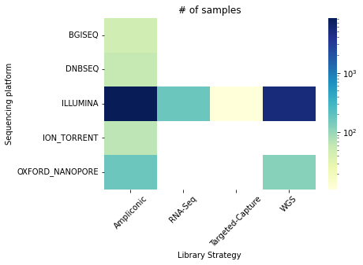

# Introduction

Millions of people have been affected by the COVID-19 pandemic after the first report of SARS-CoV-2 in Wuhan, China. During the COVID-19 pandemic, wastewater surveillance has received extensive public attention as passive monitoring system that complements clinical and genomic surveillance:

1. The wastewater methods allow the **detection of outbreaks before the first positive clinical** tests are reported.

   Based on the first cases of SARS-CoV-2 wastewater surveillance, it has been found () that virus RNA is detected in sewage even when COVID-19 prevalence is low, and that the correlation between concentration in sewage and reported COVID-19 prevalence indicates that sewage surveillance can be used as a sensitive tool to monitor viral circulation in the population.

2. Wastewater surveillance is **more economical** than clinical testing since it can screen large numbers of people with just a few samples and does not need clinician involvement.
3. Using the wastewater surveillance of SARS-CoV-2 method, data can be collected from people who do not have access to healthcare or in places, so-called "sequencing deserts", around the world where sequencing capacity is limited.

   Among such "sequencing deserts", new, potentially dangerous variants, like Omicron, are able to emerge and spread undetected. There is a risk that new variants or subvariants will emerge until representative samples are sufficiently sequenced. Wastewater surveillance is one of the opportunities for covering "sequencing deserts" for surveillance of variants of SARS-CoV-2. As a result, a very close to a real-time overview of disease prevalence could be provided since it was proved () successful enough in revealing infection dynamics earlier than clinical testing.

The wastewater surveillance methods are a good solution for enabling early, economical, and efficient detection so that public-health measures can be implemented as soon as they are necessary.


Various wastewater tracking projects have been then implemented in countries like [Estonia](https://www.terviseamet.ee/et/reoveeseire-kaardirakendus), [Greece](http://trams.chem.uoa.gr/covid-19/), and [Canada](https://cwn-rce.ca/covid-19-wastewater-coalition/covid-19-wastewater-coalition-maps/). [COVIDPoops19](https://www.arcgis.com/apps/dashboards/c778145ea5bb4daeb58d31afee389082), a dashboard developed by Colleen Naughton and colleagues at the University of California (UC), Merced, shows monitoring projects for SARS-CoV-2 have sprung up in at least 70 countries since then (). By October 2021, the European Union recommended that all member countries establish monitoring systems for SARS-CoV-2. 26 of 27 countries have adopted this recommendation. In the United States, the National Wastewater Surveillance System includes 400 sites in 19 states. In the U.S., on 2 March 2022, President Joe Biden's administration said the monitoring system would be part of efforts to detect new variants as the Centers for Disease Control and Prevention added a national dashboard of wastewater data.

## Methods to detect SARS-CoV-2 in wastewater samples

The tracking projects have been possible thanks to several methods and protocols, developed to detect SARS-CoV-2 in wastewater samples.

> <details-title>SARS-CoV-2 library preparation approaches and sequencing techniques</details-title>
>
> Library preparation | Shotgun metatranscriptomics | Amplicon based | Hybrid capture-enrichment | Direct RNA sequencing
> --- | --- | --- | --- | ---
> Target | SARS-Cov-2, host microbiota, host reponse to infection | SARS-Cov-2 | SARS-Cov-2 SARS-Cov-2, host transcriptome, epitranscriptomics
> Co-infection detection | Yes | No | No/Yes (depending on gene panel) | Yes
> Accuracy in SNV identification | High | High | Moderate | Moderate
> Sample type | Patient specimens, environmental samples | Patient speciments, environmental samples | Patient speciments | Viral cell cultures
> Cost | High | Low | Moderate | High
>
>
> Sequencing techniques | Nanopore | Illumina
> --- | --- | ---
> Accuracy | 92-97% | 99%
> Read length | Long | Short
> Time | Real time | 4-56h
> Cost | $7-100 | $5-150
{: .details}

**Two sequencing platforms (Illumina and Oxford Nanopore)** in combination with **2 established library preparation (ampliconic and metatranscriptomic)** strategies are predominantly used to generate SARS-CoV-2 sequence data:



## Bioinformatics pipelines for SARS-CoV-2 wastewater data

However, data alone do not equal knowledge: they need to be analyzed, using bioinformatics pipelines. Tools can differ from one pipeline to another. But the main steps, in general, are more or less the same:

1. **Pre-processing**, including
   1. **Quality control** of the sequencing data
   2. **Triming**: primer with ARTIC protocol, adapter with Illumina
   3. **Decontamination** to remove reads from the human genome
2. **Mapping** to SARS-CoV-2 reference sequence and **mapping processing** to clean mapping data
3. **Variant calling** SARS-CoV-2 variants
4. SARS-CoV-2 **lineage abundance computation**

![Here is simplified process of bioinformatics steps used to analyze sequenced data for sars-cov-2 surveillance. Tools can differ from one pipeline to another. But the main steps, in general, are more or less the same. Raw data are sequencing data. Then, primer trimming is a specific step for ampliconic datasets. The auxiliary file is used for this step - a BED file specifying the primers used during amplification. Variant calling should be run where variants from sequence data are identified. Variant calling step is followed by mutation annotation. The data is not changed; here, only format is changed to be more readable](./images/sars-surveillance-bioinf-last.png "Main steps to be done for bioinformatics of SARS-CoV-2 surveillance.")

Approaches specifically developed for wastewater are either individual tools that require data preprocessing and/or need to be plugged into pipelines before they can be used, or independent pipelines that do all the analysis from raw data to determining lineages and their abundances.

> <details-title>Bioinformatics methods to detect SARS-CoV-2 in wastewater samples</details-title>
>
> #### Individual tools
>
> Name | Goal | Input | Output | Available in Galaxy
> --- | --- | --- | --- | ---
> Freyja () | Recover relative lineage abundances from mixed SARS-CoV-2 samples from a sequencing dataset (BAM aligned to the Hu-1 reference) | Variant call and sequencing depth information | TSV file that includes the lineages present, their corresponding abundances, and summarization by constellation | Yes
> COJAC () | Analyzing co-occurrence of mutations on amplicons | BAM/CRAM/SAM and BED file describing the amplified regions | Total count of amplicons carrying the sites of interest, amplicons carrying mutations on all site of interest, amplicons where one mutation is missing, fraction (ratio of number of all amplicons carrying mutations on all sites of interest to total number of amplicons carrying cites of interest) | Yes
> LCS () | Lineage decomposition for SARS-CoV-2 pooled samples | Variant-groups definitions, raw-fastq files pooled samples, fasta file of the primers used | Lineage decomposition outputs for SARS-CoV-2 pooled samples, plots  | No
> Kallisto () | Quantifying abundances of transcripts from RNA-Seq data, or more generally of target sequences using high-throughput sequencing reads | FASTQ (single-end paired-end reads) | Abundance estimates, bootstrap estimates, and transcript length information length | Yes
> Alcov () | Abundance learning for SARS-CoV-2 variants. | BAM file of reads aligned to the SARS-CoV-2 reference genome | Number of reads with and without each mutation in each sample, heatmap showing the frequencies for all samples, mutations, read depth for each amplicon, plots of amplicon GC content against amplicon depth
> SAM refiner () | Gathering variant information from a SAM formatted files | SAM formatted files generated from sequencing mapping programs such as Bowtie2 or MiniMap2, FASTA formatted file for a reference sequence | Unique sequences, statistics about removed chimera, covariant deconvolution output | No
>
> #### Standalone pipelines
>
> Name | Goal | External tools used | Input | Output
> --- | --- | --- | --- | ---
>  | Estimating the relative proportions of SARS-CoV-2 strains from wastewater samples | Bowtie2 v2.4.5 | FASTA file; MSA FASTA of SARS-CoV-2 reference strains | Estimated proportion of candidate strains, barplot with only those strains with an estimated proportion larger than 1%
> [Gromstole](https://github.com/PoonLab/gromstole) | To estimate the relative frequencies of different SARS-CoV-2 lineages | Minimap2 v2.24, Cutadapt v4.0 | Paired-end reads in separate FASTQ/FASTA files, NC043312.fa as a reference genome | Counts of each mutation of the lineages, coverage at every position on the reference genome, estimate of the proportion (including 95% confidence interval);
> AG () | Analyzing the within-sample genetic diversity of SARS-CoV-2 in Wastewater samples | Trim Galore v0.6.7, Minimap2 v2.24, SAMtools v2.0.4, iVar v1.3.1, BEDTools v2.27, Picard v2.18, FreeBayes v1.1.0.46, SnpEff v4.3 | Paired-end .fastq files for each sample | Tabular files with scanned variants, common depth report
> Lineagespot () | Identify SARS-CoV-2 related mutations based on a single (or a list) of variant(s) file(s) (i.e., variant calling format). | Trim Galore v0.6.7, FastQC v0.73, Minimap2 v2.24, SAMtools v2, BEDTools v2, Picard v2.18, FreeBayes v1.1, SnpEff v4.3 | Raw fastq FASTQ files, anf for further analysis - VCF and file containing all lineage-assignment rules, as retrieved from the pangolin tool repository | VCF, MAF files, report about lineage abundances
> PiGx () | Analyzing data from sequenced wastewater samples and identifying given lineages of SARS-CoV-2 | iVar v1.3.1, Fastp v0.23.2, BWA v0.7.17.2, MultiQC v1.11, LoFreq v2.1.5, VEP, Kraken2 v2.1.1, Krona v2.7.1 | Raw reads and the additional information about used primers and adapters | VCF, visualization of the development of virus over time, variants report, taxonomic classification
> Cowwid () | Surveillance of SARS-CoV-2 genomic variants in wastewater | V-pipe v2.99.2, FastQC v0.73, PRINSEQ v0.20.4, VICUNA, BWA-MEM v0.7.17, ShoRAH, COJAC v0.2 | TSV table of the samples, YAML with definition of the variants, BED with amplicon positions for ARTIC, BED with amplicon description | YAML/CSV files with coocurrences, variant mutations table, plots to integrate to CoV-Spectrum
>  | Monitoring SARS-CoV-2 Circulation and Diversity through Community Wastewater Sequencing, the Netherlands and Belgium | Porechop v0.2.4, Cutadapt v4.0, UGENE, Fastp v0.23.2, BWA-MEM v0.7.17, FreeBayes v1.1, iVar v1.3.1 | Raw reads and the additional information about used primers and adapters | VCF, MAF files, Trees visualization (Fig tree)
>
>  workflow ")
>  workflow ")
>  workflow ")
> 
{: .details}

## Galaxy effort to surveillance data processing

In order to address global health emergencies in an accessible and transparent manner, there is a need for scientific computing infrastructure to help bridge these gaps. **Accessibility and transparency** in data analysis transparency are the primary focus of the Galaxy community.

Since the beginning of the pandemy, the Galaxy community put effort to offer a [complete solution to the SARS-CoV-2 data analytics challenge](https://galaxyproject.org/projects/covid19/) (). In particular, four workflows were developed aimed at detecting and interpreting sequence
variants in SARS-CoV-2 in clinical data:


> <details-title>Galaxy workflows for SARS-CoV-2 clinical data surveillance</details-title>
>
> 
> 
{: .details}

> <comment-title>Galaxy workflows for SARS-CoV-2 clinical data surveillance</comment-title>
>
>  To learn more about workflows for clinical data you can follow this [dedicated tutorial]().
{: .comment}

## Galaxy workflows for wastewater surveillance

These pipelines perform decent data preprocessing steps and have shown promising results on clinical data, making them worthy of being repurposed for
wastewater data. In addition, it is easier to adapt existing Galaxy workflows than integrating new standalone pipelines.

We then adapted the Galaxy workflows by combining them with wastewater tools. We selected **Freyja** () and **COJAC** () tools because:
1. Their use in various projects (such as wastewater monitoring of SARS-CoV-2 in the Center for Food Safety and Applied Nutrition in US, wastewater monitoring of SARS-CoV-2 variants in Switzerland and in England) has shown decent results
2. Their ability to be integrated into existing Galaxy pipelines
3. They target different user groups (e.g., politicians and researchers), which is interesting to cover

   Freyja's output is easy to interpret without some specific knowledge, while COJAC requires more knowledge to be used. First of all, it demands some knowledge in programming as the output of COJAC is quite raw so far and has to be processed for downstream analysis like plotting and integrating to remote platforms such as CoV-Spectrum. Second of all, the usage of COJAC requires some knowledge of virology. Despite this, COJAC provides more detailed information and is able to detect unknown variants.

**2 workflows** were then created for different types of input data:

- Paired-end data derived from **Illumina-based Metatranscriptomic** experiments
- Paired-end data generated with **Illumina-based Ampliconic (ARTIC)** protocols

Therefore we offer a tutorial with different versions
- for each workflow
- for each workflow, a short version consisting in running workflows and a long version (step-by-step)



> <agenda-title></agenda-title>
>
> In this tutorial, we will cover:
>
> 1. TOC
> {:toc}
>
{: .agenda}

# Prepare Galaxy and data

Any analysis should get its own Galaxy history. So let's start by creating a new one:

> <hands-on-title>Prepare the Galaxy history</hands-on-title>
>
> 1. Create a new history for this analysis
>
>    
>
> 2. Rename the history
>
>    
>
{: .hands_on}

Before we can begin any Galaxy analysis, we need to upload the input data: FASTQ files with the sequenced wastewater samples. We encourage you to use your own data here (with at least 2 samples).

<div class="Amplicon-Short Amplicon-Long" markdown="1">
If you do not have any datasets available, we provide an example dataset: [paired-end data generated synthetically with Illumina-based Ampliconic (ARTIC) protocols](https://github.com/suskraem/ww_benchmark).
</div>

<div class="Metatranscriptomic-Short Metatranscriptomic-Long" markdown="1">
If you do not have any datasets available, we provide an example dataset: paired-end Illumina-based metatranscriptomic extracted from 24-hour composite samples of municipal wastewater from around the San Francisco Bay Area, California, and enriched for respiratory viruses using the Illumina Respiratory Virus Panel ([PRJNA661613 on ENA](https://www.ebi.ac.uk/ena/browser/view/PRJNA661613)).
</div>

There are several possibilities to upload the data depending on how many datasets you have and what their origin is:

- Import datasets

  - from your local file system,
  - from a given URL or
  - from a shared data library on the Galaxy server you are working on

  and organize the imported data as a dataset collection.

  > <comment-title>Collections</comment-title>
  >
  > A dataset collection is a way to represent an arbitrarily large collection of samples as a singular entity within a user's workspace. For an in-depth introduction to the concept you can follow this [dedicated tutorial]().
  >
  {: .comment}

- Import from [NCBI's Sequence Read Archive (SRA) at NCBI](https://www.ncbi.nlm.nih.gov/sra) with the help of a dedicated tool, which will organize the data into collections for you.

   > <comment-title>Getting data from SRA</comment-title>
   >
   > [A dedicated tutorial is available to explain how to find and import SARS-CoV-2 data from SRA]().
   >
   {: .comment}

> <hands-on-title>Import datasets</hands-on-title>
>
> 1. Import the datasets
>
>    - Option 1 [](https://youtu.be/FFCDx1rMGAQ): Your own local data using **Upload Data** (recommended for 1-10 datasets).
>
>      
>
>    - Option 2 [](https://youtu.be/hC8KSuT_OP8): Your own local data using **FTP** (recommended for >10 datasets)
>
>      
>
>    - Option 3: From an external server via URL
>
>      
>
>      For our example datasets, the datasets are stored on [Zenodo]({{ page.zenodo_link }}) and can be retrieved using the following URLs:
>
>      <div class="Amplicon-Short Amplicon-Long" markdown="1">
>
>      ```
>      https://zenodo.org/record/7469383/files/sample1_R1.fastq.gz
>      https://zenodo.org/record/7469383/files/sample1_R2.fastq.gz
>      https://zenodo.org/record/7469383/files/sample2_R1.fastq.gz
>      https://zenodo.org/record/7469383/files/sample2_R2.fastq.gz
>      https://zenodo.org/record/7469383/files/sample3_R1.fastq.gz
>      https://zenodo.org/record/7469383/files/sample3_R2.fastq.gz
>      https://zenodo.org/record/7469383/files/sample4_R1.fastq.gz
>      https://zenodo.org/record/7469383/files/sample4_R2.fastq.gz
>      https://zenodo.org/record/7469383/files/sample5_R1.fastq.gz
>      https://zenodo.org/record/7469383/files/sample5_R2.fastq.gz
>      https://zenodo.org/record/7469383/files/sample6_R1.fastq.gz
>      https://zenodo.org/record/7469383/files/sample6_R2.fastq.gz
>      https://zenodo.org/record/7469383/files/sample7_R1.fastq.gz
>      https://zenodo.org/record/7469383/files/sample7_R2.fastq.gz
>      https://zenodo.org/record/7469383/files/sample8_R1.fastq.gz
>      https://zenodo.org/record/7469383/files/sample8_R2.fastq.gz
>      https://zenodo.org/record/7469383/files/sample9_R1.fastq.gz
>      https://zenodo.org/record/7469383/files/sample9_R2.fastq.gz
>      https://zenodo.org/record/7469383/files/sample10_R1.fastq.gz
>      https://zenodo.org/record/7469383/files/sample10_R2.fastq.gz
>      https://zenodo.org/record/7469383/files/sample11_R1.fastq.gz
>      https://zenodo.org/record/7469383/files/sample11_R2.fastq.gz
>      https://zenodo.org/record/7469383/files/sample12_R1.fastq.gz
>      https://zenodo.org/record/7469383/files/sample12_R2.fastq.gz
>      https://zenodo.org/record/7469383/files/sample13_R1.fastq.gz
>      https://zenodo.org/record/7469383/files/sample13_R2.fastq.gz
>      https://zenodo.org/record/7469383/files/sample14_R1.fastq.gz
>      https://zenodo.org/record/7469383/files/sample14_R2.fastq.gz
>      https://zenodo.org/record/7469383/files/sample15_R1.fastq.gz
>      https://zenodo.org/record/7469383/files/sample15_R2.fastq.gz
>      https://zenodo.org/record/7469383/files/sample16_R1.fastq.gz
>      https://zenodo.org/record/7469383/files/sample16_R2.fastq.gz
>      https://zenodo.org/record/7469383/files/sample17_R1.fastq.gz
>      https://zenodo.org/record/7469383/files/sample17_R2.fastq.gz
>      https://zenodo.org/record/7469383/files/sample18_R1.fastq.gz
>      https://zenodo.org/record/7469383/files/sample18_R2.fastq.gz
>      https://zenodo.org/record/7469383/files/sample19_R1.fastq.gz
>      https://zenodo.org/record/7469383/files/sample19_R2.fastq.gz
>      https://zenodo.org/record/7469383/files/sample20_R1.fastq.gz
>      https://zenodo.org/record/7469383/files/sample20_R2.fastq.gz
>      ```
>
>      </div>
>
>      <div class="Metatranscriptomic-Short Metatranscriptomic-Long" markdown="1">
>
>      ```
>      https://zenodo.org/record/7468942/files/SRR12596165_1.fastq.gz
>      https://zenodo.org/record/7468942/files/SRR12596165_2.fastq.gz
>      https://zenodo.org/record/7468942/files/SRR12596166_1.fastq.gz
>      https://zenodo.org/record/7468942/files/SRR12596166_2.fastq.gz
>      https://zenodo.org/record/7468942/files/SRR12596167_1.fastq.gz
>      https://zenodo.org/record/7468942/files/SRR12596167_2.fastq.gz
>      https://zenodo.org/record/7468942/files/SRR12596168_1.fastq.gz
>      https://zenodo.org/record/7468942/files/SRR12596168_2.fastq.gz
>      https://zenodo.org/record/7468942/files/SRR12596169_1.fastq.gz
>      https://zenodo.org/record/7468942/files/SRR12596169_2.fastq.gz
>      https://zenodo.org/record/7468942/files/SRR12596170_1.fastq.gz
>      https://zenodo.org/record/7468942/files/SRR12596170_2.fastq.gz
>      https://zenodo.org/record/7468942/files/SRR12596171_1.fastq.gz
>      https://zenodo.org/record/7468942/files/SRR12596171_2.fastq.gz
>      https://zenodo.org/record/7468942/files/SRR12596172_1.fastq.gz
>      https://zenodo.org/record/7468942/files/SRR12596172_2.fastq.gz
>      https://zenodo.org/record/7468942/files/SRR12596173_1.fastq.gz
>      https://zenodo.org/record/7468942/files/SRR12596173_2.fastq.gz
>      https://zenodo.org/record/7468942/files/SRR12596174_1.fastq.gz
>      https://zenodo.org/record/7468942/files/SRR12596174_2.fastq.gz
>      https://zenodo.org/record/7468942/files/SRR12596175_1.fastq.gz
>      https://zenodo.org/record/7468942/files/SRR12596175_2.fastq.gz
>      ```
>
>      </div>
>
> 2. Create a collection to organize the data
>
>    
>
>    > <comment-title></comment-title>
>    >
>    > For the example datasets, since the datasets carry `_R1` and `_R2` or `_1` and `_2` in their names, Galaxy may already have detected a possible pairing scheme for the data, in which case the datasets will appear in green in the lower half (the paired section) of the dialog. You could accept this default pairing, but as shown in the middle column of the paired section, this would include the `.fastqsanger` or `fastq` suffix in the pair names (even with `Remove file extensions?` checked Galaxy would only remove the last suffix, `.gz`, from the dataset names.
>    >
>    > To remove the extra suffix, you can click on all names in the middle column and remove the extra suffix
>    >
>    {: .comment}
>
{: .hands_on}

> <comment-title>Learning to build collections automatically</comment-title>
>
> It is possible to build collections from tabular data containing URLs, sample sheets, list of accessions or identifiers, etc., directly during upload of the data. [A dedicated tutorial is available to explain the different possibilities]().
>
{: .comment}

Besides the sequenced reads data, we need additional datasets for calling variants and annotating them:

- the SARS-CoV-2 reference sequence [NC_045512.2](https://www.ncbi.nlm.nih.gov/nuccore/NC_045512.2?report=fasta) to align and compare our sequencing data against

- a tabular dataset defining aliases for viral gene product names, which will let us translate NCBI RefSeq Protein identifiers (used by the SnpEff annotation tool) to the commonly used names of coronavirus proteins and cleavage products.

<div class="Amplicon-Short Amplicon-Long" markdown="1">

Another three datasets are needed only for the analysis of ampliconic, e.g. ARTIC-amplified, input data:

- a BED file specifying the primers used during amplification and their binding sites on the viral genome
- a custom tabular file describing the amplicon grouping of the primers
- BED file defining the amplicons that is used by **Cojac**

</div>


> <hands-on-title>Import auxiliary datasets</hands-on-title>
>
> 1. Import the auxiliary dataset(s)
>
>    
>
>    <div class="Amplicon-Short Amplicon-Long" markdown="1">
>
>    ```
>    https://zenodo.org/record/7469383/files/NC_045512.2_FASTA_sequence_of_SARS-CoV-2.fasta
>    https://zenodo.org/record/7469383/files/ARTIC_primer_BED.bed
>    https://zenodo.org/record/7469383/files/ARTIC_primers_to_amplicon_assignments.bed
>    https://zenodo.org/record/7469383/files/BED_defining_amplicons_for_COJAC.bed
>    ```
>
>    > <comment-title>Not using ARTIC v4.1 amplified sequencing data?</comment-title>
>    >
>    > The instructions here assume you will be analyzing the example samples
>    > suggested above, which have been amplified using version 4.1 of the ARTIC
>    > network's SARS-CoV-2 primer set. If you have decided to work through
>    > this tutorial using your own samples of interest, and if those samples
>    > have been amplified with a different primer set, you will have to upload
>    > your own datasets with primer and amplicon information at this point.
>    > If the primer set is from the ARTIC network, just not version 4.1, you
>    > should be able to obtain the primer BED file from
>    > [their SARS-CoV-2 github repo](https://github.com/artic-network/artic-ncov2019/tree/master/primer_schemes/nCoV-2019).
>    {: .comment}
>    </div>
>
>    <div class="Metatranscriptomic-Short Metatranscriptomic-Long" markdown="1">
>
>    ```
>    https://zenodo.org/record/7469383/files/NC_045512.2_FASTA_sequence_of_SARS-CoV-2.fasta
>    ```
>
>    </div>
>
> 2. Check and manually correct assigned datatypes
>    - `fasta` for `NC_045512.2_FASTA_sequence_of_SARS-CoV-2.fasta`
>
>    <div class="Amplicon-Short Amplicon-Long" markdown="1">
>    - `BED` for `ARTIC_primer_BED.bed`
>    - `BED` or `tabular` for `ARTIC_primers_to_amplicon_assignments.bed`
>    - `BED` for `BED_defining_amplicons_for_COJAC.bed`
>    </div>
>
>    > <comment-title></comment-title>
>    > If you have imported the auxiliary datasets via their Zenodo links, Galaxy
>    > will have tried to autodetect the format of each imported dataset, but
>    > will not always be right with its guess. It's your task now to check and
>    > possibly correct the format assignments for each of the datasets!
>    {: .comment}
>
>    
>
{: .hands_on}

<div class="Amplicon-Short Metatranscriptomic-Short" markdown="1">

# From FASTQ to SARS-CoV-2 lineages abundances

To identify the lineages and their aboundances, several steps have to be done to process data.

![Here is simplified process of bioinformatics steps used to analyze sequenced data for sars-cov-2 surveillance. Tools can differ from one pipeline to another. But the main steps, in general, are more or less the same. Raw data are sequencing data. Then, primer trimming is a specific step for ampliconic datasets. The auxiliary file is used for this step - a BED file specifying the primers used during amplification. Variant calling should be run where variants from sequence data are identified. Variant calling step is followed by mutation annotation. The data is not changed; here, only format is changed to be more readable](./images/sars-surveillance-bioinf-last.png "Main steps to be done for bioinformatics of SARS-CoV-2 surveillance.")

1. **Pre-processing**, including

   1. **Quality control** of the sequencing data

      There is no perfect sequencing technology, and each instrument will generate different types and amounts of errors, such as incorrect nucleotide calls. Each sequencing platform has technical limitations that result in these incorrectly called bases. Thus, it is important to identify and exclude error types that may affect downstream analysis interpretation. As a result, sequence quality control is an essential first step in the analysis process.

   2. **Triming**: quality and primer with ARTIC protocol and/or adapter with Illumina

      Following this, the reads are trimmed based on a quality threshold.

      <div class="Amplicon-Short" markdown="1">
      Another step, primer trimming, is a specific step for datasets generated with ARTIC protocol. The auxiliary file is used for this step - a BED file specifying the primers used during amplification and their binding sites on the viral genome. Primer trimmer uses primer positions supplied in a BED file to soft clip primer sequences from an aligned and sorted BAM file. More specifically, some primer trimmers, in order to do quality trimming, use a sliding window approach. The window slides from the 5’ end to the 3' end and if at any point the average base quality in the window falls below the threshold, the remaining read is softly clipped. If after trimming, the length of the read is greater than the minimum length specified, the read is written to the new trimmed BAM file. It should be noted, for datasets that were not generated with primer-based protocol like ARTIC, this primer-trimming step is not applicable.
      </div>

      Moreover, adapter trimming step is processed. For instance, upon Illumina sequencing we receive raw reads with adapters at 3' end. The adapters contain the sequencing primer binding sites, the index sequences, and the sites that allow library fragments to attach to the flow cell lawn. This might influence a downstream analysis, thus, adapter trimming is required.

   3. **Decontamination** to remove reads from the human genome

      A decontamination step can then be included to remove reads from the human genome, since viral sequence data from clinical samples commonly contain human contamination. Prior to sharing, it needs to be removed for legal and ethical reasons as well as to speed up downstream analysis. Here we use **ReadAndKeep** .

4. **Mapping** to SARS-CoV-2 reference sequence

   The crucial step is mapping with reference SARS-CoV-2 sequence NC_045512.2 that is publicly available in NCBI database. A mapping tool of choice can differ from one pipeline to another, depending on read length, sequencing technology, and other factors. Here we use **bwa-mem** ()

   Mapping results need afterward to be **processed**, steps that are not always included in pipelines

   - **Removing duplicated reads**

      This step can be important for Illumina sequencing reads. During the sequencing process with Illumina sequencing technology, some duplicate reads/sequences can be produced, which can create bias in downstream analyses. It is, therefore, possible to remove duplicates or mark them without removing them. When removing duplicates, one should be certain that they are duplicates and not repeated regions. It can therefore be reasonable to keep duplicates marked rather than remove them, as this can be useful for downstream analysis.

   - **Read realignment**

      Realigned reads can be taken and checked for the quality of alignment using bioinformatics tools (e.g., Qualimap ()). Based on the features of the mapped reads, it analyzes SAM/BAM alignment data and provides a global picture of the data that can help detect biases in sequencing and/or mapping of the data and ease decision-making for further analysis.

   - **Indel quality insertion**

      This step, which is not present everywhere, is helpful due to potential ambiguity, while indels are not parsed when they overlap the beginning or end of alignment boundaries. Input insertions and deletions must be homogenized with left realignment in order to gain a more homogeneous distribution. Left realignment will place all indels in homopolymer and microsatellite repeats at the same position, provided that doing so does not introduce mismatches between the read and reference other than the indel (). Basically, this step is considered to correct mapping errors and prepare reads for further variant calling.

6. **Variant calling** to identify SARS-CoV-2 variants

   Sensitive allelic-variant (AV) calling across a wide range of AFs with **lofreq** ()

   <div class="Amplicon-Short" markdown="1">
   adds extra logic operators for trimming ARTIC primer sequences off reads with the **ivar** package. In addition, this workflow uses **ivar** also to identify amplicons affected by ARTIC primer-binding site mutations and excludes reads derived from such "tainted" amplicons when calculating alternative allele frequences (AFs) of other AVs.
   </div>

7. SARS-CoV-2 **lineage abundance computation**

   <div class="Amplicon-Short" markdown="1">
   **Freyja**  and **COJAC**  in two different branches.
   </div>

   <div class="Metatranscriptomic-Short" markdown="1">
   **Freyja** 
   </div>

> <hands-on-title>From FASTQ to SARS-CoV-2 lineages abundances</hands-on-title>
>
> 1. **Get the workflow** for your data into Galaxy
>
>    - Option 1: Find workflows on the [WorkflowHub](https://workflowhub.eu) and run them directly on [usegalaxy.eu](https://usegalaxy.eu/)
>
>      - Open the [workflow page on the WorkflowHub](https://workflowhub.eu/workflows/){: .Amplicon-Short} [workflow page on the WorkflowHub](https://workflowhub.eu/workflows/){: .Metatranscriptomic-Short}
>
>      - Click on `Run on usegalaxy.eu` at the top right of the page
>
>        The browser will open a new tab with Galaxy's workflow invocation interface.
>
>    - Option 2: Import the workflow via its github link
>
>      - Open the [GitHub repository with your workflow](https://github.com/iwc-workflows/sars-cov-2-wastewater-pe-illumina-artic-variant-analysis){: .Amplicon-Short} [GitHub repository with your workflow](https://github.com/iwc-workflows/sars-cov-2-wastewater-pe-illumina-metatranscriptomic-variant-analysis){: .Metatranscriptomic-Short}
>      - Open the `.ga` file
>      - Click on `Raw` at the top right of the file view
>      - Save the file or Copy the URL of the file
>      - Import the workflow to Galaxy
>
>      
>
> 2. Run **SARS-CoV-2: lineages analysis on ...**  using the following parameters:
>
>    
>
>    - *"Send results to a new history"*: `No`
>    -  *"1: Paired Collection"*: paired collection created for the input datasets
>    -  *"2: NC_045512.2 FASTA sequence of SARS-CoV-2"*: `NC_045512.2_FASTA_sequence_of_SARS-CoV-2.fasta`
>    <div class="Amplicon-Short" markdown="1">
>    -  *"1: Paired Collection"*: paired collection created for the input datasets
>    -  *"2: NC_045512.2 FASTA sequence of SARS-CoV-2"*: `NC_045512.2_FASTA_sequence_of_SARS-CoV-2.fasta`
>    -  *"3: ARTIC primer BED"*: `ARTIC_primer_BED.bed`
>    -  *"4: ARTIC primers to amplicon assignments"*: `ARTIC_primers_to_amplicon_assignments.bed`
>    -  *"5: BED defining amplicons for COJAC"*: `BED_defining_amplicons_for_COJAC.bed`
>    </div>
{: .hands_on}

# Results interpretation

Once the jobs of previous workflows are done, we can look at the results.

**Freyja** produces the following reports:

1. **Aggregated data**: This table provides a aggregated information about lineages abundances for all samples. Each line in the table represents one sample.

   Column | Field | Meaning
   --- | --- | ---
   1 | `Sample` | sample name
   2 | `summarized` | denotes a sum of all lineage abundances in a particular WHO designation (i.e. B.1.617.2 and AY.6 abundances are summed in the above example), otherwise they are grouped into "Other"
   3 | `lineages` | lists the identified lineages in descending order
   4 | `abundances` | contains the corresponding abundances estimates
   5 | `resid` | corresponds to the residual of the weighted least absolute devation problem used to estimate lineage abundances
   6 | `coverage` | provides the 10x coverage estimate (percent of sites with 10 or greater reads

   > <question-title></question-title>
   >
   > 1. How many lineages were identified in sample SRR12596165 in metatranscriptomic-illumina dataset provided for this tutorial?
   > 2. Which proportion of B.1.533 lineage was identified in sample SRR12596170?
   >
   > > <solution-title></solution-title>
   > >
   > > 1. In the second line of the table we see 7 lineages listed in column "lineages": B.10 B.47 B.23 B.26 B.1.14 B.20 B
   > >
   > > 2. In the 9th line of the table that corresponds to SRR12596170 sample, B.1.533 lineage is in the first position in the column "lineages". Then we look at the next column "abundances" and see in the first position is the proportion of B.1.533 which is 0.15773800.
   > >
   > {: .solution}
   {: .question}

2. **Lineages abundances plot**: This plot provides a fractional abundance estimate for all aggregated samples. Each bar in the plot represents one sample. Different colors represent different lineages.

   > <question-title></question-title>
   >
   > 1. Which WHO designated variant is prevalent in sample1 from ampliconic-illumina dataset provided for this tutorial?
   > 1. What other lineages are present in this sample?
   >
   > > <solution-title></solution-title>
   > >
   > > 1. Omicron
   > >
   > > 2. Delta and Other
   > >
   > {: .solution}
   {: .question}

<div class="Amplicon-Short" markdown="1">

**COJAC** produces the following report

1. **Mutation cooccurrence**: This table provides a aggregated information about lineages abundances and mutations for all samples grouped by amplicons. Each line in the table represents one sample.

   Column | Field | Meaning
   --- | --- | ---
   1 | `Sample` | sample name
   2 | `count` | total count of amplicons carrying the sites of interest
   3 | `mut_all` | amplicons carrying mutations on all site of interest (e.g.: variant mutations observed on all sites)
   4 | `mut_oneless` | amplicons where one mutation is missing (e.g.: only 2 out of 3 sites carried the variant mutation, 1 sites carries wild-type)
   5 | `frac` | fraction (mut_all/count) or empty if no counts
   6 | `cooc` | number of considered site (e.g.: 2 sites of interests) or empty if no counts

   > <question-title></question-title>
   >
   > 1. Which fraction of BA.1 lineage is identified on amplicon A72 in sample1 from ampliconic-illumina dataset provided for this tutorial?
   > 2. How many amplicons carrying mutations on all site of interest are identified in sample 3?
   >
   > > <solution-title></solution-title>
   > >
   > > 1. 0.8181818182
   > >
   > > 2. 3
   > >
   > {: .solution}
   {: .question}

</div>

<div class="Amplicon-Long Metatranscriptomic-Long" markdown="1">

# Preprocessing

## Quality control of the sequencing data

## Triming

## Decontamination to remove reads from the human genome

# Mapping

## Mapping processing

# Variant calling

# SARS-CoV-2 lineage abundance computation

<div>

# Conclusion


In this tutorial, we used Galaxy workflows for the detection and interpretation of lineages abundances in SARS-CoV-2 wastewater samples.

The workflows can be freely used and immediately accessed from the three global Galaxy instances. Each is capable of supporting thousands of users running hundreds of thousands of analyses per month.

It is also possible to automate the workflow runs using the command line as explained in [a dedicated tutorial]().
