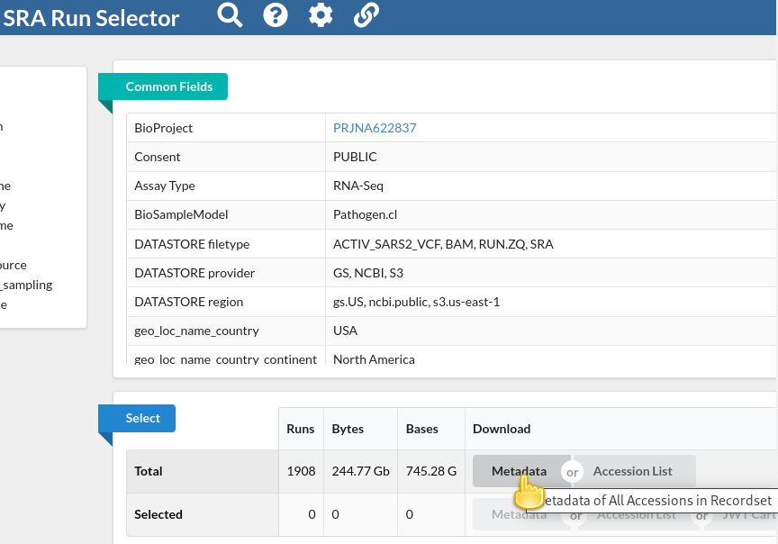

The aim of this tutorial is twofold:

1. It introduces general patterns of working with high-throughput sequencing data in Galaxy,
2. It uses SARS-CoV-2 sequencing data analysis as a concrete example of how to identify genomic mutations from high-throughput sequencing data for a batch of viral isolates in Galaxy.

> <agenda-title></agenda-title>
>
> In this tutorial, we will cover:
>
> 1. TOC
> {:toc}
>
{: .agenda}

# Prepare analysis history and data

## Create a new history for this analysis

Any analysis should get its own Galaxy history. So let's start by creating a new one:

> <hands-on-title>Prepare the Galaxy history</hands-on-title>
>
> 1. Create a new history for this analysis
>
>    
>
> 2. Rename the history
>
>    
>
{: .hands_on}

## Find, obtain and filter information about public sequencing data

First we need to find some good, public datasets to play with.

The [Sequence Read Archive (SRA)](https://www.ncbi.nlm.nih.gov/sra) is the primary archive of *unassembled reads*  operated by the [US National Institutes of Health (NIH)](https://www.ncbi.nlm.nih.gov/).
SRA is a great place to get the sequencing data that underlie publications and studies.
The study we are interested in for this tutorial is one on sequencing of SARS-CoV-2 viral isolates that were obtained in the Boston area in the first months of the COVID-19 pandemic ().

So lets see how we can find its raw data in the SRA, and how we can get some of that data into Galaxy to analyze it. The Acknowledgments section of the publication mentions that raw reads from the study have been deposited in the SRA under **BioProject PRJNA622837** so that's going to be our starting point.

> <hands-on-title>Find the example data in the SRA</hands-on-title>
>
> 1. Go to NCBI's SRA page by pointing your browser to [https://www.ncbi.nlm.nih.gov/sra](https://www.ncbi.nlm.nih.gov/sra)
> 2. In the search box enter `PRJNA622837[BioProject]`
>
>    Oh, this finds a *lot* of samples (more than 22,000 at the time of writing)!
>    This is because the BioProject ID we used is that of "SARS-CoV-2 Patient Sequencing from the Broad Institute", which has seen many more sample submissions since the published study.
>    Let's refine our search a bit.
> 3. Replace your previous search with `PRJNA622837[BioProject] AND RNA-Seq[Strategy]`
>
>    This returns only those samples from the BioProject, for which the sequencing strategy was RNA-Seq.
>
>    At the time of writing, 1908 hits are retained with this query, which is still more than the approximately 800 genomes mentioned in the publication, but we got a lot closer.
>
>    > <comment-title></comment-title>
>    >
>    > The vast majority of what has been excluded by adding `RNA-Seq[Strategy]` to the query are datasets for which the "Strategy" is *AMPLICON*.
>    > For these datasets, the viral RNA (or more precisely, the cDNA obtained from it) got amplified with a tiled-amplicon protocol.
>    > While tiled-amplicon sequencing has emerged as a standard way of sequencing SARS-CoV-2 samples over the course of the pandemic, the corresponding protocols/primer schemes were simply not available during the early phase of the pandemic.
>    >
>    {: .comment}
> 4. Instead of inspecting all 1908 hits one-by-one through the web interface, lets download the metadata for all samples in a single file
>    1. Click on the  **Send to:** dropdown at the top of the search results list
>    2. Under **Choose Destination**, select `Run Selector`
>    3. Click **Go**
>
>    
>
>    You will be taken to the SRA Run Selector page, where you can browse all of the metadata of all search hits rather conveniently.
>
> 5. In the **Select** table, click `Metadata` in the **Download** column
>
>    
>
>    This will download the metadata for all retrieved sequencing runs as a comma-separated text file.
>
{: .hands_on}

Now that we have downloaded this file we can go to a Galaxy instance and start processing it.

> <comment-title></comment-title>
>
> Note that the file we just downloaded is **not** sequencing data itself. Rather, it is *metadata* describing the data itself. We will use a few Galaxy tools to filter this list down to just a few accessions that will be used in the remainder of this tutorial.
>
{: .comment}

> <hands-on-title>Upload the metadata file into Galaxy</hands-on-title>
>
> 1. In Galaxy, click  **Upload Data**
>
>    
> 2. In the Upload dialog box, click **Choose local files**
>
>    
> 3. Find and select the downloaded metadata file on your computer
> 4. Click **Start**
> 5. Close the dialog by pressing **Close**
> 6. Once the dataset has finished uploading to your history, you can  inspect its contents.
>
>    You will see that this file contains the same metadata that you could preview on the SRA Run Selector page.
>
{: .hands_on}

In Galaxy, it is rather easy to perform further filtering of the metadata records. For example, the publication mentions that the authors analyzed samples collected between 4 March and 9 May 2020.

If you inspect the metadata, you should see a column **Collection_Date**. That looks useful!

> <hands-on-title>Filter metadata lines by collection date range</hands-on-title>
>
> 1. 
>
>    -  *"Filter"*: the uploaded metadata
>    - *"With following condition"*: `"2020-03-04" <= c11 <= "2020-05-09"`
>
>      Column 11 (c11) is the Collection_Date column in this case.
>      If your input has this column in a different position, you would need to adjust the filter condition above accordingly.
>    - *"Number of header lines to skip"*: `1`
>
{: .hands_on}

So now we are down to sequencing runs from the same date range as studied in the publication - though we still have more runs than samples discussed in the publication. Note, however, that the publication talks about assembled genomes, and it is possible that some of the sequencing runs listed in our metadata do not contain good enough data to assemble any SARS-CoV-2 genome information, or it could be that some viral samples got sequenced in several sequencing runs to obtain enough data.

We could explore this situation in more detail, and Galaxy could also process all the sequencing runs we are currently left with, but for the sake of simplicity of the tutorial, we want to select a *much* smaller subset of sequencing runs now anyway. In particular, from previous experience with this data we suggest to continue with just the following two interesting datasets: **SRR11954102** and **SRR12733957**. So let's pull their identifiers out of the metadata file.

> <comment-title></comment-title>
> The following steps may seem a bit silly given that we just revealed the two identifiers above.
> However, think of them as placeholders for extracting run identifiers based on some other criteria.
>
{: .comment}

> <hands-on-title>Extracting a subset of identifiers</hands-on-title>
>
> 1. 
>
>    -  *"Select lines from"*: the metadata filter by collection date; output of **Filter** tool
>    - *"that"*: `Matching`
>    - *"the pattern"*: `SRR12733957|SRR11954102`
>
> 2. 
>
>    -  *"File to cut"*: the metadata with only two runs retained; output of **Select** tool
>    - Under *"Cut by"*
>      - *"List of Fields"*: `Column: 1`
>
>    
>
{: .hands_on}

At this point, you should have a dataset with just two lines and a single column with this content:

```
SRR12733957
SRR11954102
```

## Retrieve selected sequencing data from the SRA

Now that we have our identifiers of interest extracted, we are ready to download the actual sequencing data. Since this is a very common need Galaxy offers a dedicated tool for the purpose of downloading sequencing data from the SRA identified via its run accession.

> <hands-on-title>Retrieve sequencing data from SRA via run accessions</hands-on-title>
>
> 1.  with the following parameters:
>    - *"select input type"*: `List of SRA accession, one per line`
>      -  *"sra accession list"*: the dataset with the two run accessions; output of **Cut**
>
{: .hands_on}

Several entries should have been created in your history panel when you submitted the previous job:
- **Pair-end data (fasterq-dump)**: Contains Paired-end datasets (if available)
- **Single-end data (fasterq-dump)** Contains Single-end datasets (if available)
- **Other data (fasterq-dump)** Contains Unpaired datasets (if available)
- **fasterq-dump log** Contains Information about the tool execution

The first three items are actually *collections* of datasets.

When the tool run is finished (all history items created by it are green / done), take a moment to explore the collections by first **clicking** on the collection name in the history panel.  This takes you inside the collection and shows you the datasets in it.  You can then navigate back to the outer level of your history.

You should find that only the **Pair-end data** collection contains any sequencing data, which makes sense as both samples have been paired-end sequenced on the Illumina platform.

## Get the reference genome data

Since our data analysis will involve mapping the sequenced reads just downloaded to the SARS-CoV-2 reference, we also need to obtain that reference now.

> <hands-on-title>Get the reference genome data</hands-on-title>
>
> 1. Import the following file into your history:
>
>    ```
>    https://ftp.ncbi.nlm.nih.gov/genomes/all/GCF/009/858/895/GCF_009858895.2_ASM985889v3/GCF_009858895.2_ASM985889v3_genomic.fna.gz
>    ```
>
>    
>
{: .hands_on}


# Identification of mutations in the batch of SARS-Cov-2 sequencing data

As our actual analysis we will now perform all steps necessary to identify mutations present in the genomes of our minimal batch of two samples with respect to the SARS-CoV-2 Wuhan-Hu-1 reference sequence.

We will perform quality control and read trimming, map the reads from both samples to the reference, and perform variant calling. Finally we will annotate each sample's variants with their predicted functional impact and report our findings in a table.

We will also summarize different quality metrics obtained throughout the analysis in one nice summary report.

## Adapter trimming with **fastp**

Removing sequencing adapters improves alignments and variant calling. **fastp**  can automatically detect widely used sequencing adapters.

> <hands-on-title>Task description</hands-on-title>
>
> 1. **fastp**  with the following parameters:
>    - *"Single-end or paired reads"*: `Paired Collection`
>        -  *"Select paired collection(s)"*: `list_paired` (output of **Faster Download and Extract Reads in FASTQ** )
>    - In *"Output Options"*:
>        - *"Output JSON report"*: `Yes`
{: .hands_on}


## Alignment with **Map with BWA-MEM**

**BWA-MEM**  is a widely used sequence aligner for short-read sequencing datasets such as those we are analysing in this tutorial.

> <hands-on-title>Align sequencing reads to reference genome</hands-on-title>
>
> 1. **Map with BWA-MEM**  with the following parameters:
>    - *"Will you select a reference genome from your history or use a built-in index?"*: `Use a genome from history and build index`
>        -  *"Use the following dataset as the reference sequence"*: `output` (Input dataset)
>    - *"Single or Paired-end reads"*: `Paired Collection`
>        -  *"Select a paired collection"*: `output_paired_coll` (output of **fastp** )
>    - *"Set read groups information?"*: `Do not set`
>    - *"Select analysis mode"*: `1.Simple Illumina mode`
>
{: .hands_on}

## Remove duplicates with **MarkDuplicates**

**MarkDuplicates**  removes duplicate sequences originating from library preparation artifacts and sequencing artifacts. It is important to remove these artefactual sequences to avoid artificial overrepresentation of single molecule.

> <hands-on-title>Remove PCR duplicates</hands-on-title>
>
> 1. **MarkDuplicates**  with the following parameters:
>    -  *"Select SAM/BAM dataset or dataset collection"*: `bam_output` (output of **Map with BWA-MEM** )
>    - *"If true do not write duplicates to the output file instead of writing them with appropriate flags set"*: `Yes`
>
{: .hands_on}

## Generate alignment statistics with **Samtools stats**

After the duplicate marking step above we can generate statistic about the alignment we have generated.

> <hands-on-title>Generate alignment statistics</hands-on-title>
>
> 1. **Samtools stats**  with the following parameters:
>    -  *"BAM file"*: `outFile` (output of **MarkDuplicates** )
>    - *"Set coverage distribution"*: `No`
>    - *"Output"*: `One single summary file`
>    - *"Filter by SAM flags"*: `Do not filter`
>    - *"Use a reference sequence"*: `No`
>    - *"Filter by regions"*: `No`
{: .hands_on}

## **Realign reads** with lofreq viterbi

**Realign reads**  corrects misalignments around insertions and deletions. This is required in order to accurately detect variants.

> <hands-on-title>Realign reads around indels</hands-on-title>
>
> 1. **Realign reads** with lofreq  with the following parameters:
>    -  *"Reads to realign"*: `outFile` (output of **MarkDuplicates** )
>    - *"Choose the source for the reference genome"*: `History`
>        -  *"Reference"*: `output` (Input dataset)
>    - In *"Advanced options"*:
>        - *"How to handle base qualities of 2?"*: `Keep unchanged`
{: .hands_on}

## Add indel qualities with lofreq **Insert indel qualities**

This step adds indel qualities into our alignment file. This is necessary in order to call variants using **Call variants** with lofreq 

> <hands-on-title>Add indel qualities</hands-on-title>
>
> 1. **Insert indel qualities** with lofreq  with the following parameters:
>    -  *"Reads"*: `realigned` (output of **Realign reads** )
>    - *"Indel calculation approach"*: `Dindel`
>        - *"Choose the source for the reference genome"*: `History`
>            -  *"Reference"*: `output` (Input dataset)
>
{: .hands_on}

## Call Variants using lofreq **Call variants**

We are now ready to call variants.

> <hands-on-title>Call variants</hands-on-title>
>
> 1. **Call variants** with lofreq  with the following parameters:
>    -  *"Input reads in BAM format"*: `output` (output of **Insert indel qualities** )
>    - *"Choose the source for the reference genome"*: `History`
>        -  *"Reference"*: `output` (Input dataset)
>    - *"Call variants across"*: `Whole reference`
>    - *"Types of variants to call"*: `SNVs and indels`
>    - *"Variant calling parameters"*: `Configure settings`
>        - In *"Coverage"*:
>            - *"Minimal coverage"*: `50`
>        - In *"Base-calling quality"*:
>            - *"Minimum baseQ"*: `30`
>            - *"Minimum baseQ for alternate bases"*: `30`
>        - In *"Mapping quality"*:
>            - *"Minimum mapping quality"*: `20`
>    - *"Variant filter parameters"*: `Preset filtering on QUAL score + coverage + strand bias (lofreq call default)`
{: .hands_on}

The output of this step is a collection of VCF files that can be visualized in a genome browser.

## Annotate variant effects with **SnpEff eff:**

We will now annotate the variants we called in the previous step with the effect they have on the SARS-CoV-2 genome.

> <hands-on-title>Annotate variant effects</hands-on-title>
>
> 1. **SnpEff eff:**  with the following parameters:
>    -  *"Sequence changes (SNPs, MNPs, InDels)"*: `variants` (output of **Call variants** )
>    - *"Output format"*: `VCF (only if input is VCF)`
>    - *"Create CSV report, useful for downstream analysis (-csvStats)"*: `Yes`
>    - *"Annotation options"*: ``
>    - *"Filter output"*: ``
>    - *"Filter out specific Effects"*: `No`
>
{: .hands_on}

The output of this step is a VCF file with added variant effects.

## Create table of variants using **SnpSift Extract Fields**

We will now select various effects from the VCF and create a tabular file that is easier to understand for humans.

> <hands-on-title>Create table of variants</hands-on-title>
>
> 1. **SnpSift Extract Fields**  with the following parameters:
>    -  *"Variant input file in VCF format"*: `snpeff_output` (output of **SnpEff eff:** )
>    - *"Fields to extract"*: `CHROM POS REF ALT QUAL DP AF SB DP4 EFF[*].IMPACT EFF[*].FUNCLASS EFF[*].EFFECT EFF[*].GENE EFF[*].CODON`
>    - *"multiple field separator"*: `,`
>    - *"empty field text"*: `.`
>
{: .hands_on}


## Summarize data with **MultiQC**

We will now summarize our analysis with MultiQC, which generates a beautiful report for our data.

> <hands-on-title>Summarize data</hands-on-title>
>
> 1. **MultiQC**  with the following parameters:
>    - In *"Results"*:
>        -  *"Insert Results"*
>            - *"Which tool was used generate logs?"*: `fastp`
>                -  *"Output of fastp"*: `report_json` (output of **fastp** )
>        -  *"Insert Results"*
>            - *"Which tool was used generate logs?"*: `Samtools`
>                - In *"Samtools output"*:
>                    -  *"Insert Samtools output"*
>                        - *"Type of Samtools output?"*: `stats`
>                            -  *"Samtools stats output"*: `output` (output of **Samtools stats** )
>        -  *"Insert Results"*
>            - *"Which tool was used generate logs?"*: `Picard`
>                - In *"Picard output"*:
>                    -  *"Insert Picard output"*
>                        - *"Type of Picard output?"*: `Markdups`
>                        -  *"Picard output"*: `metrics_file` (output of **MarkDuplicates** )
>        -  *"Insert Results"*
>            - *"Which tool was used generate logs?"*: `SnpEff`
>                -  *"Output of SnpEff"*: `csvFile` (output of **SnpEff eff:** )
{: .hands_on}


# Conclusion

You have seen now how to import public sequencing data into Galaxy, and you have performed the basic steps of variant calling on a batch of RNA-Seq SARS-CoV-2 data.

Galaxy allows you to do a lot more in terms of viral sequence data analysis though. Specifically, the advanced tutorial [Mutation calling, viral genome reconstruction and lineage/clade assignment from SARS-CoV-2 sequencing data]() is highly recommended if you want to learn how to perform a complete and more automated analysis of SARS-CoV-2 sequencing data that does not stop at lists of identified mutations but also produces consensus sequences and lineage assignments for all samples in a batch. This tutorial also shows how to deal with input data other than Illumina paired-end-sequenced RNA-Seq data.
