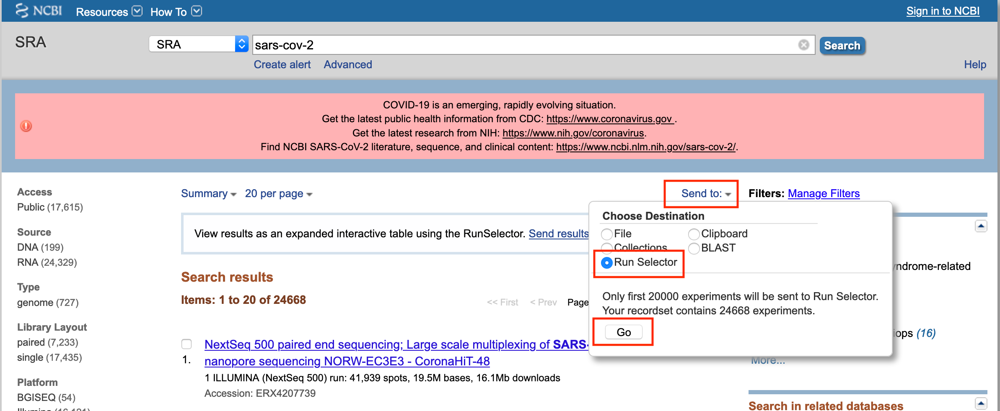

# Introduction


The aim of this tutorial is to introduce you to the processing of next generation sequencing data in Galaxy.  This tutorial uses a COVID-19 variant calling from Illumina data, but it isn't about variant calling *per se*.

<!--
SRA, like many data sources is Galaxy aware.  It has support for sending information directly to Galaxy, and it tracks which Galaxy instance it was invoked from.  Getting sequence data from SRA is a multi-step process.  This tutorial explains each step in the process and then demonstrates a particular example of how to use SRA data in Galaxy.
-->

At the completion of this tutorial you will know:

<!--

* how to go from Galaxy to SRA.
* a basic understanding of how to select data in SRA
  * see the [Search in SRA documentation](https://www.ncbi.nlm.nih.gov/sra/docs/srasearch/) from the SRA team for a fuller introduction to this topic
* how to send SRA *metadata* (such as accession numbers) to Galaxy
* how to use that SRA metadata to import *sequence* data from SRA into Galaxy.
* how to run a simple variant analysis in Galaxy using that data
  * See these [variant analysis tutorials](/training-material/topics/variant-analysis) for a more in-depth explanation of variant analysis.

-->

- How to find data in SRA and transfer this information to Galaxy
- How to perform basic NGS data processing in Galaxy including:
	- Quality Control (QC) of Illumina data
	- Mapping
	- Removal of duplicates
	- Variant calling with `lofreq`
	- Variant annotation
- Using datasets collections
- Importing data to Jupyter


<!--
> <agenda-title></agenda-title>
>
> In this tutorial, we will cover:
>
> 1. TOC
> {:toc}
>
{: .agenda}

## Two paths through this tutorial

We created twoi trajectories that you can follow through this tutorial.

1. **Trajectory 1** - start with NCBI's SRA and search for available accessions &rarr; Start [here](#the-sequence-read-archive)
2. **Trajectory 2** - bypass NCBI's SRA and start with Galaxy directly. &rarr; Start [here](#back-in-galaxy)

We recommend beginning with **Trajectory 2**.
# The Sequence Read Archive

The [Sequence Read Archive (SRA)](https://www.ncbi.nlm.nih.gov/sra) is the primary archive of *unassembled reads*  for the [US National Institutes of Health (NIH)](https://www.ncbi.nlm.nih.gov/).  SRA is a great place to get the sequencing data that underlie publications and studies.

This tutorial covers how to get sequence data from SRA into Galaxy using a direct connection between the two.

> <comment-title></comment-title>
>
> You will also hear SRA referred to as the *Short Read Archive*, its original name.
>
{: .comment}


## Accessing SRA

SRA can be reached either directly through it's website, or through the tool panel on Galaxy.

> <comment-title></comment-title>
>
> Initially the tool panel option for accessing SRA exists only on the [usegalaxy.org server](https://usegalaxy.org/).  Support for the direct connection to SRA will be included in the 20.05 release of Galaxy
{: .comment}


> <hands-on-title>Explore SRA Entrez</hands-on-title>
>
> 1. Go to your Galaxy instance of choice such as one of the [usegalaxy.org](https://usegalaxy.org/), [usegalaxy.eu](https://usegalaxy.eu), [usegalaxy.org.au](https://usegalaxy.org.au) or any other. (This tutorial uses usegalaxy.org).
> 1. If your history is not already empty, than start a new history (see [here](https://training.galaxyproject.org/training-material/topics/galaxy-interface/tutorials/history/tutorial.html) for more on Galaxy histories)
> 1. **Click** `Get Data` at the top of the tool panel.
> 1. **Click** `SRA Server` in the list of tools shown under `Get Data`.
>    This takes you the [Sequence Read Archive home page](https://www.ncbi.nlm.nih.gov/sra) -- you can also start directly from the SRA.  A search box is shown at the top of the page.  Try searching for something you are interested in, such as `dolphin` or `kidney` or `dolphin kidney` and then **click** the  `Search` button.
>
>    This returns a list of *SRA Experiments* that match your search string.  SRA Experiments, also know as *SRX entries*, contain sequence data from a particular experiment, as well as an explanation of the experiment itself and any other related data. You can explore the returned experiments by clicking on their name.  See [Understanding SRA Search Results](https://www.ncbi.nlm.nih.gov/books/NBK56913/) in the [SRA Knowledge Base](https://www.ncbi.nlm.nih.gov/books/n/helpsrakb/) for more.
>
>    When you enter text in the SRA search box, you are using [SRA's Entrez search interface](https://www.ncbi.nlm.nih.gov/sra/docs/srasearch/).  Entrez supports both simple text searches, and very precise searches that check specific metadata and use arbitrarily complex logical expressions.  Entrez allows you to scale up your searches from basic to advanced as you narrow your searches.  The syntax of advanced searches can seem daunting, but SRA provides a graphical [Advanced Search Builder](https://www.ncbi.nlm.nih.gov/sra/advanced/) to generate the specific syntax.  And, as we shall see below, the SRA Run Selector provides an even friendlier user interface for narrowing our selected data.
>
>    Play around with the SRA Entrez interface, including the advanced query builder, to see if you can identify a set of SRA experiments that are relevant to one of your research areas.
{: .hands_on}


> <hands-on-title>Generate list of matching experiments using Entrez</hands-on-title>
>
> Now that you have a basic familiarity with SRA Entrez, let's find the sequences used in this tutorial.
>
> 1. If you aren't already there, **navigate** back to the [Sequence Read Archive search page](https://www.ncbi.nlm.nih.gov/sra)
> 1. **Clear** any search text from the search box.
> 1. **Type** `sars-cov-2` in the search box and **click** `Search`.
>    This returns a longish list of SRA experiments that match our search, and that list is far too long to use in a tutorial exercise.  At this point we could use the advanced Entrez query builder we learned about above.
>    But we won't.  Instead lets send the *too long for a tutorial* list results we have to the SRA Run Selector, and use its friendlier interface to narrow our results.
>
> 
{: .hands_on}


> <hands-on-title>Go from Entrez to SRA Run Selector</hands-on-title>
>
> View results as an expanded interactive table using the RunSelector.
>
> 1. Click <u>Send results to Run selector</u>, which appears in a box at the top of the search results.
>
> 
>
> > <tip-title>What if you don't see the Run Selector Link?</tip-title>
> >
> > You may have noticed this text earlier when you were exploring Entrez search.  This text only appears some of the time, when the number of search results falls within a fairly broad window.  You won't see it if you only have a few results, and you won't see it if you have more results than the Run Selector can accept.
> >
> > *You need to get to Run Selector to send your results to Galaxy.* What if you don't have enough results to trigger this link being shown?  In that case you call get to the Run Selector by **clicking** on the `Send to` pulldown menu at the top right of the results panel.  To get to Run Selector, **select** `Run Selector` and then **click** the `Go` button.
> 
> {: .tip}
>
>
> 1. **Click** `Send results to Run selector` at the top of the search results panel. (If you don't see this link, then see the comment directly above.)
{: .hands_on}

## SRA Run Selector

We learned earlier how to narrow our search results by using Entrez's advanced syntax.  However, we didn't take advantage of that power when we were in Entrez.  Instead we used a simple search and then sent all the results to the Run Selector.  We don't yet have the (short) list of results we want to run analysis on. *What are we doing?*

We are using Entrez and the Run Selector how they are designed to be used:

 * Use the Entrez interface to narrow your results down to a size that the Run Selector can consume.
 * Send those Entrez results to the SRA Run Selector
 * Use the Run Selector's much friendlier interface to
    1. More easily understand the data we have
    1. Narrow those results using that knowledge.


> <comment-title>Run Selector is both more and less than Entrez</comment-title>
>
> Run Selector can do most, but not all of what Entrez search syntax can do.  Run selector uses *faceted search* technology which is easy to use, and powerful, but which has inherent limits.  Specifically, Entrez will work better when searching on attributes that have tens, hundreds, or thousands of different values.  Run Selector will work better searching attributes with fewer than 20 different values.  Fortunately, that describes most searches.
{: .comment}


The Run Selector window is divided into several panels:

* **`Filters List`**: In the upper left hand corner.  This is where we will refine our search.
* **`Select`**: A summary of what was initially passed to Run Selector, and how much of that we have selected so far.  (And so far, we haven't selected any of it.)  Also note the tantalizing, but still grayed out, `Galaxy` button.
* **`Found x Items`** Initially, this is the list of items sent to Run Selector from Entrez.  This list will shrink as we apply filters to it.


> <comment-title>Why did the number of found items <i>go up?</i></comment-title>
>
> Recall that the Entrez interface lists SRA experiments (SRX entries).  Run Selector lists *runs* &mdash; sequencing datasets &mdash; and there are *one or more* runs per experiment. We have the same data as before, we are now just seeing it in finer detail.
{: .comment}

The `Filters List` in the upper left shows columns in our results that have either continuous numerical values, or 10 or less (you can change this number) distinct values in them.  **Scroll** down through the list select a few of the filters.  When a filter is selected, a *values* box appears below, listing options for this filter, and the number of runs with each option.  These values / options are pulled from the dataset metadata.  Try **selecting** a few interesting sounding filters and then **select** one or more options for each filter. Try **unselecting** options and filters. As you do this, the number of found results will decrease or increase.

> <tip-title>Use Filters to better understand the data</tip-title>
>
> Filters are how you narrow the datasets under consideration for sending to Galaxy, but they are also an excellent way to understand your data:
> First, selecting a filter is an easy way to see the range of values in a column.  You may not be able to [find documentation on what the `sirs_outcome` column means](https://www.google.com/search?q=sra+sirs_outcome), but you can possibly figure it out by seeing what values are in it.
> Second, you can explore how different columns relate to each other.  Is there a relationship between `sirs_outcome` values and `disease_stage` values?
{: .tip}


> <hands-on-title>Narrow your results using Run Selector</hands-on-title>
>
> 1. If you have any filters turned on, **unselect** them.
>     Once you have done this, there won't be any *values* boxes appearing below the `Filters List`.
> 2. **Copy and paste** this search string into the `Found Items` search box.
>     ```
>      SRR11772204 OR SRR11597145 OR SRR11667145
>     ```
>     This hand-picked set of runs limits our results to 3 runs from different geographic distribution.
{: .hands_on}

This reduces your `Found Items` list from tens of thousands of runs to 3 runs (a manageable number for a tutorial!). But we aren't quite done with Run Selector yet. Note that the `Galaxy` button is still grayed out.  We have narrowed our options, but we haven't actually selected anything to send to Galaxy yet.

It's possible to select every remaining run by **clicking** the checkmark at the top of the first column.  You can unselect everything by **clicking** the `X`.

> <hands-on-title>Select runs and send to Galaxy</hands-on-title>
>
> 1. Select all runs by **clicking** the `X`.
>    And now, the `Galaxy` button is live.
> 1. **Click** the `Galaxy` button in the `Select` section at the top of the page.
{: .hands_on}


## Back in Galaxy

When we click `Galaxy` in Run Selector several things happen.  First, it launches a new browser tab or window which opens in Galaxy.  You will see the *big green box* indicating that the handshake between SRA and Galaxy was successful and you will then see a new `SRA` job in your history panel.  This box may start out as gray / pending, indicating that the transfer has not yet started, or it may go straight to yellow / running or to green / done.

> <hands-on-title>Examine the new SRA Dataset</hands-on-title>
>
> 1. Once the `SRA` transfer is complete, **click** on the dataset's  (eye) icon.
>
>    This displays the dataset in Galaxy's center panel.
{: .hands_on}


The `SRA` dataset is not sequence data, but rather *metadata* that we will use to get sequence data from SRA.  This metadata mirrors the information we saw in the Run Selector's `Found Items` section.  The metadata is not the end data that we are seeking from SRA, but having all that metadata is often useful in subsequent analysis steps.

Lets now use that metadata to fetch the sequence data from SRA.  SRA provides tools for extracting all sorts of information, including the sequence data itself.  The Galaxy Tool `Faster Download and Extract Reads in FASTQ` is based on the SRA [`fasterq-dump`](https://github.com/ncbi/sra-tools/wiki/HowTo:-fasterq-dump) utility, and does just that.

-->

## Find necessary data in SRA

First we need to find a good dataset to play with. The [Sequence Read Archive (SRA)](https://www.ncbi.nlm.nih.gov/sra) is the primary archive of *unassembled reads*  operated by the [US National Institutes of Health (NIH)](https://www.ncbi.nlm.nih.gov/).  SRA is a great place to get the sequencing data that underlie publications and studies. Let's do that:

> <hands-on-title>Task description</hands-on-title>
>
> 1. Go to NCBI's SRA page by pointing your browser to https://www.ncbi.nlm.nih.gov/sra
> 2. In the search box enter `SARS-CoV-2 Patient Sequencing From Partners / MGH`:
>  (Alternatively, you simply click on this [link](https://www.ncbi.nlm.nih.gov/sra/?term=SARS-CoV-2+Patient+Sequencing+From+Partners+%2F+MGH))
> 3. Note that some of the datasets found say "ARTICv3 amplicon sequencing". This is a sequencing technique that requires addition analysis steps not discussed in this tutorial. The data that we will analyse (datasets mentioned below) uses a technique called "metagenomic sequencing".
> 4. The web page will show a large number of SRA datasets (at the time of writing there were 3,927). This is data from a [study](https://science.sciencemag.org/content/early/2020/12/09/science.abe3261) describing analysis of SARS-CoV-2 in Boston area.
> 5. Download metadata describing these datasets by:
>   - clicking on **Send to:** dropdown
>   - Selecting `File`
>   - Changing **Format** to `RunInfo`
>   - Clicking **Create file**
> Here is how it should look like:
> 
> 6. This would create a rather large `SraRunInfo.csv` file in your `Downloads` folder.
{: .hands_on}

Now that we have downloaded this file we can go to a Galaxy instance and start processing it.

> <comment-title></comment-title>
>
> Note that the file we just downloaded is **not** sequencing data itself. Rather, it is *metadata* describing properties of sequencing reads. We will filter this list down to just a few accessions that will be used in the remainder of this tutorial.
>
{: .comment}

## Process and filter `SraRunInfo.csv` file in Galaxy

> <hands-on-title>Upload `SraRunInfo.csv` file into Galaxy</hands-on-title>
>
> 1. Go to your Galaxy instance of choice such as one of the [usegalaxy.org](https://usegalaxy.org/), [usegalaxy.eu](https://usegalaxy.eu), [usegalaxy.org.au](https://usegalaxy.org.au) or any other. (This tutorial uses usegalaxy.org).
> 1. Click *Upload Data* button:
> 
> 1. In the dialog box that would appear click "*Choose local files*" button:
> 
> 1. Find and select `SraRunInfo.csv` file from your computer
> 1. Click *Start* button
> 1. Close dialog by pressing **Close** button
> 1. You can now look at the content of this file by clicking  (eye) icon. You will see that this file contains a lot of information about individual SRA accessions. In this study every accession corresponds to an individual patient whose samples were sequenced.
{: .hands_on}

Galaxy can process all 2,000+ datasets but to make this tutorial bearable we need to selected a smaller subset. In particular our previous experience with this data shows two interesting datasets `SRR11954102` and `SRR12733957`. So, let's pull them out.



> <hands-on-title>Creating a subset of data</hands-on-title>
>
> 1. Find  "**Select lines that match an expression**" tool in **Filter and Sort** section of the tool panel.
>    > <tip-title>Finding tools</tip-title>
>    > Galaxy may have an overwhelming amount of tools installed. To find a specific tool type the tool name in the tool panel search box to find the tool.
>    {: .tip}
> 1. Make sure the `SraRunInfo.csv` dataset we just uploaded is listed in the  "*Select lines from*" field of the tool form.
> 1. In "*the pattern*" field enter the following expression &rarr; `SRR12733957|SRR11954102`. These are two accession we want to find separated by the pipe symbol `|`. The `|` means `or`: find lines containing `SRR12733957` **or** `SRR11954102`.
> 1. Click `Execute` button.
> 1. This will generate a file containing two lines (well ... one line is also used as the header, so it will appear the the file has three lines. It is OK.)
> 1. Cut the first column from the file using  "**Cut**" tool, which you will find in **Text Manipulation** section of the tool pane.
> 1. Make sure the dataset produced by the previous step is selected in the "*File to cut*" field of the tool form.
> 1. Change "*Delimited by*" to `Comma`
> 1. In "*List of fields*" select `Column: 1`.
> 1. Hit `Execute`
> This will produce a text file with just two lines:
> ```
> SRR12733957
> SRR11954102
>```
{: .hands_on}

Now that we have identifiers of datasets we want we need to download the actual sequencing data.

## Download sequencing data with **Faster Download and Extract Reads in FASTQ**

> <hands-on-title>Task description</hands-on-title>
>
> 1. **Faster Download and Extract Reads in FASTQ**  with the following parameters:
>    - *"select input type"*: `List of SRA accession, one per line`
>        - The parameter  *"sra accession list"* should point the output of the  "**Cut**" from the previous step.
>    - **Click** the `Execute` button. This will run the tool, which retrieves the sequence read datasets for the runs that were listed in the `SRA` dataset. It may take some time. So this may be a good time to do get coffee.
>
> 2. Several entries are created in your history panel when you submit this job:
>    - **`Pair-end data (fasterq-dump)`**: Contains Paired-end datasets (if available)
>    - **`Single-end data (fasterq-dump)`** Contains Single-end datasets (if available)
>    - **`Other data (fasterq-dump)`** Contains Unpaired datasets (if available)
>    - **`fasterq-dump log`** Contains Information about the tool execution
{: .hands_on}

The first three items are actually *collections* of datasets.  *Collections* in Galaxy are logical groupings of datasets that reflect the semantic relationships between them in the experiment / analysis.  In this case the tool creates a separate collection each for paired-end reads, single reads, and *other*.
See the Collections tutorials for more.

Explore the collections by first **clicking** on the collection name in the history panel.  This takes you inside the collection and shows you the datasets in it.  You can then navigate back to the outer level of your history.

Once `fasterq` finishes transferring data (all boxes are green / done), we are ready to analyze it.


# Now what?

You can now analyze the retrieved data using any sequence analysis tools and workflows in Galaxy.  SRA holds backing data for every imaginable type of *-seq experiment.

If you ran this tutorial, but retrieved datasets that you were interested in, then see the rest of the GTN library for ideas on how to analyze in Galaxy.

However, if you retrieved the datasets used in this tutorial's examples above, then you are ready to run the SARS-CoV-2 variant analysis below.


# Variation Analysis of SARS-Cov-2 sequencing data

In this part of the tutorial we will perform variant calling and basic analysis of the datasets downloaded above. We will start by downloading the Wuhan-Hu-1 SARS-CoV-2 reference sequence, then run adapter trimming, alignment and variant calling and finally look at the geographic distribution of some of the found variants.

> <comment-title>The usegalaxy.* COVID-19 analysis project</comment-title>
> This tutorial uses a subset of the data and runs through the
> [Variation Analysis](https://covid19.galaxyproject.org/genomics/4-variation/)
> section of [covid19.galaxyproject.org](https://covid19.galaxyproject.org/).
> The data for [covid19.galaxyproject.org](https://covid19.galaxyproject.org/) is
> being updated continuously as new datasets are made public.
{: .comment}


# Get the reference genome data

The reference genome data for today is for SARS-CoV-2, "Severe acute respiratory syndrome coronavirus 2 isolate Wuhan-Hu-1, complete genome", having the accession ID of NC_045512.2.

This data is available from Zenodo using the following [link](https://doi.org/10.5281/zenodo.3906454).

> <hands-on-title>Get the reference genome data</hands-on-title>
>
> 1. Import the following file into your history:
>
>    ```
>    https://ftp.ncbi.nlm.nih.gov/genomes/all/GCF/009/858/895/GCF_009858895.2_ASM985889v3/GCF_009858895.2_ASM985889v3_genomic.fna.gz
>    ```
>
>    
>
{: .hands_on}

<!-- Previous version of the link -> https://zenodo.org/record/3906454/files/NC_045512.2.fasta -->


## Adapter trimming with **fastp**

Removing sequencing adapters improves alignments and variant calling. **fastp**  can automatically detect widely used sequencing adapters.

> <hands-on-title>Task description</hands-on-title>
>
> 1. **fastp**  with the following parameters:
>    - *"Single-end or paired reads"*: `Paired Collection`
>        -  *"Select paired collection(s)"*: `list_paired` (output of **Faster Download and Extract Reads in FASTQ** )
>    - In *"Output Options"*:
>        - *"Output JSON report"*: `Yes`
{: .hands_on}


## Alignment with  **Map with BWA-MEM**

**BWA-MEM**  is a widely used sequence aligner for short-read sequencing datasets such as those we are analysing in this tutorial.

> <hands-on-title>Align sequencing reads to reference genome</hands-on-title>
>
> 1. **Map with BWA-MEM**  with the following parameters:
>    - *"Will you select a reference genome from your history or use a built-in index?"*: `Use a genome from history and build index`
>        -  *"Use the following dataset as the reference sequence"*: `output` (Input dataset)
>    - *"Single or Paired-end reads"*: `Paired Collection`
>        -  *"Select a paired collection"*: `output_paired_coll` (output of **fastp** )
>    - *"Set read groups information?"*: `Do not set`
>    - *"Select analysis mode"*: `1.Simple Illumina mode`
>
{: .hands_on}


## Remove duplicates with **MarkDuplicates**

**MarkDuplicates**  removes duplicate sequences originating from library preparation artifacts and sequencing artifacts. It is important to remove these artefactual sequences to avoid artificial overrepresentation of single molecule.

> <hands-on-title>Remove PCR duplicates</hands-on-title>
>
> 1. **MarkDuplicates**  with the following parameters:
>    -  *"Select SAM/BAM dataset or dataset collection"*: `bam_output` (output of **Map with BWA-MEM** )
>    - *"If true do not write duplicates to the output file instead of writing them with appropriate flags set"*: `Yes`
>
{: .hands_on}

## Generate alignment statistics with **Samtools stats**

After the duplicate marking step above we can generate statistic about the alignment we have generated.

> <hands-on-title>Generate alignment statistics</hands-on-title>
>
> 1. **Samtools stats**  with the following parameters:
>    -  *"BAM file"*: `outFile` (output of **MarkDuplicates** )
>    - *"Set coverage distribution"*: `No`
>    - *"Output"*: `One single summary file`
>    - *"Filter by SAM flags"*: `Do not filter`
>    - *"Use a reference sequence"*: `No`
>    - *"Filter by regions"*: `No`
{: .hands_on}

## **Realign reads** with lofreq viterbi

**Realign reads**  corrects misalignments around insertions and deletions. This is required in order to accurately detect variants.

> <hands-on-title>Realign reads around indels</hands-on-title>
>
> 1. **Realign reads** with lofreq  with the following parameters:
>    -  *"Reads to realign"*: `outFile` (output of **MarkDuplicates** )
>    - *"Choose the source for the reference genome"*: `History`
>        -  *"Reference"*: `output` (Input dataset)
>    - In *"Advanced options"*:
>        - *"How to handle base qualities of 2?"*: `Keep unchanged`
{: .hands_on}

## Add indel qualities with lofreq **Insert indel qualities**

This step adds indel qualities into our alignment file. This is necessary in order to call variants using **Call variants** with lofreq 

> <hands-on-title>Add indel qualities</hands-on-title>
>
> 1. **Insert indel qualities** with lofreq  with the following parameters:
>    -  *"Reads"*: `realigned` (output of **Realign reads** )
>    - *"Indel calculation approach"*: `Dindel`
>        - *"Choose the source for the reference genome"*: `History`
>            -  *"Reference"*: `output` (Input dataset)
>
{: .hands_on}

## Call Variants using lofreq **Call variants**

We are now ready to call variants.

> <hands-on-title>Call variants</hands-on-title>
>
> 1. **Call variants** with lofreq  with the following parameters:
>    -  *"Input reads in BAM format"*: `output` (output of **Insert indel qualities** )
>    - *"Choose the source for the reference genome"*: `History`
>        -  *"Reference"*: `output` (Input dataset)
>    - *"Call variants across"*: `Whole reference`
>    - *"Types of variants to call"*: `SNVs and indels`
>    - *"Variant calling parameters"*: `Configure settings`
>        - In *"Coverage"*:
>            - *"Minimal coverage"*: `50`
>        - In *"Base-calling quality"*:
>            - *"Minimum baseQ"*: `30`
>            - *"Minimum baseQ for alternate bases"*: `30`
>        - In *"Mapping quality"*:
>            - *"Minimum mapping quality"*: `20`
>    - *"Variant filter parameters"*: `Preset filtering on QUAL score + coverage + strand bias (lofreq call default)`
{: .hands_on}

The output of this step is a collection of VCF files that can be visualized in a genome browser.

## Annotate variant effects with **SnpEff eff:**

We will now annotate the variants we called in the previous step with the effect they have on the SARS-CoV-2 genome.

> <hands-on-title>Annotate variant effects</hands-on-title>
>
> 1. **SnpEff eff:**  with the following parameters:
>    -  *"Sequence changes (SNPs, MNPs, InDels)"*: `variants` (output of **Call variants** )
>    - *"Output format"*: `VCF (only if input is VCF)`
>    - *"Create CSV report, useful for downstream analysis (-csvStats)"*: `Yes`
>    - *"Annotation options"*: ``
>    - *"Filter output"*: ``
>    - *"Filter out specific Effects"*: `No`
>
{: .hands_on}

The output of this step is a VCF file with added variant effects.

## Create table of variants using **SnpSift Extract Fields**

We will now select various effects from the VCF and create a tabular file that is easier to understand for humans.

> <hands-on-title>Create table of variants</hands-on-title>
>
> 1. **SnpSift Extract Fields**  with the following parameters:
>    -  *"Variant input file in VCF format"*: `snpeff_output` (output of **SnpEff eff:** )
>    - *"Fields to extract"*: `CHROM POS REF ALT QUAL DP AF SB DP4 EFF[*].IMPACT EFF[*].FUNCLASS EFF[*].EFFECT EFF[*].GENE EFF[*].CODON`
>    - *"multiple field separator"*: `,`
>    - *"empty field text"*: `.`
>
{: .hands_on}

We can inspect the output files and see check if Variants in this file are also described in [an observable notebook that shows the geographic distribution of SARS-CoV-2 variant sequences](https://observablehq.com/@spond/distribution-of-sars-cov-2-sequences-that-have-a-particular)

Interesting variants include the C to T variant at position 14408 (14408C/T) in SRR11772204, 28144T/C in SRR11597145 and 25563G/T in SRR11667145.


## Summarize data with **MultiQC**

We will now summarize our analysis with MultiQC, which generates a beautiful report for our data.

> <hands-on-title>Summarize data</hands-on-title>
>
> 1. **MultiQC**  with the following parameters:
>    - In *"Results"*:
>        -  *"Insert Results"*
>            - *"Which tool was used generate logs?"*: `fastp`
>                -  *"Output of fastp"*: `report_json` (output of **fastp** )
>        -  *"Insert Results"*
>            - *"Which tool was used generate logs?"*: `Samtools`
>                - In *"Samtools output"*:
>                    -  *"Insert Samtools output"*
>                        - *"Type of Samtools output?"*: `stats`
>                            -  *"Samtools stats output"*: `output` (output of **Samtools stats** )
>        -  *"Insert Results"*
>            - *"Which tool was used generate logs?"*: `Picard`
>                - In *"Picard output"*:
>                    -  *"Insert Picard output"*
>                        - *"Type of Picard output?"*: `Markdups`
>                        -  *"Picard output"*: `metrics_file` (output of **MarkDuplicates** )
>        -  *"Insert Results"*
>            - *"Which tool was used generate logs?"*: `SnpEff`
>                -  *"Output of SnpEff"*: `csvFile` (output of **SnpEff eff:** )
{: .hands_on}


# Conclusion


Congratulations, you now know how to import sequence data from the SRA and how to run an example analysis on these datasets.
