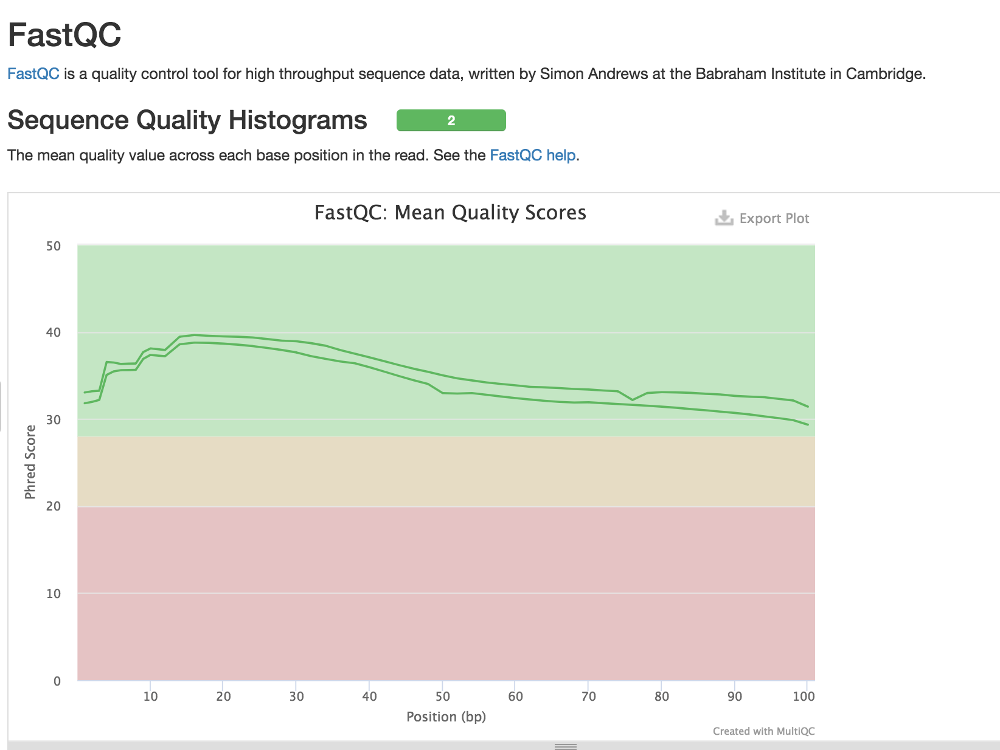
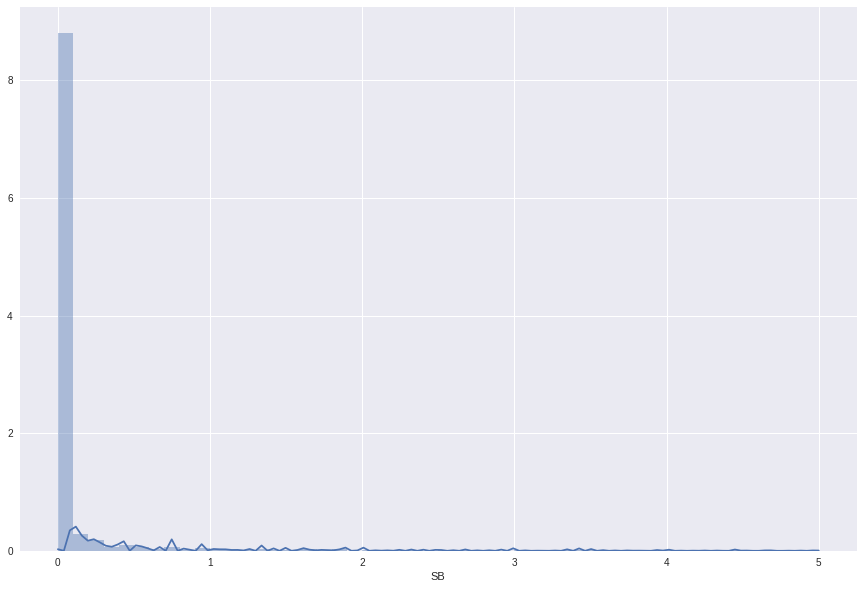

# Introduction
{:.no_toc}

In this tutorial we are going to use data from a study on antibiotic resistance ([Barbosa et al. 2017](http://academic.oup.com/mbe/article/34/9/2229/3829862/Alternative-Evolutionary-Paths-to-Bacterial)).
The study grew a strain of Pseudomonas aeruginosa grown in media containing different antibiotics to study apparition of resistance, its impact on growth and phenomena of cross-resistance. The data are composed of sequencing of 83 samples for 10 conditions:
 - Control samples (con): 10 samples
 - Wild Type (wt): 1 sample
 - Ciprofloxacin (cip): 10 samples
 - Gentamicin (gen): 10 samples
 - Streptomycin (str): 10 samples
 - Piperacillin (pip): 10 samples
 - Carbenicillin (car): 10 samples
 - Doripenem (dor): 10 samples
 - Imipenem (imi): 2 samples
 - Cefsulodin (cef): 10 samples


> ### Agenda
>
> In this tutorial, you will learn perform the annotation and analysis of variants:
>
> 1. TOC
> {:toc}
>
{: .agenda}

# Get the data

## Create reads collection

First we are going to use the SRA uploading tool to upload a collection of paired end reads in Galaxy.

> ###  Hands-on: Get the read data
>
> 1. Open the [bioproject of the study](https://www.ncbi.nlm.nih.gov/bioproject/PRJNA355367)
> 2. In *Related information* click on SRA, you have now access to each sample of the experiment.
> 3. For a more interactive access, click on _Send Result to RunSelector_ on the top of the page
> 4. In the download section, click on _Runinfo Table_ and _Accession List_
> 5. Upload the two files in Galaxy
> 6. **Download and Extract Reads in FASTA/Q format from NCBI SRA**  : download SRA files with
>   -  *"select input type"* : `List of SRA accession, one per line`
>   -  *"sra accession list"* : the `Accession List` file we downloaded from NCBI
>   -  *"Select output format"* : `Uncompressed fastq`
{: .hands_on}

The download of the data can take a little time, and will create two collections, one of paired end data, one of single end data. When you click on the single end collection, you can notice it is empty. To keep the history as clean as possible you can delete it by clicking on the cross.

When you click on the paired end collection you can notice it contains a list of pairs of files (forward and reverse), labeled with samples IDs. The names are not very informative, and in order to facilitate the analysis we want to change the names so it includes the condition of growth of the sample.

> ###  Hands-on: Change the collection names
>We are goin go use a tool to replace the old names by new ones including the condition information. This starts by creating a file containing the old and new names.
>
> 1. **Cut columns from a table (cut)**  : Remove columns with
>   -  *"File to cut"* : the `RunInfo Table` we downloaded from NCBI
>   -  *"List of Fields"* : `column:9` and `column:10` , these columns contain the sample ID and the condition
> 2. **Add column to an existing dataset**  : Add column with
>   -   *"Add this value"* : `_` (This will serve as a separator in the new names)
>   -   *"to Dataset"* : the file we generated at the previous step
> 3. **Replace Text in a specific column**  : Replace text with
>   -   *"File to Process"* : the file we generated at the previous steps
>   -   *"in column"* : `Column:2`
>   -   *"Find Pattern"* : `(.{3}).*` to select the first three letters corresponding to the condition of growth
>   -   *"Replace with"* : `\\1` to replace the whole string with only the condition name
> 4. **Merge Columns together**   : Merge columns with
>   -  *"Select data"* : the file we just generated
>   -  *"Merge column"* : `Column:1`
>   -  *"with column"*  to `Column:3`
>   -  *"Insert column"* :
>   >    *    *"Add column"* : `Column:2`
> 5. **Cut columns from a table (cut)**   : Remove column with
>   -  *"File to cut"* : the file we generated at the previous step
>   -  *"List of Fields"* as `column:1` and `column:4` , these columns contain old and new names of our files
> 6. **Relabel List Identifiers from contents of a file**   : Rename the files in your collectioni with
>   -  *"Input Collection"* : the collection of paired-end data downloaded from SRA accessions
>   -  *"How should the new labels be specified?"* as `Maps original identifiers to new ones using a two column table`
>   -  *New identifiers* : the two column datasets we generated at the previous step
> 7. Rename your collection with a meaningful name, for example `Pa14 Experiment paired Reads`
{: .hands_on}

## Get reference genome data

Once we got a clean collection with our sequencing data, we need to upload the genome and annotations file of the reference genome.
You can find these files on the [Pseudomonas Genome Database Website](http://pseudomonas.com/strain/download). Download the Genomic sequence file and the gbk annotation file for *Pseudomonas aeruginosa UCBPP-PA14* (second line) and upload them in Galaxy.

> ###  Tip: Importing data via links
>
> 1. Copy the link location
> 2. Open the Galaxy Upload Manager
> 3. Select **Paste/Fetch Data**
> 4. Paste the link into the text field
> 5. Press **Start**
> 6. Click on **Edit attribute** to give more meaningful names to the datasets.
{: .tip}

Now that you have the reference files in your history we can start the analysis by aligning the reads to the reference genome.
This will allow us to assign a position for each reads and therefore detect where variations occurs.

# Align the reads to the reference genome

## Quality Control

Before we can align the reads on the reference genome, we need to check the quality and the average length of the reads.

> ###  Hands-on: Quality Control
>We are going to use two tools to perform quality control on our reads : FastQC that is going to generate one result per file and MultiQC to aggregate all the results
>
> 1. **FastQC Read Quality reports**   : Evaluate the quality of your reads with
>   -   *"Short Read data from your history"* : the collection  of paired-end data
> 2. **Flatten Collection into a flat list of datasets**  : MultiQC need a simple collection as an input, we therefore need to flatten our list of pairs of files with
>   -   *"Input Collection"* : the raw data output of Fastqc `FastQC on collection [...]:RawData`
> 3.  **MultiQC**  : Aggregate quality control outputs with :
>   -   *Which tool was used generate logs?* : `FastQC`
>   -   *FastQC output* : the flatten collection we generated at the previous step
{: .hands_on}

MultiQC provides two outputs : a Webpage aggregating all the results from FastQC and a collection containing statistics in the text format.
As we said earlier, we are looking for two informations here: the quality and the average length of reads.

You can find the read quality on the web page output.



We can see there that the quality of the reads are good over the whole length of the reads. We therefore don't need to perform quality treatment and we can use them as they are.

We can find the average read length in the file *general_stats* of the stats file collection output of MultiQC.


> ###  Questions
>
> 1. What is the average read length(rounded to the closest integer)?
> 2. MultiQC grouped our 80 samples in two samples, based on which criteria?
> 3. Can that grouping be a problem?  
>    > ###  Solution
>    >
>    > 1. The average read length is 101 bases.
>    > 2. MultiQC grouped the samples in *forward* and  *reverse* samples.
>    > 3. We are applying the same treatment to all our samples, so we are only interested in the average quality accross all samples. Therefore grouping them is not a problem.
>    >
>    {: .solution}
{: .question}


## Mapping

Now that we have good quality reads we are going to map them against the reference genome.

> ###  Hands-on: Mapping
>Now that we have good quality reads we are going to map them against the reference genome.
> 1.   **BWA-MEM**   : Map your reads against the reference with

>   -  
{: .hands_on}

# Search variations

## Plot coverage to identify structural variations

## Identification and annotation of small variations


### Identification

The second type of variation we want to detect are small variations with a size of a few bases.

> ###  Hands-on: Variants calling
>
> 1. **Freebayes**   :
>   -   *""* :
{: .hands_on}

### Annotation

Now that we have identified the variants, we need to get annotations. The identification of the impacted genes, the effects of mutations, will allow us to study links between the variants and the antibbiotic resistance.

> ###  Hands-on: Variants annotation
>
> 1. **SnpEff build: database from Genbank record**   : Create your database of annotations with
>   -   *"Name for the database"* : The name you want to give to you database, like `PA14`
>   -   *"Genbank dataset to build database from"* : The genbank file containing annotations `Pseudomonas_aeruginosa_UCBPP-PA14_109.gbk`
>   -   *"Parse Genbank into Fasta"* : `Yes`
> 2. **SnpEff eff: annotate variants**  : Annotate your variants with :
>   -   *"Sequence changes (SNPs, MNPs, InDels)"* : The collection  containing the variants files `Freebayes on collection [...] (Variants)`
>   -  *"SnpEff4.3 Genome Data"* : The database we created at the previous step `SnpEff.43 database for [...]`
>   -  *"Upstream / Downstream length"* :  `No upstream / Downstream intervals (0 bases)`
>   -  *"Set size for splice sites (donor and acceptor) in bases"* : `nothing selected`
>   -  *"Annotation options"* : check `Use 'EFF' field compatible with older version (instead of 'ANN')` and  `Add loss of function (LOF) and nonsense mediated decay (NMD) tags`
>   -  *"Filter output"* : `Select all`
> 3. **SnpSift Variant Type Annotate with variant type**  :Annotate the variants type with
>   -   *"Variant file (VCF)"* : Output collection  of SnpEff `SnpEff eff: on [...]`
> 4. **SnpSift Extract Fields from a VCF file into a tabular file**  : organize the annotations in a tabular file with
>   -   *"Variant input file in VCF format"* :  Output collection  of the previous step `SnpSift Variant type on [...] : VCF`
>   -   *"Fields to extract"* : `CHROM POS REF ALT QUAL SAF SAR SRF SRR SAP SRP EPP DP EFF[*].GENEID EFF[*].GENE EFF[*].EFFECT EFF[*].AA EFF[*].IMPACT EFF[*].FUNCLASS` to know more about the fields, take a look at the vcf header like
>    > ```##INFO=<ID=SRF,Number=1,Type=Integer,Description="Number of reference observations on the forward strand">
##INFO=<ID=SRR,Number=1,Type=Integer,Description="Number of reference observations on the reverse strand">
##INFO=<ID=SAF,Number=A,Type=Integer,Description="Number of alternate observations on the forward strand">
##INFO=<ID=SAR,Number=A,Type=Integer,Description="Number of alternate observations on the reverse strand">```
>   -   *"One effect per line"*: `Yes`
>   -  *"multiple field separator"*: `,`
>   -  *"empty field text"*: `.`
{: .hands_on}


### Quality metrics and unique IDs computation

Now that we have annotated our variants for each sample, we want to merge the data to compare the variations among samples. We therefore need to merge the file together by variants. To do than we need to create unique identifiers for each variants. We also want to calculate the Strand Bias to remove highly biased variants

> ###  Hands-on: Create unique identifier for each variant
> 1. **Select first lines from a dataset (head)**  : Get single header line with
>   -  *"File to select"*: Collection  output of SnpSift `SnpSift extract fields on [...]`
>   -  *"Operation"*:  `Keep first lines`
>   -  *"Number of lines"*:  `1`
> 2. **Add column to an existing dataset**  : Add a header for the strand bias column with
>   -  *"Add this value"*:  `SB`
>   -  *"to Dataset"*:  Output collection  of the previous step `Select first on [...]`
>   -   *"Iterate?"* : `no`
> 3. **Filter data on any column using simple expressions**  : Filter out variation showing 2 alternatives with :
>   -  *"Filter"*:  `SnpSift extract fields on [...]`
>   -  *"With following condition"*:  `len(c4.split(',')) < 2` to remove the variants where the list of alternatives is longer than 1
>   -  *"Number of header lines to skip"*:  `1`
> 4. **Compute an expression on every row**  : Add a column with the calculated Strand bias for each variant with
>   -  *"Add expression"* :  `abs(((c6/(c6+c8))-(c7/(c9+c7)))) / ((c6+c7)/(c9+c6+c7+c8) )`
>   -  *"as a new column to"* : Output collection  from the previous step `Filter on [...]`
>   -  *"Round result?"* : `NO`
> 5. **Add column to an existing dataset**  : Add a header for the variant ID with
>   -  *"Add this value"*:  `id`
>   -  *"to Dataset"*:  Output collection  of the previous step `Add column on [...]`
>   -   *"Iterate?"* : `no`
> 6. **Compute an expression on every row**  : Concatenate columns to create variant IDs with
>   -  *"Add expression"* :  `str(c15)+"-"+str(c2)+"-"+str(c3)`
>   -  *"as a new column to"* : Output collection  from the previous step `Compute on [...]`
>   -  *"Round result?"* : `NO`
> 7. **Concatenate datasets tail-to-head**  : Concatenate the new header with the data containing the strand bias and the variant ID with
>   -  *"Concatenate Dataset"* :  `Add column on [...]`
>   -  *"Select"* : `Compute on [...]`
> 8. **Collapse Collection into single dataset in order of the collection**  : Collapse the collection for SB analysis with
>   -  *"Collection of files to collapse into single dataset"* :  Collection  containing Strand Bias and Unique IDs. `Concatenate dataset on [...]`
>   -  *"Keep one header line"* : to `Yes`
>   -  *"Append File name"* : to `Yes`
>   -  *"Where to add dataset name"* : to `Same line and each line in dataset` to have the sample name appear on each line.
{: .hands_on}

Once we have created our variants IDs and calculated the strand bias, we want to evaluate the distribution of the strand bias to remove the variants presenting a high bias.
We are going to prepare a Jupyter notebook to analyze the Strand bias.

### Strand Bias analysis in Jupyter

Start a Jupyter notebook with the concatenated file we just generated. You can learn how to use Jupyter notebook in Galaxy in [this tutorial](http://galaxyproject.github.io/training-material/topics/galaxy-ui/tutorials/galaxy-intro-jupyter/tutorial.html).

Start with installing necessary libraries.

```
!conda install -y pandas
!conda install -y -c conda-forge seaborn
```

The [pandas](https://pandas.pydata.org/) library provides powerful data structures for the manipulation of large data tables, and [seaborn](https://seaborn.pydata.org/) is a visualization library.

Let's now import them .

```
import pandas as pd
import matplotlib.pyplot as plt
import seaborn as sns
```

To plot the distribution of the Strand Bias values, we use the distplot funtion of the seaborn library.

```
collapsed = pd.read_table(2018)
fig, ax = plt.subplots( nrows=1, ncols=1 ,figsize=(15, 10) )
sns.distplot(collapsed["SB"]);
display(fig)
```

-   `collapsed = pd.read_table(2018)` Import the dataset you obtained by collapsing the collection as a Dataframe (2018 here is to be replaced by the number of the dataset in your history).
-   `fig, ax = plt.subplots( nrows=1, ncols=1 ,figsize=(15, 10) )` Defines a figure containing one plot (one column and one row) and with a size of 15 by 10.
-   `sns.distplot(collapsed["SB"]);` Plot the SB collumn of the collapsed dataframe as a distribution plot.
-   `display(fig)` Display the figure in the jupyter notebook.

You should get a plot looking like that.



As you can see the distribution of the strand bias is mostly grouped close to zero, and the large majority of variants have a strand bias inferior to 2.

### Filter out highly biased variants

As most of the variants have a strand bias inferior to 2, we can filter out the variants with a strand bias superior to 2. This will allow us to remove highly biased variants without loosing probably relevant variants.

> ###  Hands-on: Filter out highly biased variants
> 1. **Filter data on any column using simple expressions**  : Filter data on the SB column
>   -  *"Filter"*:  Collection  containing Strand Bias and Unique IDs before its collapse. `Concatenate dataset on [...]`
>   -  *"With following condition"*: to `c20<2` to select variants with a Strand Bias superior to 2
>   -  *"Number of header lines to skip"*: to  `1`
{: .hands_on}

# Identify relevant variants

Now that we filtered the variants to remove the high strand biases, we are going to prepare the files to use in Jupyter notebooks for the analysis of variants. We are going to prepare a joined file and a collapsed file. The joined file will contain a matrix where each line is a variant and each column is a column of the dataset of the collection. You will then have for example a "Sample1_EFFECT", "Sample2_EFFECT" etc.


> ###  Hands-on: Filter out highly biased variants
> 1. **Column Join on Collections**  :Join the collection with
>   -  *"Tabular files"*:  Collection  output of the filter step `Filter on [...]`
>   -  *"Identifier column"*:  to `21` to join the datafile with the unique identifier column
>   -  *"Number of Header lines in each item"*:  to `1`
>   -  *"Fill character"*:  to `.`
> 2. **Collapse Collection into single dataset in order of the collection**  : Collapse the collection with
>   -  *"Collection of files to collapse into single dataset"* :  Collection  output of the filter step `Filter on [...]`
>   -  *"Keep one header line"* : to `Yes`
>   -  *"Append File name"* : to `Yes`
>   -  *"Where to add dataset name"* : to `Same line and each line in dataset` to have the sample name appear on each line.
{: .hands_on}


## Hierarchical clustering

Now that we have prepared the files that will allow us to analyze the variants across the samples of the experiment, we are going to perform a hierarchical clustering to determine if we observe a link between the gene presenting small variations and antibiotic resistance. This analysis will be performed in three steps, each in a jupyter notebook : the creation of the distance matrix, the clustering, and the tree display.

### Distance Matrix base on gene impacted

## Functional analysis


# Conclusion
{:.no_toc}
