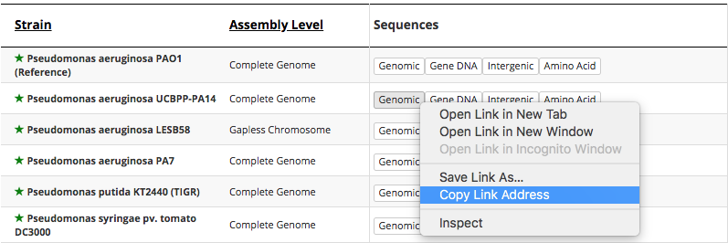
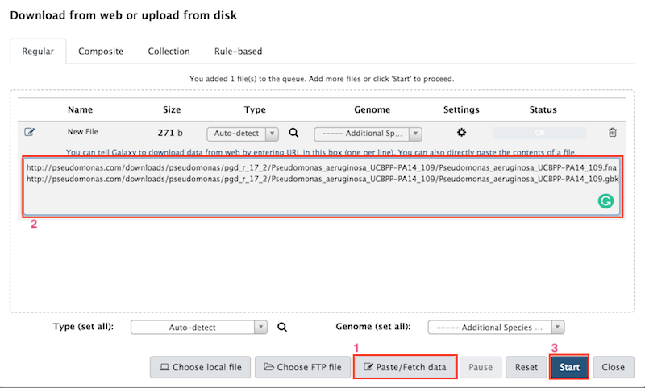

# Introduction
{:.no_toc}

In this tutorial we are going to use data from a study on antibiotic resistance ([Barbosa et al. 2017](http://academic.oup.com/mbe/article/34/9/2229/3829862/Alternative-Evolutionary-Paths-to-Bacterial)).
The study grew a strain of Pseudomonas aeruginosa grown in media containing different antibiotics to study apparition of resistance, its impact on growth and phenomena of cross-resistance. The data are composed of sequencing of 83 samples for 10 conditions:
 - Control samples (con): 10 samples
 - Wild Type (wt): 1 sample
 - Ciprofloxacin (cip): 10 samples
 - Gentamicin (gen): 10 samples
 - Streptomycin (str): 10 samples
 - Piperacillin (pip): 10 samples
 - Carbenicillin (car): 10 samples
 - Doripenem (dor): 10 samples
 - Imipenem (imi): 2 samples
 - Cefsulodin (cef): 10 samples

> ### Agenda
>
> In this tutorial, we will deal with:
>
>
> {:toc}
>
{: .agenda}

# Get the data

## Create reads collection

First we are going to use the SRA uploading tool to upload a collection of paired end reads in Galaxy.

> ###  Hands-on: Get the read data
>
> 1. Open [bioproject of the study](https://www.ncbi.nlm.nih.gov/bioproject/PRJNA355367)
> 2. In *Related information* click on SRA, you have now access to each sample of the experiment.
> 3. For a more interactive access, click on _Send Result to RunSelector_ on the top of the page
> 4. In the download section, click on _Runinfo Table_ and _Accession List_
> 5. Upload the two files in Galaxy
> 6. Run the tool **Download and Extract Reads in FASTA/Q format from NCBI SRA** with parameters as follows :
>   - *select input type* as *List of SRA accession, one per line*
>   - *sra accession list* as the Accession List file we donloaded from NCBI
{: .hands_on}

The downlad of the data can take a little time, and will create two collections, one of paired end data, one of single end data. When you click on the Sungle end collection, you can notice it is empty. To keep the history as clean as possible you can delete it by clicking on the cross.

When you click on the paired end collection you can notice it contains a list of pairs of files (forward and reverse), labeled with samples IDs. The names are not very informative, and in order to facilitate the analysis we want to change the names so it includes the condition of growth of the sample.

> ###  Hands-on: Change the collection names
>We are goin go use a tool to replace the old names by new ones including the condition information. This starts by creating a file containing the old and new names.
>
> 1. Run the tool **Cut columns from a table (cut)** with parameters as follows:
>   - *File to cut* set as the *RunInfo Table* we downloaded from NCBI
>   - *List of Fields* set as *column:9* and *column:10* , these columns contain the sample ID and the condition
> 2.  Run the tool **Add column to an existing dataset** with parameters as follows:
>   - Set  *Add this value* with `_` (This will serve as a separator in the new names)
>   - Set *to Dataset* to the file we generated at the previous step
> 3. Run the tool **Replace Text in a specific column** with parameters as follows:
>   - Set *File to Process* to the file we generated at the previous steps
>   - Set *in column* to *Column:2*
>   - Set *Find Pattern* to `(.{3}).*` to select the first three letters corresponding to the condition of growth
>   - Set *Replace with* to `\\1` to replace the whole string with only the condition name
> 4. Run the tool **Merge Columns together** with parameters as follows:
>   - Set *Select data* with the file we just generated
>   - Set *Merge column* with *Column:1*
>   - Set *with column*  to *Column:3*
>   - Click on *Insert column* and set *Add column* to *Column:2*
> 5. Run the tool **Cut columns from a table (cut)** with parameters as follows:
>   - Set *File to cut* as the file we generated at the previous step
>   - Set *List of Fields* as *column:1* and *column:4* , these columns contain old and new names of our files
> 6. Run the tool **Relabel List Identifiers from contents of a file** with parameters as follows:
>   - Set *Input Collection* as the collection of paired-end data downloaded from SRA accessions
>   - Set *How should the new labels be specified?* as `Maps original identifiers to new ones unsing a two column table`
>   - Set *New identifiers* as the two column datasets we generated at the previous step
> 7. Rename your collection with a meaningful name, for example `Pa14 Experiment paired Reads`
{: .hands_on}

## Get reference genome data

Once we got a clean collection with our sequencing data, we need to upload the genome and annotations file of the reference genome.
You can find these files on the [Pseudomonas Genome Database Website](http://pseudomonas.com/strain/download). Download the Genomic sequence file and the gbk annotation file for *Pseudomonas aeruginosa UCBPP-PA14* (second line) and upload them in Galaxy.

> ###  Tip: Upload file in Galaxy through their url
>
> 1. Get urls of the files you want to upload 
> 2. Click on the upload data icon 
> 3. Click on *Paste/Fetch data* and copy the links in the text area (one per line)
>
> 4. Click on *Start*
> 5. Click on *Edit attribute* to give more meaningful names to the datasets.
{: .tip}

Now that you have the reference files in your history we can start the analysis by aligning the reads to the reference genome.
This will allow us to assign a position for each reads and therefore detect where variations occurs.

# Align the reads to the reference genome

## Quality Control

Before we can align the reads on the reference genome, we need to check the quality and the average length of the reads.

> ###  Hands-on: Quality Control
>We are going to use two tools to perform quality control on our reads : FastQC that is going to generate one result per file and MultiQC to aggregate all the results
>
> 1. Run the tool **FastQC Read Quality reports** with the parameters as follows:
>   - Set *Short Read data from your history* on the collection of paired-end data by clicking on the folder icon 
> 2. MultiQC need a simple collection as an input, we therefore need to flatten our list of pairs of files. We do that with the tool **Flatten Collection into a flat list of datasets** with parameters as follows:
>   - Set *Input Collection* on the raw data output of Fastqc. It should look like that : `FastQC on collection [...]:RawData`
> 3. Run **MultiQC** with parameters as follows :
>   - Set *Which tool was used generate logs?* on `FastQC`
>   - Set *FastQC output* on the flatten collection we generated at the previous step
{: .hands_on}

MultiQC provides two outputs : a Webpage aggregating all the results from FastQC and a collection containing statistics in the text format.
As we said earlier, we are looking for two informations here: the quality and the average length of reads.

You can find the read quality on the web page output.

We can see there that the quality of the reads are good over the whole length of the reads. We therefore don't need to perform quality treatment and we can use them as they are.

We can find the average read length in the file *general_stats* of the stats file collection output of MultiQC.

> ###  Questions
>
> 1. What is the average read length(rounded to the closest integer)?
> 2. MultiQC grouped our 80 samples in two samples, based on which criteria?
> 3. Can that grouping be a problem?  
>    > ###  Solution
>    >
>    > 1. The average read length is 101 bases.
>    > 2. MultiQC grouped the samples in *forward* and  *reverse* samples.
>    > 3. We are applying the same treatment to all our samples, so we are only interested in the average quality accross all samples. Therefore grouping them is not a problem.
>    >
>    {: .solution}
{: .question}

## Mapping

Now that we have good quality reads we are going to map them against the reference genome.

> ###  Hands-on: Mapping
>Now that we have good quality reads we are going to map them against the reference genome.
> 1.  Run **BWA-MEM** tool with parameters as follows :
>   -  
{: .hands_on}

# Search variations

## Plot coverage to identify structural variations

## Identify and annotation small variations

# Identify relevant variants

## Hierarchical clustering

## Functional analysis

# Conclusion
{:.no_toc}
