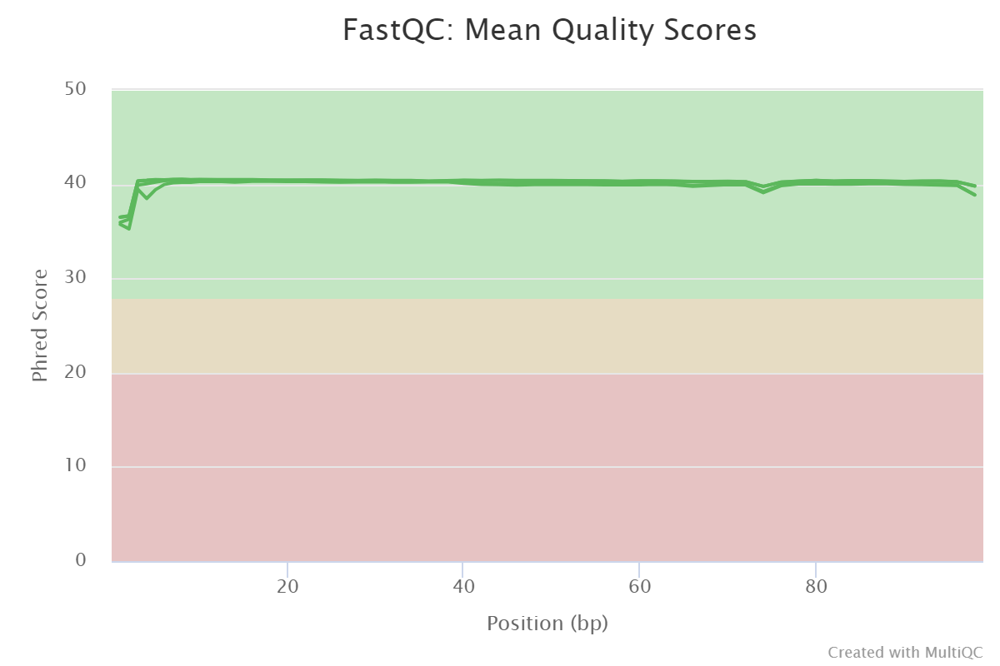
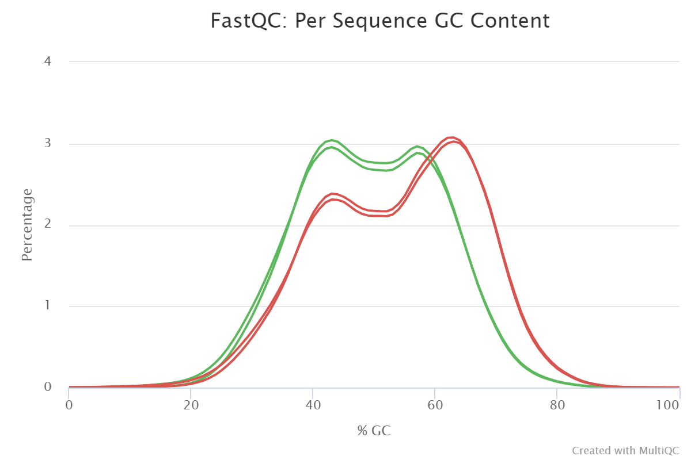
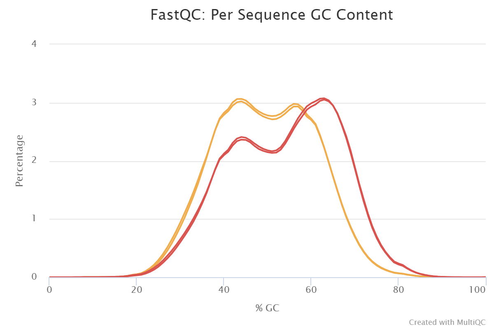
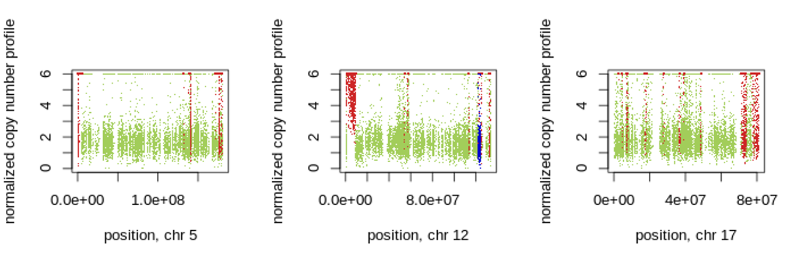
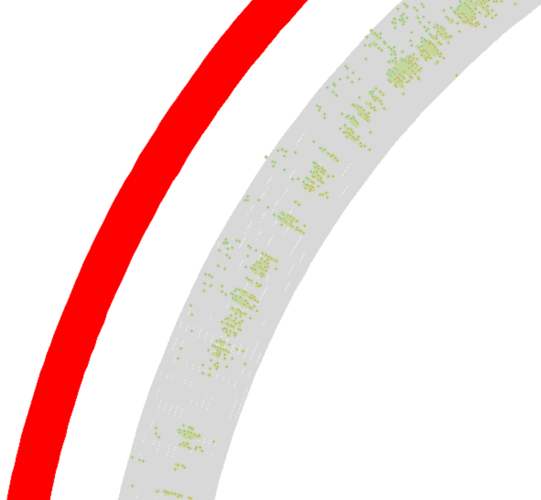

# Introduction


Human Copy Number Variations (hCNVs) are the result of structural genomic rearrangements that result in the duplication or deletion of DNA segments. These changes contribute significantly to human genetic variability, diseases, and somatic genome variations in cancer and other diseases . hCNVs can be routinely investigated by genomic hybridisation and sequencing technologies
. There is a range of software tools that can be used to identify and quantify hCNVs. Unfortunately, locating hCNVs is still a challenge in standardising formats for data representation and exchange. Furthermore, the sensitivity, specificity, reproducibility, and reusability of hCNV detection and analysis research software varies. As a result, there is a need for the adoption of community-developed standards for data discovery and exchange. To address that ELIXIR developed  protocol and  standards, as well as mechanisms for annotating, benchmarking, creating reproducible and sharable tools and workflows, such as , Galaxy, and , and, most importantly, accessible training resources and infrastructure.

 This tutorial is a modification of a Galaxy Training Network tutorial [Somatic variant calling]() tutorial to provide training on how to preprocess, identify and visualise hCNV regions using Control-FreeC tool using tumor/normal samples pairs.


> <agenda-title></agenda-title>
>
> In this tutorial, we will cover:
>
> 1. TOC
> {:toc}
>
{: .agenda}

# Data Preparation
First, start with uploading and preparing the input data to analyze. The sequencing reads used in this analysis are from real-world data from a cancer patient’s tumor and normal tissue samples. For the sake of an acceptable speed of the analysis, the original data has been downsampled though to include only the reads from human chromosomes 5, 12 and 17.

| Name | Format | Origin | Encoding | Sequence length | Total Sequences | Chromosome  | Data size (MB) |
| ---- | -----| -------| ------  | -------- | --------------- | -------------- | ------------ |
| SLGFSK-N_231335_r1_chr5_12_17 | fastq | Normal tissue | Sanger / Illumina 1.9 | 101 |10602766 | 5, 12 and 7 | 530.4 MB |
| SLGFSK-N_231335_r2_chr5_12_17 | fastq | Normal tissue | Sanger / Illumina 1.9 | 101 | 10602766 | 5, 12 and 7 | 582.0 MB |
| SLGFSK-T_231336_r1_chr5_12_17 | fastq | Cancer tissue | Sanger / Illumina 1.9 | 101 |16293448 | 5, 12 and 7 | 811.3 MB |
| SLGFSK-T_231336_r2_chr5_12_17 | fastq  | Cancer tissue | Sanger / Illumina 1.9 | 101 |16293448 | 5, 12 and 7 | 868.7 MB |

## Get data

> <hands-on-title>Data upload</hands-on-title>
>
> 1. For this tutorial, make a new history.
>
>    
>    
>
> 2. Import the data files from
>    [Zenodo](https://zenodo.org/record/2582555):
>
>    ```
>    https://zenodo.org/record/2582555/files/SLGFSK-N_231335_r1_chr5_12_17.fastq.gz
>    https://zenodo.org/record/2582555/files/SLGFSK-N_231335_r2_chr5_12_17.fastq.gz
>    https://zenodo.org/record/2582555/files/SLGFSK-T_231336_r1_chr5_12_17.fastq.gz
>    https://zenodo.org/record/2582555/files/SLGFSK-T_231336_r2_chr5_12_17.fastq.gz
>    ```
>   This will download four sequenced files ordered as: 
>   The first two files are for the forward and the reverse reads for the sample **normal**
>   tissue sequence.
>   The other two belong to the **tumor** reads.
> 
>    In some cases the same dataset can be found in the Galaxy shared data library. 
>    Ask the instructor for more details about this.
>
>    The dat aset can also be downloaded a local storage.  
>
>    
>
>    
>
> 3. Make sure to upload the sequences in fastaq format. Look at the history and
>    check if the created datasets have their data types assigned correctly with two reads for
>    the tumor tissues and two reads for the normal tissues. If not, fix any
>    missing or wrong data type assignments.
>
>    
>
> 4. Give the data meaningful names and tags to facilitate analysis.
>     
>
>    When uploading data from a link, Galaxy names the files after the link address.
>    It might be useful to change or modify the name to something more meaningful.
>
>    
>
>
> 5. This tutorial has a set of shared steps performed on the data. To track the
>    data in the history, it is recommended to tag the datasets by attaching a meaningful tag '#'
>    to them. The tagging will automatically be attached to any file generated
>    from the original tagged dataset.
>    *e.g.*, `#normal` for normal tissue datasets (with `-N_` in the name) and
>    *e.g.*, `#tumor` for tumor dataset (with `-T_` in the name).
>
>
>    
>
>
{: .hands_on}

# Quality control and mapping of NGS reads
The data was obtained following a series of laboratory procedures, including DNA preparation, extraction, and sequencing, which means there is a possibility of errors occurring during those steps, which could affect data quality. To address that, it is necessary to test the quality of the fastq reads. The data quality needs to be within an acceptable range before looking for hCNVs. The low-quality data can lead us to false results. To detect low-quality data,  preprocessing step is required to trim or discard the low-quality reads before proceeding with the mapping and hCNV detection steps.

> <comment-title>More on quality control and mapping</comment-title>
>  To read more about quality control this is tutorial on Galaxy training network 
> [ Quality Control]() 
> For mapping [Mapping]()
{: .comment}


## Quality Control
> <hands-on-title>Quality control of the input datasets</hands-on-title>
> 1. Run  on the fastq datasets
>       -  *"Short read data from the current history"*: all 4 FASTQ  datasets selected with **Multiple datasets**
>
>    
>
>    This job will generate eight new datasets to the history. To
>    parse the quality results view the html report of each dataset.
>
>    For the next step use the raw data fidings from FastQC.
>
> 2. Use  to aggregate the raw **FastQC** data of all four input datasets into one report
>      - In *"Results"*
>        - *"Which tool was used generate logs?"*: `FastQC`
>        - In *"FastQC output"*
>           - *"Type of FastQC output?"*: `Raw data`
>           -  *"FastQC output"*: all four *RawData*
>             outputs of **FastQC** )
>
> 3. Inspect the *Webpage* output produced by the tool
>
>    > <question-title></question-title>
>    >
>    > 1. 1. How do you feel about the sequence's overall quality? 
>    > 
>    > 
>    >
>    > > <solution-title></solution-title>
>    > >
>    > > 1. The forwards and reversed reads show good 
>    > >    quality, , with no major issues discovered
>    > >    discovered during the preparation process..
>    > >
>    > > 2. TThe GC content plots for the samples' forward and reverse reads 
>    > >    show an unusual bimodal distribution.
>    > >
>    > >    The unnormal distribution of the GC content of reads from a sample is 
>    > >    usually interpreted as a sign of possible contamination.
>    > >    However, we are dealing with sequencing data from captured exomes,
>    > >    which means that the reads do not represent random sequences from a  genome.
>    > >    They rather represent an arbitrary selection. Indeed, the samples were 
>    > >    prepared using Agilent's SureSelect V5 technology for exome enrichment, 
>    > >    and bimodal GC content distributions have been identified as a hallmark 
>    > >    of that capture method
>    > >    for example, see Fig. 4C in
>    > >    .
>    > >
>    > {: .solution}
>    {: .question}
{: .hands_on}

## Read trimming and filtering
As previously demonstrated, The data have relatively high-quality sequenced reads.
However, the aim is to detect clear reads for hCNVs and will use a trimming step to see if the analysis can be improved.


> <hands-on-title>Read trimming and filtering of the normal tissue reads</hands-on-title>
> 1. Run  to trim and filter the normal tissue reads
>    - *"Single-end or paired-end reads?"*: `Paired-end (two separate
>      input files)`
>      
>      This makes the tool treat the forward and reverse reads simultaneously.
>
>      -  *"Input FASTQ file (R1/first of pair)"*: the
>        forward reads (r1) dataset of the normal tissue sample
>      -  *"Input FASTQ file (R2/second of pair)"*: the
>        reverse reads (r2) dataset of the normal tissue sample
>
>    - *"Perform initial ILLUMINACLIP step?"*: `Yes`
>       - *"Select standard adapter sequences or provide custom?"*: `Standard`
>          - *"Adapter sequences to use"*: `TruSeq3 (paired-ended, for MiSeq and HiSeq)`
>       - *"Maximum mismatch count which will still allow a full match to be
>        performed"*: `2`
>       - *"How accurate the match between the two 'adapter ligated' reads must
>        be for PE palindrome read alignment"*: `30`
>       - *"How accurate the match between any adapter etc. sequence must be
>        against a read"*: `10`
>       - *"Minimum length of adapter that needs to be detected (PE specific/
>        palindrome mode)"*: `8`
>       - *"Always keep both reads (PE specific/palindrome mode)?"*: `Yes`
>
>       These parameters are used to cut ILLUMINA-specific adapter sequences
>       from the reads.
>
>    - In *"Trimmomatic Operation"*
>       - In *"1: Trimmomatic Operation"*
>           -  *"Select Trimmomatic operation to perform"*: `Cut the specified number
>       of bases from the start of the read (HEADCROP)`
>              - *"Number of bases to remove from the start of the read"*: `3`
>       -  "Insert Trimmomatic Operation"*
>       - In *"2: Trimmomatic Operation"*
>           -  *"Select Trimmomatic operation to perform"*: `Cut bases off the end of
>       a read, if below a threshold quality (TRAILING)`
>              - *"Minimum quality required to keep a base"*: `10`
>       -  "Insert Trimmomatic Operation"*
>       - In *"3: Trimmomatic Operation"*
>           - *"Select Trimmomatic operation to perform"*: `Drop reads below a
>       specified length (MINLEN)`
>              - *"Minimum quality required to keep a base"*: `25`
>
>    
{: .hands_on}

This step will creates four files in the history. The sizes of those two files vary depending on the original data quality and trimming intensity. The first two files are for mated forward and reverse reads, respectively.
The other two are for unmated reads as a result of excessive trimming.
However, because of the high average data quality, there was no need to perform excessive trimming by selecting the previous three trimming conditions, so those files should be empty. Those files can be heden to keep the history cleaner.

> <details-title>Keeping attention on the data type</details-title>
> Track whether the reads are paired or unpaired, and remember to include them in any tool to be used.
> The reason is that there are some tools, such as read mappers,
> that expect reads to be in a specific order and having unmapped reads can result in significant.
{: .details}

> <hands-on-title>Read trimming and filtering of the tumor tissue reads</hands-on-title>
> 2. repeat the previous step for **tumor tissue** reads following the same steps as above.
{: .hands_on}

> <hands-on-title>Exercise: Quality control of the polished datasets</hands-on-title>
> Use  and  like before,
> but using the four trimmed datasets produced by Trimmomatic as input.
>
>    > <question-title></question-title>
>    >
>    > Is there any difference between the reads before and after the trimming?
>    > , calls of reasonable quality (orange), and calls of poor quality (red).")
>    > 
>    >
>    > > <solution-title></solution-title>
>    > >
>    > > The quality of the data is good, so 
>    > > trimming them didn't lead to dramatic changes. However,
>    > > we can point out that some of the adapters were removed.  
>    > {: .solution}
>    {: .question}
{: .hands_on}

## Read Mapping

> <hands-on-title>Read Mapping</hands-on-title>
> 1. Use  to map the reads from the **normal tissue** sample to the reference genome
>    - *"Will you select a reference genome from your history or use a built-in index?"*: `Use a built-in genome index`
>        - *"Using reference genome"*: `Human: hg19` (or a similarly named option)
>
>      > <comment-title>Using the imported `hg19` sequence</comment-title>
>      > If you have imported the `hg19` sequence as a fasta dataset into your
>      > history instead:
>      >   - *"Will you select a reference genome from your history or use a
>      >     built-in index?"*: `Use a genome from history and build index`
>      >      -  *"Use the following dataset as the reference sequence"*: your imported `hg19` fasta dataset.
>      {: .comment}
>
>    - *"Single or Paired-end reads"*: `Paired`
>       -  *"Select first set of reads"*: the trimmed
>         forward reads (r1) dataset of the **normal tissue** sample; output of
>         **Trimmomatic** 
>       -  *"Select second set of reads"*: the trimmed
>         reverse reads (r2) dataset of the **normal tissue** sample; output of
>         **Trimmomatic** 
>    - *"Set read groups information?"*: `Set read groups (SAM/BAM specification)`
>      - *"Auto-assign"*: `No`
>        - *"Read group identifier (ID)"*: `Not available.`
>      - *"Auto-assign"*: `No`
>        - *"Read group sample name (SM)"*: `Not available.`
>      - *"Platform/technology used to produce the reads (PL)"*: `ILLUNINA`
>      - *"Select analysis mode"*: `Simple illumina mode`
>
>    > <comment-title>More on read group identifiers and sample names</comment-title>
>    > In general, we can choose our own ID and SM values, but the ID should
>    > unambiguously identify the sequencing run that produced the reads,
>    > while the SM value should identify the biological sample.
>    {: .comment}
>
> 2. Use  to map the reads from the **tumor tissue** sample
>    - *"Will you select a reference genome from your history or use a built-in index?"*: `Use a built-in genome index`
>        - *"Using reference genome"*: `Human: hg19` (or a similarly named option)
>
>      Adjust these settings as before in case of using imported reference
>      genome.
>    - *"Single or Paired-end reads"*: `Paired`
>       -  *"Select first set of reads"*: the trimmed
>         forward reads (r1) dataset of the **tumor tissue** sample; output of
>         **Trimmomatic** 
>       -  *"Select second set of reads"*: the reverse
>         reads (r2) dataset of the **tumor tissue** sample; output of
>         **Trimmomatic** 
>    - *"Set read groups information?"*: `Set read groups (SAM/BAM specification)`
>      - *"Auto-assign"*: `No`
>        - *"Read group identifier (ID)"*: `Not available.`
>      - *"Auto-assign"*: `No`
>        - *"Read group sample name (SM)"*: `Not available.`
>      - *"Platform/technology used to produce the reads (PL)"*: `ILLUNINA`
>      - *"Select analysis mode"*: `Simple illumina mode`
 {: .hands_on}

 > Name the created list as **Mapping-lsit**


# Copy Number Variation detection (hCNV).

After the mapping step, the data are ready to the hCNV detection step. This tutorial focuses on the **Control-FreeC** tool as a method for hCNV identification:

- Identifies variant alleles in tumor/normal pair samples.
- Visualize the hCNV using the Circos tool.

## Mapped reads filtering

The remaining data preprocessing until the Control-FreeC step is the same for Normal and Tumor reads.  Create a data collection to include those two files.

> <hands-on-title>Filtrate the mapped reads</hands-on-title>
> 1. Use  to creat a list from the maped reads of the **normal tissue** and **tumor tissue**
>    -   *"Dataset"*: `Insert dataset`
>       - *"Input dataset"*: `The output of map with BWA-MEM for normal tissue`
>    -   *"Dataset"*: `Insert dataset`
>       - *"Input dataset"*: `The output of map with BWA-MEM for cancer tissue`
> 2. Run   with the following parameters
>   -  *"Characters to insert"*: `normal reads`
>   -  *"Specify the number of iterations by"*: `User defined number`
>   -  *"How many times?"*: `1`
>   -   "Insert selection"*
>      -  *"Characters to insert"*: `tumor reads`
>      -  *"Specify the number of iterations by"*: `User defined number`
>      -  *"How many times?"*: `1`
>   - This will create a text file with only two lines normal reads and tumor reads
>
> 3. Run   with the following parameters
>   -  *"Input Collection"*: the creat a list from `Build lsit tool`.
>   - *"How should the new labels be specified?"*: `Using lines in a simple text file.`
>   -  *"New Identifiers"*: The outcom from `Create txt file tool`
>   -  *"Ensure strict mapping"*: `False`
>
>   - Make sure to use the same files order for the both of **Build list** tool and **Creat text file**.   
{: .hands_on}

It is essential to filtrate the reads before the mapping step.
It is also required to filtrate the reads after. The preprocessing step
works by filtrating the mapped reads by removing the low-quality regions
and the duplicated reads. This step is needed to reduce the running time
and in results interpretation.

> <hands-on-title>Data filtration and Remove duplicates</hands-on-title>
> 1. Run   with the following parameters
>   -  *"SAM/BAM/CRAM dataset"*: The outpot of  `Relabel identifiers` dataset cpllection.
>   -  *"What would you like to look at?"*: `A filtered/subsampled selection of reads`
>   -  In*"Configure filters:"*:
>        - In *"1: Configure filters:"*
>          -  *"Filter by quality"*: `1`
>        - In *"2: Configure filters:"*
>          -  *"Exclude reads with any of the following flags set"*: `Read is unmapped` `Mate  is unmapped`
>   -  *Produce extra dataset with dropped reads?"*: `False`
>   -  *"Output format"*: `BAM (-b)`
>   -  *"Reference data"*: `No`
>
>    
>
> 2. Run   with the following parameters
>   -  *"BAM File"*:  The outpot of  `Samtools view`
>   - *"Is this paired-end or single end data"*: `BAM is paired-end`
>   - *"Treat as single-end"*: `False`
{: .hands_on}


## Homogenize mapped reads

To detect hCNVs expression accurately. The reads must go through the lift alignment process. Lift Alignment works by shifting reads that contain indels to the left of a reference genome until they can not be shifted anymore. As a result, it will only extract reads with indels, with no false reads (reads that mismatch with the reference genome other than the indels).


> <hands-on-title>Homogenize the positional distributed indels</hands-on-title>
> 1. Run   with the following parameters
>   -  *"Choose the source for the reference genome"*: `Locally cached `
>   -   *"Select alignment file in BAM format"*: The outpot of  `tool RmDup`.
>   -  *"Using reference genome"*: `hg19`
>   -  *"Maximum number of iterations"*: `5`
>
> 2. Run   with the following parameters
>   -   *"BAM file to recalculate"*: The outpot of  `BamLeftAlign`.
>   -  *"Choose the source for the reference genome"*: `Use a built-in genome`
>   -  *"Using reference genome"*: `hg19`
>   -  *"Do you also want BAQ (Base Alignment Quality) scores to be calculated?"*: `No`
>   -  *"Additional options"*: `Advanced options`
>   -  *"Change identical bases to '='"*: `False`
>   -  *"Coefficient to cap mapping quality of poorly mapped reads"*: `50`
{: .hands_on}


After the Homogenizing step, it is now to extract the reads which hold indels from the mapped reads.

## Filtrate indels

> <hands-on-title>Filtrate the indels reads</hands-on-title>
> 1. Run   with the following parameters
>   -   *"BAM file to recalculate"*: The outpot of  `Samtools CalMD`.
>   -  *"What would you like to look at?"*: `Just the input header (-H)`
>   -  *"What would you like to have reported?"*: `The header in ...`
>   -  *"Output format"*: `SAM`
>   -  *"Reference data"*: `No, see help (-output-fmt-option no_ref)`  
> 2. Run   with the following parameters
>   -   *"Select lines from"*: The outpot of  `Samtools view`.
>   -  *"that"*: `Matching`
>   -  *"the pattern"*: `^@SQ\tSN:(chr[0-9]+|chrM|chrX|chrY)\tLN:[0-9]+`
>   -  *"Keep header line"*: `False`
>
> 3. Run   with the following parameters
>   -   *"Select lines from"*: The outpot of  `Select`.
>   -  In *"Replacements:"*:
>       - In *"1: Replacements:"*
>          -  *"Find pattern"*: `^@SQ\tSN:(chr[0-9]+|chrM|chrX|chrY)\tLN:([0-9]+)`
>       - In *"2: Replacements:"*
>          -  *"Replace with:"*: `\1\t0\t\2`
>
>    This step will generate a data collection folder with two files inside. Change the datatype for the files inside it into **BED format**.  
>
>    
>
> 4. Run   with the following parameters
>   -  *"SAM/BAM/CRAM data set"*: The outpot of  `CalMD`.
>   -  *"What would you like to look at?"*: `A filtered/subsampled selection of reads`
>   -  In*"Configure filters:"*:
>       - In *"1: Configure filters:"*
>         -  *"Filter by quality"*: `255`
>   -  *What would you like to have reported?"*: `Reads dropped during filtering and subsampling`
>   -  *Produce extra dataset with dropped reads?"*: `False`
>   -  *"Output format"*: `BAM (-b)`
>   -  *"Reference data"*: `No`
>
>
> 5. Run   with the following parameters
>   -  *"SAM/BAM/CRAM data set"*: The outpot of  `Samtools view`.
>   -  *"What would you like to look at?"*: `A filtered/subsampled selection of reads`
>   -  In*"Configure filters:"*:
>       - In *"1: Configure filters:"*
>         -  *"Filter by regions:"*: `Regions from BED file`
>       - In *"2: Configure filters:"*
>         -   *"Filter by intervals in a bed file:"*: The outpot of  ` Replace Text` BED format.
>       - In *"3: Configure filters:"*
>         -  *"Filter by readgroup"*: `NO`
>       - In *"4: Configure filters:"*
>         -  *"Filter by quality"*: `1`
>   -  *Produce extra dataset with dropped reads?"*: `False`
>   -  *"Output format"*: `BAM (-b)`
>   -  *"Reference data"*:`No`
{: .hands_on}

> <hands-on-title>Extract files form list</hands-on-title>
> extract the files from the list to handel them separitly
> 1. Run   with the following parameters:
>   -   *"Input List"*: `The outpot of Samtools view`.
>   -  *"How should a dataset be selected?"*: `Select by element identifier`
>   -  *"Element identifier:"*: `tumor reads`
>
> 2. Run   with the following parameters:
>   -   *"Input List"*: The outpot of  `Samtools view`.
>   -  *"How should a dataset be selected?"*: `Select by element identifier`
>   -  *"Element identifier:"*: `normal reads`
{: .hands_on}


## Control_FREEC for hCNV detection  
The data are now ready to detect hCNV. Control-FREEC detects copy-number alterations and allelic imbalances (including loss of heterozygosity; LOH) by automatically computing, normalising, and segmenting copy number profile and beta allele frequency (BAF) profile, and then calling copy number alterations and LOH. Control-FREEC differentiates between somatic and germline variants. Based on those profiles. The control reads display the gene status for each segment.


> <comment-title>More on control_FREEC and hCNVs detection</comment-title>
> Control-freec works by: 
> 1. Annotating genomic changes and heterozygosity loss in the sample dataset.
> 2. Distinguishes between germline and somatic variants by creating copy number profile and BAF profile.
> 3. Employs the information in those profiles to detect copy number changes in sample reads.
>
{: .comment}


> <question-title></question-title>
> Can you expect the essential factors that afflict hCNVs detection?
>
> > <solution-title></solution-title>
> >
> > 1. Coverage bias in reads 
> > Changes in reading mobility and GC content may favour the duplication of specific reads over others.
> > 2. Bias in reading alignment
> > Because normal cells have higher read coverage than allelic reads during alignment, they may be classified as noise findings.
> > 3. Normal cell contamination 
> > The presence of normal cells within tumour cells can have an impact on the construction of a tumour genome's copy number profile.
> {: .solution}
{: .question}


> <hands-on-title>Detection of copy-number changes</hands-on-title>
> 1. Import the DED file for the captured reagions from [Zenodo](https://doi.org/10.5281/zenodo.5697358):
>
>    ```
>    https://zenodo.org/record/5697358/files/capture_targets_chr5_12_17.bed
>    ```
>
 > 2. Run   with the following parameters
>   -  *"Select the sequencing method of the input file(s)?"*: `whole-exome sequencing (WES)`
>   -   *"Sample file"*: The outpot of  `Extract Dataset` (**cancer reads**)
>   -   *"Control file"*: The outpot of  `Extract Dataset` (**normal reads**)
>   -   *"BED file with capture regions"*: `chr 5, 7, 12 capture reagions **Input file**` 
>   -  *"Format of reads"*: `Illumina paired-end (FR)`
>
>   -  In*"Advanced WES settings:"*:
>      - In *"1: Advanced WES settings:"*
>         -  *"Degree of polynomial:"*: `control-read-count-based normalization, WES (1)`
>      - In *"2:Advanced WES settings:"*
>         -  *"Read Count (RC) correction for GC-content bias and low mappability:"*: `normalize the sample and the control RC using GC-content and then calculate the ratio "Sample RC/contol RC" (1)`
>      - In *"3: Advanced WES settings:"*
>         -  *"Minimal number of consecutive windows to call a CNA"*: `WES (3)`
>      - In *"4: Advanced WES settings:"*
>         -  *"Segmentation of normalized profiles (break point)"*: `1.2`
>      - In *"5: Advanced WES settings:"*
>         -  *"Desired behavior in the ambiguous regions"-1" "*: `make a separate fragment of this "unknown" region and do not assign any copy number to this region at all (4)`
>      - In *"6: Advanced WES settings:"*
>         -  *"Adjust sample contamination?"*: `True`
>      - In *"7: Advanced WES settings:"*
>         -  *"Sample contamination by normal cells"*: `0.30000000000000004`
>      - In *"8: Advanced WES settings:"*
>         -  *"Intercept of polynomial"*: `with GC-content (1)`
>      - In *"9: Advanced WES settings:"*
>         -  *"Sample sex"*: `XX`
>
>   -  *"Choose the source for the reference genome"*: `Locally cached`
>   -  *"Reference genome"*: `hg19`
>   -  In*"Outputs:"*:
>       - In *"1: Outputs:"*
>         -  *"BedGraph Output for UCSC genome browser"*: `False`
>       - In *"2 :Outputs:"*
>         -  *"Visualize normalized copy number profile with predicted CNAs"*: `True`
>       - In *"3: Outputs:"*
>         -  *"2D data track file for Circos"*: `True`
>
> > <question-title></question-title>
> >
> > In your opinion, what are the challenges in hCNVs detection?
> > > <solution-title></solution-title>
> > >
> > > 1. The bias in Reads coverage changes in reads mobility and GC content can lead to 
> > > favouring the duplication of specific reads over others.
> > > 2. The bias in reads alignment. 
> > > Normal cells' reads coverage is higher than the allelic reads, for 
> > > that the allelic reads some times expressed as noise findings
> > > 3. Contamination with normal cells 
> > > The availability of normal cells within tumor cells can
> > > effect on the construction of the copy number profile of a 
> > > tumor genome
> > {: .solution}
> {: .question}
{: .hands_on}


## Visualise detected hCNVs

Cicros demonstrates the relationship and the positions of different objects with an appealing,
high quality and illustrative multilayers circular plot. Circos gives the user flexibility to
present the link between their data at a high rate by providing the ability to control the features 
and elements in creating the plot. Circos visualise the genomic alterations in genome structure and 
the relationships between the genomic intervals [Krzywinski, Schein et al. 2009](https://genome.cshlp.org/content/19/9/1639.short).

> <hands-on-title>Visualise the hCNV findings</hands-on-title>
> 1. Run   with the following parameters
>   -  *"Reference Genome Source"*: `Custom Karyotype`
>   -   *"Sample file"*: The outpot of  `Output dataset out_chr_sorted_circos from control freec`
>
>   -  In*"Ideogram:"*:
>       - In *"1: Ideogram:"*
>         -  *Spacing Between Ideograms (in chromosome units)"*: `3.0`
>       - In *"2: Ideogram:"*
>         -  *"Radius"*: `0.8`
>       - In *"3: Ideogram:"*
>         -  *"Thickness"*: `45.0`
>       - In *"4: Ideogram:"*
>         -  In*"Labels:"*:
>             -  In*"1: Labels:"*
>                 -  *"Radius"*: `0.01`
>             -  In*"2: Labels:"*
>                 -  *"Label Font Size"*: `40`
>       - In *"5: Ideogram:"*
>         -  In*"Cytogenic Bands:"*:
>             -  In*"1: Cytogenic Bands:"*
>                 -  *"Band Stroke Color"*: `Black`
>   -  In*"2D Data Tracks:"*:
>      -   "Insert 2D Data Plot"*
>         -  In*"2D Data Plots:"*:
>            - In *"1: 2D Data Plots:"*
>              -  *"Outside Radius"*: `0.95`
>            - In *"2: 2D Data Plots:"*
>              -  *"Plot Type"*: `Scatter`
>            - In *"3: 2D Data Plots:"*
>              -   *"Scatter Plot Data Source"*: `Output dataset 'out_ratio_log2_circos' from Control-FreeC`
>            - In *"4: 2D Data Plots:"*
>              -  In*"Plot Format Specific Options:"*:
>                 - In *"1: Plot Format Specific Options:"*
>                   -  *"Glyph"*: `Circle`
>                 - In *"2: Plot Format Specific Options:"*
>                   -  *"Glyph Size"*: `4`
>                 - In *"3: Plot Format Specific Options:"*
>                   -  *"Fill Color"*: `Gray`
>                 - In *"4: Plot Format Specific Options:"*
>                   -  *"Stroke Color"*: `Black`
>                 - In *"5: Plot Format Specific Options:"*
>                   -  *"Stroke Thickness"*: `0`  
>         - In *"5: 2D Data Plots:"*
>           -  In*"Rules:"*:
>               - In *"1: Rules:"*
>                 -   *"Insert Rule"*:
>                    -  In*"Rule 1"*
>                       - In *"1: Rule 1"*
>                         -   *"Insert Conditions to Apply"*
>                            -  In*" Conditions to Applies"*
>                               - In *"1: Conditions to Applies"*
>                                  -  *"Condition"*: `Based on value (ONLY for scatter/histogram/heatmap/line)`
>                               - In *"2: Conditions to Applies"*
>                                  -  *"Points above this value"*: `0.0`
>                       - In *"2: Rule 1"*
>                          -   *"Insert Actions to Apply"*
>                             -  In*"Actions to Applies"*
>                                - In *"1: Actions to Applies"*
>                                   -  *"Action"*: `Change Fill Color for all points`
>                                - In *"2: Actions to Applies"*
>                                   -  *"Fill Color"*: `Red`
>                       - In *"3: Rule 1"*
>                         -  *"Continue flow"*: `False`
>               - In *"2: Rules:"*
>                  -   *"Insert Rule"*:
>                     -  In*"Rule 2"*
>                        - In *"1: Rule 2"*
>                           -   *"Insert Conditions to Apply"*:
>                              -  In*" Conditions to Applies"*
>                                 - In *"1: Conditions to Applies"*
>                                    -  *"Condition"*: `Based on value (ONLY for scatter/histogram/heatmap/line)`
>                                 - In *"2: Conditions to Applies"*
>                                    -  *"Points below this value"*: `0.0`
>                        - In *"2: Rule 2"*
>                           -   *"Insert Actions to ApplyInsert Actions to Apply"*:
>                              -  In*"Actions to Applies"*
>                                 - In *"1: Actions to Applies"*
>                                    -  *"Action"*: `Change Fill Color for all points`
>                                 - In *"2: Actions to Applies"*
>                                    -  *"Fill Color"*: `Blue`
>                      - In *"3: Rule 2"*
>                        -  *"Continue flow"*: `False`
>            - In *"6: 2D Data Plots:"*
>                -  In*"Axes:"*:
>                   -  In “1: Axes:”
>                      -   *"Insert Conditions to Apply"*
>                        -  In*"Axis 1:"*:
>                           - In *"1: Axis 1"*
>                              -  *"Radial Position"*: `Absolute position (values match data values)`
>                           - In *"2: Axis 2"*
>                             -  *"Spacing"*: `1.0`
>                           - In *"3: Axis 1"*
>                             -  *"y0"*: `-4.0`
>                           - In *"4: Axis 1"*
>                             -  *"y1"*: `4.0`
>                           - In *"5: Axis 1"*
>                             -  *"Color"*: `Gray`
>                           - In *"6: Axis 1"*
>                             -  *"Color Transparency"*: `1.0`
>                           - In *"7: Axis 1"*
>                             -  *"Thickness"*: `2`
>                   -  In “2: Axes:”
>                      - *"When to show"*: `Always`
>   -  In*"Limits:"*:
>       - In *"1: Limits:"*
>         -  *"Maximum number of links to draw"*: `2500000`
>       - In *"2: Limits:"*
>         -  *"Maximum number of points per track"*: `2500000`
{: .hands_on}

> <question-title></question-title>
> Can you interpret generated plot from the Circos tool?
> 
> 
> > <solution-title></solution-title>
> > The outermost circle represents the targeted chromosomes. 
> > The inner circle
> > shows the copy number changes in those regions.
> >
> > The inner circle has two parts. The deletion-related variations are the red dots directed to the centre 
> > (below the centre line), while the amplificated variations are the green dots pointed out of the center (toward chromosomes).
> {: .solution}
{: .question}

# Conclusion

In this tutorial, we introduced Contol-FreeC as an alternative tool for detecting hCNVs and highlighted the steps for preparing reads and analysis.
