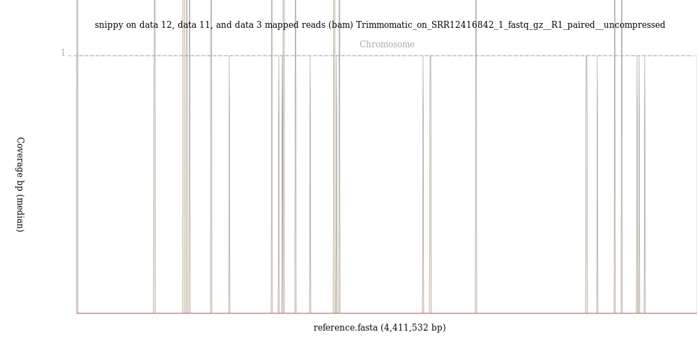
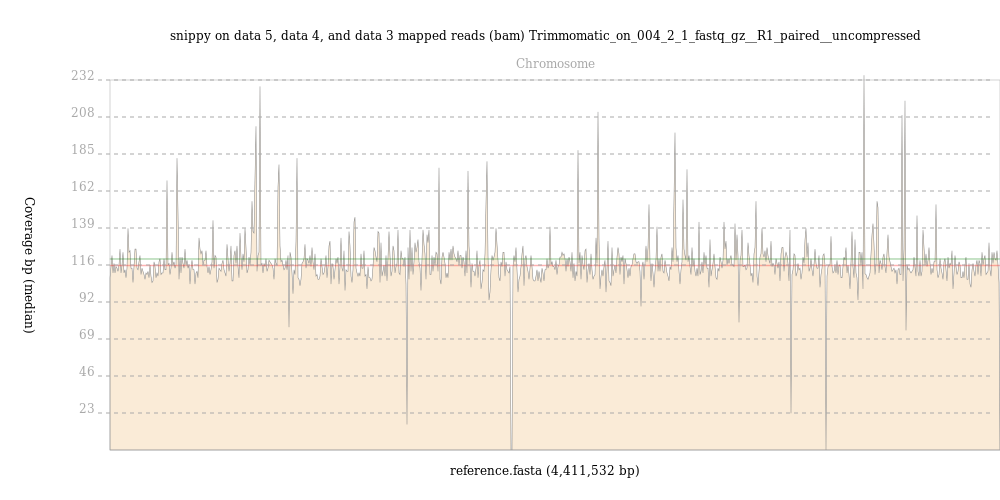

# Introduction


Tuberculosis (TB) is an infectious disease caused by the bacterium *Mycobacterium tuberculosis*. According to the [WHO](https://www.who.int/tb/publications/global_report/en/), in 2018 there were 10.0 million new cases of TB worldwide and 1.4 million deaths due to the disease, making TB the world's most deadly infectious disease. The [publication](https://www.ncbi.nlm.nih.gov/pubmed/9634230) of the genome of *M. tuberculosis H37Rv* in 1998 gave researchers a powerful new tool in understanding this pathogen. This genome has been revised since then, with the latest version being available
as RefSeq entry [NC_000962.3](https://www.ncbi.nlm.nih.gov/nuccore/NC_000962.3/). The genome comprises a single circular chromosome of some 4.4 megabases. The H37Rv strain that the genome was sequenced from is a long-preserved laboratory strain, originally [isolated](https://www.ncbi.nlm.nih.gov/pmc/articles/PMC2132400) from a patient in 1905 and [named](https://journals.sagepub.com/doi/abs/10.3181/00379727-33-8330P) as H37Rv in 1935. It is notably different in some genomic [regions](https://www.sciencedirect.com/science/article/pii/S0888754317300617?via%3Dihub) from some modern clinical strains but remains the standard reference sequence for *M. tuberculosis* (Mtb). In a larger context *M. tuberculosis* is a prominent member of the Mycobacterium Tuberculosis Complex (MTBC).

This group of related species comprises of the [8](https://www.nature.com/articles/s41467-020-16626-6) [lineages](https://www.ncbi.nlm.nih.gov/pubmed/29456241) of human-infecting *M. tuberculosis* as well as predominantly animal-infecting species such as *M. bovis* and *M. pinnipedii*. Two other close relatives of Mtb, *M. leprae* and *M. lepromatosis* circulate between humans, causing the disease leprosy. Finally amongst the Mycobacteria there are several other species that live in the environment and can cause human disease. These are the [Nontuberculous Mycobacteria](https://www.ncbi.nlm.nih.gov/pubmed/28345639).

Variation in the genome of *M. tuberculosis* (Mtb) is associated with changes in phenotype, for example [drug resistance](https://genomemedicine.biomedcentral.com/articles/10.1186/s13073-019-0660-8) and virulence. It is also useful for [outbreak investigation](https://www.frontiersin.org/articles/10.3389/fpubh.2019.00087/full) as the single nucleotide polymorphisms (SNPs) in a sample can be used to build a phylogeny.

This tutorial will focus on identifying genomic variation in Mtb and using that to explore drug resistance and other aspects of the bacteria.

# Get your data

The data for today is a sample of *M. tuberculosis* [collected](https://www.ncbi.nlm.nih.gov/bioproject/PRJEB18529) from a [southern African patient](https://bmcmedicine.biomedcentral.com/articles/10.1186/s12916-017-0834-4). In addition to the bacterial sequence sample we will work with a Genbank format version of the genome of the [inferred](https://www.nature.com/articles/ng.590) most recent common [ancestor](https://zenodo.org/record/3497110) of the M. tuberculosis complex which is combined with the annotation of the H37Rv reference sequence. This ancestral genome only differs from the H37Rv version 3 genome ([NC_000962.3](https://www.ncbi.nlm.nih.gov/nuccore/NC_000962.3)) by the insertion of SNPs to try and model the ancestor of all lineages of Mtb.

> <hands-on-title>Get the data</hands-on-title>
>
> 1.  the following files from [Zenodo](https://doi.org/10.5281/zenodo.3960260) or from the shared data library
>```
>https://zenodo.org/record/3960260/files/004-2_1.fastq.gz
>https://zenodo.org/record/3960260/files/004-2_2.fastq.gz
>https://zenodo.org/record/3960260/files/Mycobacterium_tuberculosis_ancestral_reference.gbk
>https://zenodo.org/record/3960260/files/Mycobacterium_tuberculosis_h37rv.ASM19595v2.45.chromosome.Chromosome.gff3
>```
>
>    
>    
>
{: .hands_on}

# Quality control

This step serves the purpose of identifying possible issues with the raw
sequenced reads input data before embarking on any "real" analysis steps.

Some of the typical problems with NGS data can be mitigated by preprocessing
affected sequencing reads before trying to map them to the reference genome.
Detecting some other, more severe problems early on may at least save you a lot
of time spent on analyzing low-quality data that is not worth the effort.

Here, we will perform a standard quality check on our input data and only point
out a few interesting aspects about that data. For a more thorough explanation
of NGS data quality control, you may want to have a look at the dedicated
tutorial on ["Quality control"]().

> <hands-on-title>Quality control of the input datasets</hands-on-title>
>
> 1. Execute   on both of your fastq datasets
>
>       -  *"Short read data from your current history"*: select both FASTQ datasets.
>
>    
>
>    The **FastQC**  input form looks like this. You only need to pay attention to the top part
>    where *Short read data from your current history* is selected. Leave all the other parameters at their default
>    values and click *Execute*.
>
>    
>
>    When you start this job, four new datasets (one with the calculated raw
>    data, another one with an html report of the findings for each input
>    dataset) will get added to your history.
>
{: .hands_on}

While one could examine the quality control report for each set of reads (forward and reverse) independently it can be quite useful to inspect them side by side using the **MultiQC** tool.

> <hands-on-title>Combining QC results</hands-on-title>
>
> 1. Use   to aggregate the raw **FastQC** data of all input datasets into one report
>      - In *"Results"*
>        - *"Which tool was used generate logs?"*: `FastQC`
>        - In *"FastQC output"*
>           - *"Type of FastQC output?"*: `Raw data`
>           -  *"FastQC output"*: both *RawData*
>             outputs of **FastQC** )
>
> 2. Using the  button, inspect the *Webpage* output produced by the tool
>
>    > <question-title></question-title>
>    >
>    > 1. Based on the report, do you think preprocessing of the reads
>    >    (trimming and/or filtering) will be necessary before mapping?
>    >
>    > > <solution-title></solution-title>
>    > >
>    > > 1. Sequence quality is quite good overall. If anything you might
>    > >    consider trimming the 3' ends of reads (base qualities decline
>    > >    slightly towards the 3' ends) or to filter out the small fraction
>    > >    of reads with a mean base quality < 5.
>    > >    We will run **Trimmomatic**  on the
>    > >    fastq datasets in the next step
>    > >
>    > {: .solution}
>    {: .question}
>
{: .hands_on}

As these reads look like they need a bit of trimming, we can turn to the **Trimmomatic** tool to clean up our data.

> <hands-on-title>Quality trimming</hands-on-title>
> 1. Use   to clean up the reads and remove the poor quality sections.
>       - *"Single-end or paired-end reads?"*: `Paired End (two separate input files)`
>       -  *"Input FASTQ file (R1/first of pair)"*: `004-2_1.fastq.gz`
>       -  *"Input FASTQ file (R2/second of pair)"*: `004-2_2.fastq.gz`
>       - *"Select Trimmomatic operation to perform"*
>           - Keep the default value of `Sliding window trimming` but set
>           - *"Average quality required"*: `30`
>       - *"+Insert Trimmomatic Operation"*
>           - *"Select Trimmomatic operation to perform"*: `Drop reads below a specified length (MINLEN)`
>           - *"Minimum length of reads to be kept"*: `20`
>
> 2. Inspect the output produced by Trimmomatic
>
>    > <question-title></question-title>
>    >
>    > 1. Why are there 4 output read files instead of 2?
>    >
>    > > <solution-title></solution-title>
>    > >
>    > > 1. There are 4 output files: Forwards paired and single reads and reverse paired and single reads. The single reads come about when one read in a pair of reads has failed the quality checks and so is deleted. The other half of the pair may still be good and so it is put into the single reads file for the appropriate direction. While un-paired reads might sometimes be useful, paired reads are more useful because both their sequence and the gap between them (the "insert size") can be used for further analysis. In a typical analysis, only the paired reads are used.
>    > >
>    > {: .solution}
>    {: .question}
{: .hands_on}

*Note:* We would normally examine our trimmed reads with **FastQC** and **MultiQC** again to see if the quality trimming has been successful, but in this tutorial we will move straight on to save time.

# Look for contamination with Kraken2 (optional)

We should also look for contamination in our reads. Sometimes, other sources of DNA accidentally or inadvertantly get mixed in with our sample. Any reads from non-sample sources will confound our SNP analysis. **Kraken2** is an effective way of looking at which species is represented in our reads and so we can easily spot possible contamination of our sample. Unfortunately the tool uses a lot of RAM (typically 50GB when used with the *Standard* database), so you might want to skip this step if your environment doesn't have enough computing nodes able to process such jobs. For an example of a probably-contaminated sample that does not use **Kraken2** as part of its analysis, see the optional section on analysing *SRR12416842* at the end of this tutorial.

> <hands-on-title>Run Kraken2</hands-on-title>
>
> 1. Execute   with the following parameters
>   - *"Single or paired reads"*: `Paired`
>       - *"Forward Strand"*: `Trimmomatic on X (R1 paired)`
>       - *"Reverse Strand"*: `Trimmomatic on X (R2 paired)`
>
>   - *"Print scientific names instead of just taxids"*: `Yes`
>   - *"Enable quick operation"*: `Yes`
>   - Under *"Create report"*:
>       - *"Print a report with aggregrate counts/clade to file"*: `Yes`
>   - *"Select a Kraken2 database"*: `Standard`
>
> 2. Inspect the report produced by Kraken
>
>    > <question-title></question-title>
>    >
>    > 1. Was there any significant contamination of the sample?
>    >
>    > > <solution-title></solution-title>
>    > >
>    > > 1. Over 85% of the reads here have been positively identified as *Mycobacterium* (the precise % will differ depending on which version of the Kraken database you are using). The others found were bacteria from the same kingdom. There were no contaminating human or viral sequences detected.
>    > >
>    > {: .solution}
>    {: .question}
{: .hands_on}

# Find variants with Snippy

We will now run the Snippy tool on our reads, comparing them to the reference.

Snippy is a tool for rapid bacterial SNP calling and core genome alignments. Snippy finds SNPs between a haploid reference genome and your NGS sequence reads. It will find both substitutions (SNPs) and insertions/deletions (indels).

If we give Snippy an annotated reference in Genbank format, it will run a tool called SnpEff which will figure out the effect of any changes on the genes and other features. If we just give Snippy the reference sequence alone without the annotations, it will not run SnpEff.

We have an annotated reference built from the inferred *M. tuberculosis* [ancestral reference genome](https://zenodo.org/record/3497110) and the
gene annotation from the [H37Rv strain](https://www.ncbi.nlm.nih.gov/nuccore/NC_000962.3) so will use it in this case.

> <hands-on-title>Run Snippy</hands-on-title>
>
> 1.   with the following parameters
>   - *"Will you select a reference genome from your history or use a built-in index?"*: `Use a genome from history and build index`
>   - *"Use the following dataset as the reference sequence"*: `Mycobacterium_tuberculosis_ancestral_reference.gbk`
>   - *"Single or Paired-end reads"*: `Paired`
>       - *"Select first set of reads"*: `Trimmomatic on X (R1 paired)`
>       - *"Select second set of reads"*: `Trimmomatic on X (R2 paired)`
>
>   - Under *"Advanced parameters"*
>       - *"Minimum proportion for variant evidence"*: `0.1` (This is so we can see possible rare variants in our sample)
>   - Under *"Output selection"* select the following:
>       - *"The final annotated variants in VCF format"*
>       - *"A simple tab-separated summary of all the variants"*
>       - *"The alignments in BAM format"*
>       - Deselect any others.
>
> 2. Inspect the Snippy VCF output
>
>    > <question-title></question-title>
>    >
>    > 1. What type of variant is the first one in the list?
>    >
>    > 2. What was the effect of this variant on the coding region it was found in?
>    >
>    > 3. How many variants were found?
>    >
>    > > <solution-title></solution-title>
>    > >
>    > > 1. Substitution of a `C` to a `T`. This variant is supported by 134 reads.
>    > >
>    > > 2. According to SnpEff, it's a Synonymous change in Rv0002.
>    > >
>    > > 3. 1086 variants are found. To count variants, look at how many non-comment lines are in the snippy VCF output or how many lines (excluding the header) there are in the VCF file. This is quite typical for *M. tuberculosis*.
>    > >
>    > {: .solution}
>    {: .question}
{: .hands_on}

**RECAP**: So far we have taken our sample reads, cleaned them up a bit, checked for taxonomic assocation, compared the reads with our reference sequence and then called variants (SNPs and indels) between our sample and the reference genome. We have tried to mitigate a few errors along the way:

1. Sequencing errors: these were addressed by the quality trimming step
2. Sample contamination: we used **Kraken2** to assess the extent of this problem in our sample
3. Appropriate choice of a reference genome: we used a genome that is inferred to be ancestral to all *M. tuberculosis* for our analysis and the diversity within Mtb is limited enough for us to rely on a single reference genome for the entire species.
4. Quality filtering in the mapping and variant calling stage: Internally `snippy` uses tools like `bwa-mem` and `freebayes` that judge the quality of their predictions. `snippy` then uses this information to perform some filtering on variant calling predictions.

# Further variant filtering and TB-profiling

We still cannot entirely trust the proposed variants. In particular, there are regions of the *M. tuberculosis* genome that are difficult to effectively map reads to. These include the PE/PPE/PGRS genes, which are highly repetitive, and the IS (insertion sequence sites). Secondly, when an insertion or deletion (indel) occurs in our sample relative to the reference it can cause apparent, but false, single nucleotide variants to appear near the indel. Finally where few reads map to a region of the reference genome, either because of a sequence deletion or because of a high GC content in the genomic region, we cannot be confident about the quality of variant calling in the region. The `TB Variant Filter` can help filter out variants based on a variety of criteria, including those listed above.

> <hands-on-title>Run Snippy</hands-on-title>
> 1. :  with the following parameters
>   - *"VCF file to be filter"*: `snippy on data XX, data XX, and data XX mapped reads vcf file`
>   - *"Filters to apply"*: Select `Filter variants by region`, `Filter variants close to indels` and `Filter sites by read alignment depth`.
>
> 2. Open the new VCF file.
>
>    > <question-title></question-title>
>    >
>    > 1. How many of the original variants have now been filtered out?
>    >
>    > > <solution-title></solution-title>
>    > >
>    > > 1. `218` (The difference in the number of lines between the snippy vcf file and the filtered vcf file.)
>    > >
>    > {: .solution}
>    {: .question}
{: .hands_on}

Now that we have a collection of *high quality variants* we can search them against variants known to be associated with drug resistance. The *TB Profiler* tool does this using a database of variants curated by Dr Jody Phelan at the London School of Hygiene and Tropical Medicine. It can do its own mapping and variant calling but also accepts mapped reads in BAM format as input. It does its own variant calling and filtering.

Finally, TB Variant Report use the COMBAT-TB [eXplorer](https://explorer.sanbi.ac.za) [database](https://academic.oup.com/bioinformatics/advance-article/doi/10.1093/bioinformatics/btz658/5554700) of *M. tuberculosis* genome annotation to annotate variants in Mtb. It also takes the output of *TB Profiler* and produces a neat report that is easy to browse and search.

> <hands-on-title>Run TB Profiler and TB Variant Report</hands-on-title>
> 1. :  with the following parameters
>   - *"Input File Type"*: `BAM`
>       - *"Bam"*: `snippy on data XX, data XX, and data X mapped reads (bam)`
>
>
>       **TB Profiler** produces 3 output files, it's own VCF file, a report about the sample including it's likely lineages and any AMR found. There is also a `.json` formatted results file.
>
> 2. When *snippy* is run with Genbank format input it prepends `GENE_` to gene names in the VCF annotation. This causes a problem for *TB Variant report*, so we need to edit the output with sed.
>
>     :  with the following parameters:
>
>       - *"File to process"*: `TB Variant Filter on data XX`
>       - *"SED Program"*: `s/GENE_//g`
> 
> 3. :  with the following parameters
>   - *"Input SnpEff annotated M.tuberculosis VCF(s)"*: `Text transformation on data XX`
>   - *"TBProfiler Drug Resistance Report (Optional)"*: `TB-Profiler Profile on data XX: Results.json`
>
> 3. Open the drug resistance and variant report html files.
>
>    > <question-title></question-title>
>    >
>    > 1. What was the final lineage of the sample we tested?
>    >
>    > 2. Were there any drug resistances found?
>    >
>    > > <solution-title></solution-title>
>    > >
>    > > 1. `4`
>    > >
>    > > 2. Yes, resistance to isoniazid, rifampicin, ethambutol, pyrazinamide and streptomycin as well as to the flouroquinolines (amikacin, capreomycin and kanamycin) is predicted from mutations in the katG, rpoB, embB, pncA, rpsL and rrs (ribosomal RNA) genes respectively.
>    > >
>    > {: .solution}
>    {: .question}
{: .hands_on}

# View Snippy output in JBrowse

We could go through all of the variants in the VCF files and read them out of a text table, but this is onerous and doesn't really give the context of the changes very well. It would be much nicer to have a visualisation of the SNPs and the other relevant data. In Galaxy we can use a tool called JBrowse.

> <hands-on-title>Run JBrowse</hands-on-title>
>
> 1. Use {% tool [seqret](toolshed.g2.bx.psu.edu/repos/devteam/emboss_5/EMBOSS:%20seqret84/5.0.0) %}  to convert the Genbank format reference (`Mycobacterium_tuberculosis_ancestral_reference.gbk`) to FASTA format. Use the following parameters:
>    - *"Sequences"*: `Mycobacterium_tuberculosis_ancestral_reference.gbk`
>    - *"Use feature information"*: `No`
>    - *"Read one sequence and stop"*: `Yes`
>    - *"Output sequence file format"*: `FASTA (m)`
>
> 2.   with the following parameters
>    - *"Reference genome to display"*: `Use a genome from history`
>       - *"Select the reference genome"*: `seqret output from the previous step`
>
>       This sequence will be the reference against which annotations are displayed
>
>    - *"Genetic Code"*: `11: The Bacterial, Archaeal and Plant Plastid Code`
>    - *"JBrowse-in-Galaxy Action"*: `New JBrowse Instance`
>    - *"Track Group"*
>
>        We will now set up three different tracks - these are datasets displayed underneath the reference sequence (which is displayed as nucleotides in FASTA format). We will choose to display the sequence reads (the .bam file), the variants found by snippy (the .gff file) and the annotated reference genome (the wildtype.gff)
>
>       - **Track 1 - sequence reads**: Click on `Insert Track Group` and fill it with
>           - "Track Category" to `sequence reads`
>           - Click on `Insert Annotation Track` and fill it with
>               - "Track Type" to `BAM Pileups`
>               - "BAM Track Data" to `snippy on data XX, data XX, and data XX mapped reads (bam)`
>               - "Autogenerate SNP Track" to `Yes`
>               - "Track Visibility" to `On for new users`
>       - **Track 2 - variants**: Click on `Insert Track Group` and fill it with
>           - "Track Category" to `variants`
>           - Click on `Insert Annotation Track` and fill it with
>               - "Track Type" to `VCF SNPs`
>               - "SNP Track Data" to `TB Variant Filter on data XX`
>               - "Track Visibility" to `On for new users`
>       - **Track 3 - annotated reference**: Click on `Insert Track Group` and fill it with
>           - "Track Category" to `annotated reference`
>           - Click on `Insert Annotation Track` and fill it with
>               - "Track Type" to `GFF/GFF3/BED Features`
>               - "GFF/GFF3/BED Track Data" to `https://zenodo.org/record/3531703/files/Mycobacterium_tuberculosis_h37rv.ASM19595v2.45.chromosome.Chromosome.gff3`
>               - "JBrowse Track Type [Advanced]" to `Canvas Features`
>               - Click on "JBrowse Styling Options [Advanced]"
>               - "JBrowse style.label" to `product`
>               - "JBrowse style.description" to `product`
>               - "Track Visibility" to `On for new users`
{: .hands_on}

A new dataset will be created in your history, containing the JBrowse interactive visualisation. We will now view its contents and play with it by clicking the  (eye) icon of the `JBrowse on data XX and data XX - Complete` dataset. The JBrowse window will appear in the centre Galaxy panel.

You can now click on the names of the tracks to add them in, try the vcf file and gff file. You can see where the variants are located and which genes they are in. If you click on the BAM file you can zoom right in to see the read alignments for each variant if you wish.

# Different samples, different stories (optional)

In [Zenodo](https://doi.org/10.5281/zenodo.3960260) we have included sample *18-1* from the same study (aka. [ERR1750907](https://www.ebi.ac.uk/ena/browser/view/ERR1750907)). This is also a southern African
*M. tuberculosis* sample, but in some ways quite different from the sample we have analysed in the tutorial thus
far.

> <hands-on-title>Take a closer look at sample 18-1</hands-on-title>
>
> 1. Fetch the data from Zenodo
>```
>https://zenodo.org/record/3960260/files/018-1_1.fastq.gz
>https://zenodo.org/record/3960260/files/018-1_2.fastq.gz
>```
>
> 2. Examine the sequence quality with  .
>
> 3. Examine the sample composition with  .
>
>    > <question-title></question-title>
>    >
>    > 1. What problems were discovered with sequence quality?
>    >
>    > 2. What did the **Kraken2** report show? How does this impact your assessment of variants discovered from this sample?
>    >
>    > > <solution-title></solution-title>
>    > >
>    > > 1. The quality of the sequence drops sharply towards the end of the sequences. Even more concerning, the sequence content changes across the length of the sample, which is not what we would expect at all. Finally, the sample seems to contain sequencing adapters, an artefact of the sequencing process that should be trimmed out before any sequence analysis.
>    > >
>    > > 2. Less than 60% of the sequence reads are associated with the genus *Mycobacterium*. Perhaps the quality problems in the sequence reads contribute to this poor classification? They certainly will make variant calling less reliable. You might get too many (false positive) or too few (false negative) variants reported compared to what is actually present in the sample.
>    > >
>    > {: .solution}
>    {: .question}
{: .hands_on}

As you can see, quality of sequence data strongly determines how useful it is for subsequent analysis. This is why quality control is always a first step before trying to call and interpret variants. What we do with a sample like this will depend on what resources we have available. Can we discard it and use other data for our analysis? Can we re-sequence? Can we clean it up, remove the adapters (using **Trimmomatic**, **fastp** or **cutadapt**) and perhaps use the **Kraken2** output to decide which reads to keep? These are all possible strategies and there is no one answer for which is the correct one to pursue.

The next example is *SRR12416842* from an Indonesia [study](https://www.microbiologyresearch.org/content/journal/jmm/10.1099/jmm.0.001221) of multi-drug resistant (MDR) tuberculosis.

> <hands-on-title>Take a closer look at sample SRR12416842</hands-on-title>
>
> 1. Fetch the data from EBI European Nucleotide Archive
>```
>ftp://ftp.sra.ebi.ac.uk/vol1/fastq/SRR124/042/SRR12416842/SRR12416842_1.fastq.gz
>ftp://ftp.sra.ebi.ac.uk/vol1/fastq/SRR124/042/SRR12416842/SRR12416842_2.fastq.gz
>```
>
> 2. Examine the sequence quality with  .
>
> 3. Perform quality trimming with  
>
> 4. Map the samples to the *M. tuberculosis* reference genome with  
>
>    > <question-title></question-title>
>    >
>    > 1. Was the sequence quality good?
>    >
>    > 2. How many variants were discovered by snippy?
>    >
>    > > <solution-title></solution-title>
>    > >
>    > > 1. The **FastQC** result shows that while there is some dropoff in sequence quality (especially towards the end of the reads from the second dataset), the sequences are of good enough quality to analyse.
>    > >
>    > > 2. **snippy* discovered more than 15,000 variants. This is unusual for a *M. tuberculosis* sample where we expect at most a few thousand variants across the length of the genome.
>    > {: .solution}
>    {: .question}
>
> 5. Run   on the *snippy on data XX, data XX, and data XX mapped reads (bam)* file. In the output, pay attention to the *sequences*, *reads mapped* and *reads unmapped* results.
>
> 6. Run the   on the mapped reads BAM file that you got from **snippy**.
>
>    > <question-title></question-title>
>    >
>    > 1. What percentage of reads mapped to the reference genome?
>    >
>    > 2. If you could run the **BAM Coverage Plotter** tool, was the coverage even across the genome?
>    >
>    > > <solution-title></solution-title>
>    > >
>    > > 1. Less than 110000 out of 7297618, that is 1.5%, of the reads mapped to the reference genome.
>    > >
>    > > 2. The image from the **BAM Coverage Plotter** tool shows just a few vertical bars, suggestion that almost no reads mapped to the reference genome.
>    > >
>    > > 
>    > >
>    > > By contrast, reads from the `004-02` map evenly across the *M. tuberculosis* genome, with an average depth of over 100 reads, as shown in this output from **BAM Coverage Plotter**:
>    > >
>    > > 
>    > >
>    > > If you wish to investigate further, analyse the SRR12416842 sample with **Kraken2**.
>    > {: .solution}
>    {: .question}
{: .hands_on}

There is something clearly wrong with sample SRR12416842, perhaps indicating sample contamination. This example of a sample that doesn't map to the reference genome illustrates that even when sequence quality is good, sequence data problems can become apparent in later steps of analysis and it is important to always have a sense of what results to expect. You can develop a better sense of what quality control results to expect by first practicing techniques with known data before analysing new samples.

We hope you enjoyed this tutorial!
