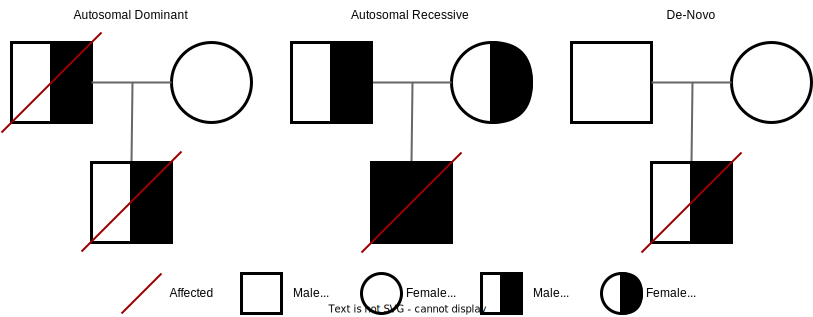
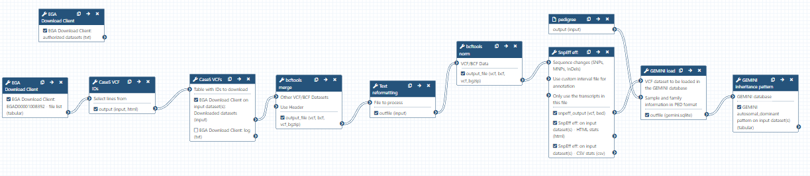

# Introduction
{:.no_toc}
To discover causal mutations of inherited diseases it’s common practice to do a trio analysis. In a trio analysis DNA is sequenced of both the patient and parents. Using this method, it’s possible to identify multiple inheritance patterns. These patterns include autosomal recessive, autosomal dominant, and even de-novo variants, which are represented in the figure below. To elaborate, with an autosomal dominant disease the offspring inherited a faulty copy of the gene from one of the parents and in an autosomal recessive disease the offspring inherited a faulty copy of the same gene from both parents. Finally, a de-novo mutation is caused by a mutation on a gene only in the offspring which is caused by a random mutation during the offspring’s lifetime. 



To discover these mutations either whole exome sequencing (WES) or whole genome sequencing (WGS) can be used. With these technologies it is possible to uncover the DNA of the parents and offspring. With this data mutations in the DNA can be determined. These mutations can include insertions/deletions (indels), loss of heterozygosity (LOH), single nucleotide variants (SNVs), copy number variations (CNVs), and fusion genes. 

> ### Agenda
>
> In this tutorial, we will cover:
>
> 1. Introduction
> 2. Data preperation
>     1. Getting DAC access
>     2. Download list of files
>     3. Filter list of files
>     4. Download files
> 3. Pre-Processing
>     1. Merge VCF collection into one dataset
>     2. Normalize VCF
> 4. Annotation
>     1. Annotate with SNPeff
> 5. GEMINI Analysis
>     1. Create a pedigree file describing the family trio
>     2. Subsample VCF
>     3. Load GEMINI database
>     4. Find inheritence pattern
>

# Data preperation
In this tutorial we will use case 5 from the RD-Connect GPAP synthetic datasets. This data was built using the same three public genomic datasets from HapMap samples NA12877, NA12878, and NA12882 (https://www.genome.gov/10001688/international-hapmap-project). In these datasets real causative variants which correlate with the phenotypic data are manually spiked-in. 

The dataset consists of WGS from a family trio, in which both the mother and daughter are affected by breast cancer. Our goal is to identify the genetic variation that is responsible for the disease. 

## Getting DAC access
Our test data is stored in EGA, which can be easily accessed using the EGA Download Client. Our specific EGA dataset accession ID is: "EGAD00001008392". However, before you can access this data you need to request DAC access to this dataset. This can be requested by emailing to helpdesk@ega-archive.org, don’t forget to mention the dataset ID! When the EGA grants you access it will create an account for you, if you don't have it already. If you do, you should link your account to your galaxy account by going to the homepage on galaxy and at the top bar click User > Preferences > Manage Information. Now add your email and password of your (new) EGA account under: "Your EGA (european Genome Archive) account". After that you can check if you can log in and see if you have access to the dataset by using the  tool.

> ###  Hands-on: Check log-in and authorized datasets
>
> 1.  with the following parameters:
>    - *"What would you like to do?"*: ` List my authorized datasets `
>
>    > ###  Is dataset listed?
>    >
>    > Check if your dataset is listed in the output of the tool. If not you can look at the header of the output to find out why it is not listed. When the header does not provide any information you could have a look at the error message by clicking on the eye of the output dataset and then click on the info icon. The error should be listed at "Tool Standard Error".
>    {: .comment}
>

## Download list of files
When you have access to the EGA dataset, you can download all the needed files. However, the EGA dataset contains many different filetypes and cases, but we are only interested in the VCFs from case 5 and, to reduce execution time, the variants on chromosome 17. To be able to donwload these files we first need to request the list of files from which we can download.

> ###  Hands-on: Request list of files in the dataset
>
> 1.  with the following parameters:
>    - *"What would you like to do?"*: ` List files in a datasets `
>    - *"EGA Dataset Accession ID?"*: ` EGAD00001008392 `
>

## Filter list of files
Now that we have listed all the files we need to filter out the files we actually need. We can do this by using a simple regulary expression or regex using the  tool.

> ###  Hands-on: Filter out VCFs from list of files
>
> 1.  with the following parameters:
>    -  *"Select lines from"*: `dataset_file_list` (output of **EGA Download Client** )
>    - *"Type of regex"*: `Extended (egrep)`
>    - *"Regular Expression"*: `Case5.+17.+vcf.gz$` The regex might seem a bit complicated if you never worked with it, however it is quite simple. We simple search for lines which contain our sequence of characters, which are lines that contain Case5 then any character for any length, denoted by the ".+", until (chromosome) 17 is found and then again any character for any length until the sequence ends with, denoted by the dollar sign, "vcf.gz".
>    - *"Match type"*: `case sensitive`
>
>    > ###  Comment
>    >
>    > If the filtering was succesfull you should now have a tabular file with 3 listed VCF files.
>

## Download files
After the filtering you should have a tabular file with 3 lines each containing the ID of a VCF file from case 5.

> ###  Hands-on: Download listed VCFs
>
> 1.  with the following parameters:
>    - *"What would you like to do?"*: ` Download multiple files (based on a file with IDs) `
>        -  *"Table with IDs to download"*: `output` (output of **Search in textfiles** )
>        - *"Column containing the file IDs"*: `Column: 1`d
>
>    > ###  Comment
>    >
>    > After the download you should have a collection with one file for each family member, i.e. mother (M), father (F), and case (IC). Make sure the files are recognized as the vcf_bgzip format.
>
>    > ###  Change file format
>    >
>    > To transform the file format click on the pencil of the dataset. Next click on the Datatypes button and select the type vcf_bgzip.
>
{: .hands_on}


# Pre-Processing
Before starting the analysis, the VCF files have to be pre-processed in order to meet input requirements of the tools which will use for the downstream analysis. 

## Merge VCF collection into one dataset
First, we have to merge the 3 separate files of the parents and patient. This will put overlapping variants between the parents and patient on the same line which makes it easier to find overlapping variants. A tool which can do this is the  tool.

> ###  Hands-on: Merge VCFs
>
> 1.  with the following parameters:
>    -  *"Other VCF/BCF Datasets"*: `downloaded_file_collection` (output of **EGA Download Client** )
>    - In *"Restrict to"*:
>        - *"Regions"*: `Do not restrict to Regions`
>    - In *"Merge Options"*:
>        - *"Merge"*: `none - no new multiallelics, output multiple records instead`
>    - *""*: `uncompressed VCF`
>
>    > ###  Comment
>    >
>    > Now you can check the merged VCF. Now each line should contain 3 columns at the which represents the presence of the variant for the mother, father, and offspring. 
>    {: .comment}
>
{: .hands_on}

## Normalizing VCF
After merging we need to normalize the variants in the VCF, i.e. standardizing how the variants are represented within the VCF. This is a very important step, since the variants in the mother and daughter might be represented differently, which would mean that the causative variant might be overlooked! 

The standardization includes splitting multiallelic variants, i.e., 2 variants detected on the same position but on a different allele. Splitting these records will put the 2 variants on a separate line, that way the impact of both mutations can be evaluated. In addition, indels need to be left-aligned and normalized because that’s how they are stored in the annotation databases. An indel is left-aligned and normalized “if and only if it is no longer possible to shift its position to the left while keeping the length of all its alleles constant” and “if it is represented in as few nucleotides as possible”. (https://genome.sph.umich.edu/wiki/Variant_Normalization#Left_alignment)


Before we can normalize our VCFs we need to slightly modify our VCF, since the identifiers of the VCFs do not overlap with the reference genome. This is because the VCFs miss the "chr" prefix for the chromosome locations. However we will add those using the  tool.

> ###  Hands-on: Normalize VCF
>
> 1.  with the following parameters:
>    -  *"File to process"*: `output_file` (output of **bcftools merge** )
>    - *"AWK Program"*: `{
    if($1 ~ /^([0-9]|[0-9][0-9]|Y|X|MT)$/ ) 
        print chr$0;
    else if(match($0,/(##contig=<ID=)(.*)/,m) && $0 ~ /##contig=<ID=([0-9]|[0-9][0-9]|Y|X|MT),/)
        print m[1]chrm[2];
    else
        print $0
}`
> 
>    > ###  Comment
>    > AWK is a programming languague which can be used to loop over the lines of a text file and printing them with additional information. To explain this AWK program, it first checks for lines that start with one or two numbers or X, Y, MT and adds the chr prefix to them. The next if statement checks if the line describes a contig in the header and adds the chr prefix to it and the else statement simply prints the line normally.
>    {: .comment}
>
> 2.  with the following parameters:
>    -  *"VCF/BCF Data"*: `outfile` (output of **Text reformatting** )
>    - *"Choose the source for the reference genome"*: `Use a built-in genome`
>        - *"Reference genome"*: `Human (Homo sapiens): hg19`
>    - *"Left-align and normalize indels?"*: `Yes`
>    - *"~multiallelics"*: `split multiallelic sites into biallelic records (-)`
>    - In *"Restrict all operations to"*:
>        - *"Regions"*: `Do not restrict to Regions`
>        - *"Targets"*: `Do not restrict to Targets`
>    - *""*: `uncompressed VCF`
>
> ###  Check normalization summary
> >
> > To check what changes bcftools norm made you can have a look at the summary. You can find this by expanding the output of bcftools norm (by clicking on the box) to see the details click on the info logo and look at the output of the ToolStandard Error. The summary should contain the following line total/split/realigned/skipped: 5770600/195928/8246/0.
> >
>
{: .hands_on}

# Annotation
To understand what the effect of our variants are we need to annotate our variants. We will use the tool , which will compare our variants to a database of variants with known effects.  

## Annotate with SNPeff
Running SnpEff will produce the annotated VCF and an HTML summary file. The annotations are added to the INFO column in the VCF and the added INFO IDs (ANN, LOF, and NMD) are explained in the header. The summary files include the HTML stats file which contains general metrics, such as the number of annotated variants, the impacts of all the variants, and much more.  

> ###  Hands-on: Annotation with SnpEff
>
> 1.  with the following parameters:
>    -  *"Sequence changes (SNPs, MNPs, InDels)"*: `output_file` (output of **bcftools norm** )
>    - *"Output format"*: `VCF (only if input is VCF)`
>    - *"Genome source"*: `Locally installed snpEff database`
>        - *"Genome"*: `Homo sapiens : hg19`
>    - *"spliceRegion Settings"*: `Use Defaults`
>    - *"Filter out specific Effects"*: `No`
>
> ###  Questions
>
> 1. How many variants got annotated?
> 2. Is there something notable you can see from the HTML file?
>
> > ###  Solution
> >
> > 1. The number of variants processed is 210,119.
> > 2. Most variants are found in the intronic regions. However, this is to be expected since the mutations in intonic regions do not affect the gene. 
> >
> {: .solution}
>
{: .question}
>
{: .hands_on}

# GEMINI analyses
Next, we will transform our VCF into a GEMINI database which makes it easier to query the VCFs and to determine different inheritence patterns between the mother, father, and offspring. In addition, GEMINI will add even more annotations to the variants, which allows for even more filtering allowing us to get closer to the real causative variant.
All these steps are performed by the  tool. However, before we can load the VCF we also need to define a pedigree file, which is shown below, to tell GEMINI which family members are affected by the disease and which sample name corresponds to what individual. 

## Create a pedigree file describing the family trio
The pedigree file is simply a table containing information about the phenotype of the family. The pedigree file contains the following columns:
1. family_id: Which family a row belongs to.
2. name: The name of the sample, note! This sample name has to overlap with the sample name in the VCF. However, for some reason the VCFs contain the sample name from case 6 and not case 5. This was probably just a typo in the VCF, however here we just copy the sample name to our pedigree file.
3. paternal_id: The sample name of the father or 0 for missing.
4. maternal_id: The sample name of the mother or 0 for missing.
5. sex: The sex of the person.
6. phenotype: Wether or not the person is affected by the disease of interest.

<style type="text/css">
.tg  {border-collapse:collapse;border-spacing:0;}
.tg td{border-color:black;border-style:solid;border-width:1px;font-family:Arial, sans-serif;font-size:14px;
  overflow:hidden;padding:10px 5px;word-break:normal;}
.tg th{border-color:black;border-style:solid;border-width:1px;font-family:Arial, sans-serif;font-size:14px;
  font-weight:normal;overflow:hidden;padding:10px 5px;word-break:normal;}
.tg .tg-0pky{border-color:inherit;text-align:left;vertical-align:top}
</style>
<table class="tg">
<thead>
  <tr>
    <th class="tg-0pky">#family_id</th>
    <th class="tg-0pky">name</th>
    <th class="tg-0pky">paternal_id</th>
    <th class="tg-0pky">maternal_id</th>
    <th class="tg-0pky">sex</th>
    <th class="tg-0pky">phenotype</th>
  </tr>
</thead>
<tbody>
  <tr>
    <td class="tg-0pky">FAM0001822</td>
    <td class="tg-0pky">Case6M</td>
    <td class="tg-0pky">0</td>
    <td class="tg-0pky">0</td>
    <td class="tg-0pky">2</td>
    <td class="tg-0pky">2</td>
  </tr>
  <tr>
    <td class="tg-0pky">FAM0001822</td>
    <td class="tg-0pky">Case6F</td>
    <td class="tg-0pky">0</td>
    <td class="tg-0pky">0</td>
    <td class="tg-0pky">1</td>
    <td class="tg-0pky">1</td>
  </tr>
  <tr>
    <td class="tg-0pky">FAM0001822</td>
    <td class="tg-0pky">Case6C</td>
    <td class="tg-0pky">Case6F</td>
    <td class="tg-0pky">Case6M</td>
    <td class="tg-0pky">2</td>
    <td class="tg-0pky">2</td>
  </tr>
</tbody>
</table>

> ###  Hands-on: Creating the PED file
>
> 1. Click on Upload Data
> 2. Click Paste/Fetch data
> 3. Paste the pedigree file from above into the text block
> 4. Set type to tabular
> 5. Name the file
> 6. Click on start
>
{: .hands_on}

For more information on the PED file you can read the help section of the  tool at the bottom in the description. Now we can transform our VCF and pedigree file into a GEMINI database. 

## Subsample VCF
Since, it takes a very long time to transform a VCF into a GEMINI database we will subsample our VCF down to a smaller region of 1 million basepairs using .

> ###  Hands-on: Task description
>
> 1.  with the following parameters:
>    -  *"VCF/BCF Data"*: `snpeff_output` (output of **SnpEff eff:** )
>    - In *"Restrict to"*:
>        - *"Regions"*: `Specify one or more Region(s) directly`
>            - In *"Region Filter"*:
>                -  *"Insert Region Filter"*
>                    - *"Region chromosome"*: `chr17`
>                    - *"Region start position"*: `41000000`
>                    - *"Region end position"*: `42000000`
>        - *"Targets"*: `Do not restrict to Targets`
>    - *""*: `uncompressed VCF`
>
>
{: .hands_on}

## Load GEMINI database
Now we can transform the subsampled VCF and PED file into a GEMINI database using .

> ###  Hands-on: Transform VCF and PED files into a GEMINI database
>
> 1.  with the following parameters:
>    -  *"VCF dataset to be loaded in the GEMINI database"*: `output_file` (output of **bcftools view** )
>    -  *"Sample and family information in PED format"*: the pedigree file prepared above
>
>
{: .hands_on}

## Find inheritance pattern
With the GEMINI database it is now possible to identify the causative variant that could explain the breast cancer in the mother and daughter. This inheritance information makes it a bit easier to determine which tool to run, to find the causative variant. 

> ###  Questions
>
> 1. Which inheritance pattern could have occurred in this family trio? The available inheritance patterns can be found in the GEMINI inheritance pattern tool.
>
> > ###  Solution
> >
> > 1. Answer for question1
> >     - Since the father is unaffected and both the daughter and mother are affected, the mutation is most likely dominant. The disease could still be recessive if the father has one copy of the faulty gene, however this is less likely. 
> >     - The mutation is most likely not de-novo since both the daughter and mother are affected, however it could still have occurred. 
> >     - The mutation could be X-linked, however since the VCF only contain mutations on chromosome 17 it would practically be impossible.  
> >     - The disease could be compound heterozygous, however in that case the disease should be recessive which is less likely. 
> >     - A loss of heterozygosity (LOH) is also possible, since it is a common occurrence in cancer so this could be a viable inheritance pattern. 
> >
> {: .solution}
>
{: .question}

Based on these findings it would make sense to start looking for inherited autosomal dominant variants as a first step. If there are no convincing candidate mutations it would always be possible to look at the other less likely inheritance patterns, namely de-novo, compound heterozygous, and LOH events. 

To find the most plausible causative variant we will use the GEMINI inheritance pattern tool. This tool allows us to select the most likely inheritance pattern (autosomal dominant). Below it is explained how to run the tool for this specific pattern, but you can always try other inheritence patterns if you are curious.

> ###  Hands-on: Run GEMINI autosomal dominant inhertiance pattern
>
> 1.  with the following parameters:
>    -  *"GEMINI database"*: `outfile` (output of **GEMINI load** )
>    - *"Your assumption about the inheritance pattern of the phenotype of interest"*: `Autosomal dominant`
>        - In *"Additional constraints on variants"*:
>            -  *"Insert Additional constraints on variants"*
>                - *"Additional constraints expressed in SQL syntax"*: `impact_severity != 'LOW'` To filter variants on their functional genomic impact we will use the impact_severity feature. Here a low severity means a variant with no impact on protein function, such as silent mutations.
>    - In *"Family-wise criteria for variant selection"*:
>        - *"Specify additional criteria to exclude families on a per-variant basis"*: `No, analyze all variants from all included families`
>    - In *"Output - included information"*:
>        - *"Set of columns to include in the variant report table"*: `Custom (report user-specified columns)`
>            - *"Additional columns (comma-separated)"*: `chrom, start, ref, alt, impact, gene, clinvar_sig, clinvar_disease_name, clinvar_gene_phenotype, rs_ids`
>
{: .hands_on}

> ###  Questions
>
> 1. Did you find the causative variant in the output of the GEMINI inheritance pattern tool? 
>
> > ###  Solution
> > The only pathogenic variant related to breast cancer in the output, according to clinvar, is a SNP at chr17 at position 41215919 on the BRCA1 gene which transforms a G into a T. This missense mutation transforms an alanine amino acid into a glutamine amino acid. Even though this variant has an unknown clinical significance in BRCA1 it was found to be among the top 10 SNPs which likely leads to breast cancer, according to Easton et al., 2007. You can find more info on this mutation by googling it's rs_ID rs28897696. 
> {: .solution}
>
{: .question}

# Conclusion
We started with more than 6 million variants and were able to filter all those variants down using the SnpEff and GEMINI annotations to find the causative variant. This shows that some of these daunting tasks can be solved easily using the suite of galaxy tools.
{:.no_toc}

# Workflow
Here is the final layout of the workflow. For more details you can download the workflow from the overview at the top of the page.


<!-- 

# Title of the section usually corresponding to a big step in the analysis

It comes first a description of the step: some background and some theory.
Some image can be added there to support the theory explanation:


The idea is to keep the theory description before quite simple to focus more on the practical part.

***TODO***: *Consider adding a detail box to expand the theory*

> ###  More details about the theory
>
> But to describe more details, it is possible to use the detail boxes which are expandable
>
{: .details}


> ###  Hands-on: Data upload
>
> 1. Create a new history for this tutorial
> 2. Import the files from [Zenodo]({{ page.zenodo_link }}) or from
>    the shared data library (`GTN - Material` -> `{{ page.topic_name }}`
>     -> `{{ page.title }}`):
>
>    ```
>    
>    ```
>    ***TODO***: *Add the files by the ones on Zenodo here (if not added)*
>
>    ***TODO***: *Remove the useless files (if added)*
>
>    
>
>    
>
> 3. Rename the datasets
> 4. Check that the datatype
>
>    
>
> 5. Add to each database a tag corresponding to ...
>
>    
>
{: .hands_on}

***TODO***: *Consider adding a question to test the learners understanding of the previous exercise*

> ###  Questions
>
> 1. Question1?
> 2. Question2?
>
> > ###  Solution
> >
> > 1. Answer for question1
> > 2. Answer for question2
> >
> {: .solution}
>
{: .question}

-->