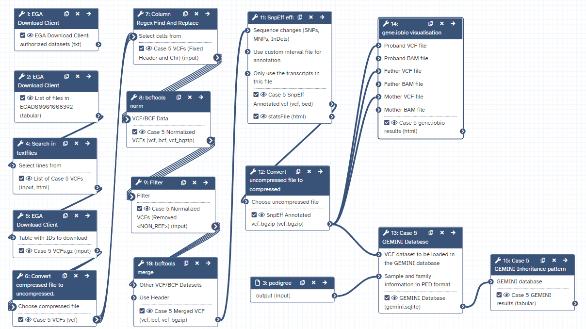

# Introduction
{:.no_toc}
To discover causal mutations of inherited diseases it’s common practice to do a trio analysis. In a trio analysis DNA is sequenced of both the patient and parents. Using this method, it’s possible to identify multiple inheritance patterns. Some examples of these patterns are autosomal recessive, autosomal dominant, and  de-novo variants, which are represented in the figure below. To elaborate, with an autosomal dominant disease the offspring inherited a faulty copy of the gene from one of the parents and in an autosomal recessive disease the offspring inherited a faulty copy of the same gene from both parents. Finally, a de-novo mutation is caused by a mutation on a gene only in the offspring which is caused by a random mutation during the offspring’s lifetime. 


To discover these mutations either whole exome sequencing (WES) or whole genome sequencing (WGS) can be used. With these technologies it is possible to uncover the DNA of the parents and offspring. With this data mutations in the DNA can be determined. These mutations can include insertions/deletions (indels), loss of heterozygosity (LOH), single nucleotide variants (SNVs), copy number variations (CNVs), and fusion genes. 

In this tutorial we will also make use of the HTSGET protocol, which is a program to download our data securely and savely. This protocol has been implemented in the  tool, so we don't have to leave galaxy to retrieve our data.

> ### Agenda
>
> In this tutorial, we will cover:
> 
> 1. 
> {:toc}
>
{: .agenda}


# Data preperation
In this tutorial we will use case 5 from the RD-Connect GPAP synthetic datasets. This data was built using the same three public genomic datasets from HapMap samples NA12877, NA12878, and NA12882, click [here](https://www.genome.gov/10001688/international-hapmap-project) for more info. In these datasets real causative variants which correlate with the phenotypic data are manually spiked-in. 

The dataset consists of WGS from a family trio, in which both the mother and daughter are affected by breast cancer. Our goal is to identify the genetic variation that is responsible for the disease. 

We offer two ways to download the files, the download the files directly from the EGA-archive by requesting DAC access. This will take only 1 workday and gives you access to all of the RD-Connect GPAP synthetic datasets. However if you don't have the time you can also download the from zenodo. After the downloading step you should go to [pre-processing](#pre-processing).

>  ###  Shortcut: Downloading files from zenodo
>
>  If you can't wait to get DAC access you can also download the data from zenodo for this tutorial. How to do that is described below.
>
> > ###  Hands-on: Data upload
> >
> > 1. Import the 3 VCFs from [Zenodo]({{ https://sandbox.zenodo.org/record/1055097 }}).
> >   ```
> >   https://sandbox.zenodo.org/record/1055250/files/Case5_F.17.g.vcf.gz
> >   https://sandbox.zenodo.org/record/1055250/files/Case5_IC.17.g.vcf.gz
> >   https://sandbox.zenodo.org/record/1055250/files/Case5_M.17.g.vcf.gz
> >   ```
> > 
> >
> > 2. Rename the datasets to your liking
> > 3. Check that the datatype is vcf_bgzip
> >
> >    
> >
> > 4. Put all the VCFs into one collection.
> > 
> > > ###  Adding files to collection
> > >
> > > 1. Click on the dataset selector icon  in your history.
> > >
> > > 2. Select the 3 vcf files.
> > >
> > > 3. Click on the button "For all selected..." and select "Build Dataset List"
> > >
> > > {: .tip}
> > {: .hands_on}
> 
> {: .comment}

> ###  Hands-on: Check log-in and authorized datasets
>
> 1.  with the following parameters:
>    - *"What would you like to do?"*: `List my authorized datasets`
>
> > ###  Is the dataset listed?
> > 
> > Check if your dataset is listed in the output of the tool. If not you can look at the header of the output to find out why it is not listed. When the header does not provide any information you could have a look at the error message by clicking on the eye of the output dataset and then click on the icon view details . The error should be listed at "Tool Standard Error".
> {: .comment}
>
{: .hands_on}

## Getting DAC access
Our test data is stored in EGA, which can be easily accessed using the EGA Download Client. Our specific EGA dataset accession ID is: "EGAD00001008392". However, before you can access this data you need to request DAC access to this dataset. This can be requested by emailing to <helpdesk@ega-archive.org>, don’t forget to mention the dataset ID! When the EGA grants you access it will create an account for you, if you don't have it already. Next, you should link your account to your galaxy account by going to the homepage on galaxy and at the top bar click User > Preferences > Manage Information. Now add your email and password of your (new) EGA account under: "Your EGA (european Genome Archive) account". After that you can check if you can log in and see if you have access to the dataset. 


## Download list of files
When you have access to the EGA dataset, you can download all the needed files. However, the EGA dataset contains many different filetypes and cases, but we are only interested in the VCFs from case 5 and, to reduce execution time, the variants on chromosome 17. To be able to donwload these files we first need to request the list of files from which we can download. Make sure to use <ins>version 4+</ins> of the EGA Download Client.

> ###  Changing tool version.
> 
> To change the version of a tool you first need to open the tool in galaxy. Next, open the versions tab in the top right corner, next to the star icon. If you click on it you can find all the listed versions.
> {: .tip}

> ###  Hands-on: Request list of files in the dataset
>
> 1.  with the following parameters:
>    - *"What would you like to do?"*: `List files in a datasets`
>    - *"EGA Dataset Accession ID?"*: `EGAD00001008392`
>
> {: .comment}
{: .hands_on}


## Filter list of files
Now that we have listed all the files, we need to filter out the files we actually need. We can do this by using a simple regular expression or regex.

> ###  Hands-on: Filter out VCFs from list of files
>
> 1.  with the following parameters:
>    -  *"Select lines from"*: `list of EGA datasets` (output of **EGA Download Client** )
>    - *"Type of regex"*: `Extended (egrep)`
>    - *"Regular Expression"*: `Case5.+17.+vcf.gz$` The regex might seem a bit complicated if you never worked with it, however it is quite simple. We simply search for lines which contain our sequence of characters, which are lines that contain Case5 then any character for any length, denoted by the ".+", until (chromosome) 17 is found and then again any character for any length until the sequence ends with, denoted by the dollar sign, "vcf.gz".
>    - *"Match type"*: `case sensitive`
>
{: .hands_on}

## Download files
After the filtering you should have a tabular file with 3 lines each containing the ID of a VCF file from case 5 which we can download.

> ###  Hands-on: Download listed VCFs
>
> 1.  with the following parameters:
>    - *"What would you like to do?"*: `Download multiple files (based on a file with IDs)`
>        -  *"Table with IDs to download"*: `filtered list of files` (output of **Search in textfiles** )
>        - *"Column containing the file IDs"*: `Column: 1`
>
> > ###  Check the output files
> >
> > After the download you should have a collection with one file for each family member, i.e. mother (M), father (F), and case (IC). Make sure the files are recognized as the vcf_bgzip format.
> {: .comment}
>
>
> > ###  Change file format
> >
> > 1. To transform the file format, click on the pencil  of the dataset.
> > 2. Next click on the Datatypes tab  and under <strong>New type</strong> select vcf_bgzip.
> > 3. Save  the file.
> {: .tip}
>
{: .hands_on}

# Pre-Processing
Before starting the analysis, the VCF files have to be pre-processed in order to meet input requirements of the tools which we will use for the downstream analysis. 

## Decompress VCFs
First, we need to decompress our bgzipped VCFs, since we will use a text manipulation tool as a next step to process the VCFs. To decompress the vcf we will use a built-in tool from galaxy, which can be accessed by manipulating the file itself in a similair fashion as changing its detected type.

> ###  Hands-on: Convert compressed vcf to uncompressed.
>
> Open the collection of VCFs and execute the following steps for each VCF.
>
> 1. Click on the pencil  of the vcf you want to convert.
>
> 2. Click on the convert  tab.
>
> 3. Under <strong>Target datatype</strong> select "vcf (using 'Convert compressed file to uncompressed.')"
>
> 4. Click  Create Dataset.
>
> After transforming all the VCFs you need to combine the converted VCFs into a colllection again.
>
{: .hands_on}

## Filter NON_REF sites
After decompressing the VCFs we will filter out the variants with a NON_REF tag in the ALT column, the column which represents the mutated nucleotide(s). According to the header these sites correspond to: "any possible alternative allele at this location". So these sites are a sort of placeholders for potential variants. However we are not interested in this kind of variants and they slow our analysis down quite a lot. therefore, we will filter them out using AWK.

> ###  Hands-on: Filter out NON_REF sites with AWK
>
> 1.  with the following parameters:
>    -  *"Select cells from"*: `the decompressed VCFs` (output of **Convert compressed file to uncompressed.** )
>    - *"AWK Program"*: `{if(substr($1,1,1)==# || $5!=<NON_REF>){print $0}}`
>
> > ###  AWK code explained
> >
> > AWK is a very simple language that allows us to parse through each line of a textfile and change them based on the columns within the textfile. This specific awk command is explained below.
> > > 1. The first component are the curly brackets `{ }`. These simply mean that we loop through the text file line by line.
> > > 2. The second component is the if statement `if(condition){do something}`. Here `do something` is executed when the condition is met.
> > >    - Here the condition is met if the first character of the first column `substr($1, 1, 1)` is equal to a hashtag `#` or `||` if the ALT/fifth column `$5` does not equal `!=` the `<NON_REF>` tag.
> > >    - The executed code `do something` is simply printing all the columns `$0`, i.e. the whole line.
>    {: .comment}
>
{: .hands_on}

## Add chromosome prefix to vcf
Again, our next tool has some assumptions about our input VCFs. This time the tool expects the chromosome numbers to start with a prefix `chr`, because of the reference genome it uses. However, our VCFs just uses the chromosome numbers. To change this we will use a regular expression or regex. With regex it will be easy to find or replace patterns within a textfile. There are many tools in galaxy which use regex to transform files. We will use one that only operates on a single column (#CHROM) to add the prefix.

> ###  Hands-on: Add chr prefix using regex
>
> 1.  with the following parameters:
>    -  *"Select cells from"*: `the filtered VCFs` (output of **Convert compressed file to uncompressed.** )
>    - *"using column"*: `Column: 1`
>    - In *"Check"*:
>        -  *"Insert Check"*
>            - *"Find Regex"*: `(?=^[0-9MYX])`
>            - *"Replacement"*: `chr`
>
>    > ###  What does the regex pattern mean?
>    >
>    > The regex pattern might look complicated but it's quite simple if you break it down in components.
>    >  - The first component is a positive lookahead `q(?=p)`. Here q is the matched part and p is the pattern. So what it does is to match everything (q) that comes before pattern (p).
>    > - The pattern here is `^[0-9MYX]`, which can again be broken down into different comonents
>    >      - `^` means that the pattern has to start at the beginning of the line not somewhere randomly in the line. This way our prefix `chr` will be inserted at the start of the line.
>    >      - `[0-9MYX]` means that at this position there should be a character from the list `[]`, namely either a number from `0-9` or the character `M`, `Y`, or `X`.
>   > 
>   {: .comment}
>
{: .hands_on}

## Normalizing VCF
After decompressing, filtering, and adding the prefixes to the VCFs we need to normalize the variants in the VCF to standardize how the variants are represented within the VCF. This is a very important step, since the variants in the mother and daughter might be represented differently, which would mean that the causative variant might be overlooked! 

One of the normalization steps is splitting multiallelic variants, 2 variants detected on the same position but on a different allele. Splitting these records will put the 2 variants on a separate line, that way the impact of the individual mutations can be evaluated. In addition, indels need to be left-aligned and normalized because that’s how they are stored in the annotation databases. An indel is left-aligned and normalized, according to ``, "if and only if it is no longer possible to shift its position to the left while keeping the length of all its alleles constant" and "if it is represented in as few nucleotides as possible".

<strong> Figure 1: </strong> The different ways to represent INDELs [(source)](https://academic.oup.com/bioinformatics/article/31/13/2202/196142).

> ###  Hands-on: Normalize VCF
>
> 1.  with the following parameters:
>    -  *"VCF/BCF Data"*: `VCFs with chr prefix` (output of **Text reformatting** )
>    - *"Choose the source for the reference genome"*: `Use a built-in genome`
>        - *"Reference genome"*: `Human (Homo sapiens): hg19`
>    - *"Left-align and normalize indels?"*: `Yes`
>    - *"~multiallelics"*: `split multiallelic sites into biallelic records (-)`
>    - In *"Restrict all operations to"*:
>        - *"Regions"*: `Do not restrict to Regions`
>        - *"Targets"*: `Do not restrict to Targets`
>    - *"output_type"*: `uncompressed VCF`
>
> > ###  Check normalization summary
> >
> > You can have a look at the summary to check what changes were made. First, expand the output of bcftools norm (by clicking on the box) and it should be listed in the box. If not you can find it by clicking on the icon view details  and look at the output of the ToolStandard Error.
> >
> {: .tip}
>
{: .hands_on}

## Merge VCF collection into one dataset
First, we have to merge the 3 separate files of the parents and patient. This will put overlapping variants between the parents and patient on the same line which makes it easier to find overlapping variants. A tool which can do this is the  tool.

> ###  Hands-on: Merge VCFs
>
> 1.  with the following parameters:
>    -  *"Other VCF/BCF Datasets"*: `normalized VCFs` (output of **bcftools norm** )
>    - In *"Restrict to"*:
>        - *"Regions"*: `Do not restrict to Regions`
>    - In *"Merge Options"*:
>        - *"Merge"*: `none - no new multiallelics, output multiple records instead`
>    - *"output_type"*: `uncompressed VCF`
>
>    > ###  Checking the merged VCF
>    >
>    > Check the merged VCF, now each line should contain 3 columns at the which represents the presence of the variant for the mother, father, and offspring. 
>    {: .comment}
>
{: .hands_on}

# Annotation
To understand what the effect of our variants are we need to annotate our variants. We will use the tool , which will compare our variants to a database of variants with known effects.  


## Annotate with SNPeff
Running SnpEff will produce the annotated VCF and an HTML summary file. The annotations are added to the INFO column in the VCF and the added INFO IDs (ANN, LOF, and NMD) are explained in the header. The summary files include the HTML stats file which contains general metrics, such as the number of annotated variants, the impacts of all the variants, and much more.  

> ###  Hands-on: Annotation with SnpEff
>
> 1.  with the following parameters:
>    -  *"Sequence changes (SNPs, MNPs, InDels)"*: `merged VCF` (output of **bcftools merge** )
>    - *"Output format"*: `VCF (only if input is VCF)`
>    - *"Genome source"*: `Locally installed snpEff database`
>        - *"Genome"*: `Homo sapiens : hg19`
>    - *"spliceRegion Settings"*: `Use Defaults`
>    - *"Filter out specific Effects"*: `No`
>
{: .hands_on}

> ###  Question
>
> 1. How many variants got annotated?
> 2. Is there something notable you can see from the HTML file?
>
> > ###  Solution
> > 1. The number of variants processed is 209,143.
> > 2. Most variants are found in the intronic regions. However, this is to be expected since the mutations in intonic regions do not affect the gene. 
> {: .solution}
>
{: .question}


# GEMINI analyses
Next, we will transform our VCF into a GEMINI database which makes it easier to query the VCFs and to determine different inheritence patterns between the mother, father, and offspring. In addition, GEMINI will add even more annotations to the variants. This allows us to filter the variants even more which gets us to closer to the real causative variant.
All these steps are performed by the  tool. However, before we can load the VCF we also need to define a pedigree file, which is shown below, to tell GEMINI which family members are affected by the disease and which sample name corresponds to what individual. 


## Create a pedigree file describing the family trio
The pedigree file is simply a table containing information about the phenotype of the family. The pedigree file contains the following columns:
1. family_id: Which family a row belongs to.
2. name: The name of the sample, note this sample name has to overlap with the sample name in the VCF, see the last 3 columns of the VCF. However, for some reason the VCF contains the sample name from case 6 and not case 5. This was probably just a typo in the VCF, however here we just copy the sample name to our pedigree file.
3. paternal_id: The sample name of the father or 0 for missing.
4. maternal_id: The sample name of the mother or 0 for missing.
5. sex: The sex of the person.
6. phenotype: Wether or not the person is affected by the disease.

> ###  Hands-on: Creating the PED file
>
> 1. Click on Upload Data
> 2. Click Paste/Fetch data
> 3. Paste the pedigree file from above into the text block
> ```
> #family_id	name	paternal_id	maternal_id	sex	phenotype
> FAM0001822	Case6M	0	0	2	2
> FAM0001822	Case6F	0	0	1	1
> FAM0001822	Case6C	Case6F	Case6M	2	2
> ```
> 4. Set type to tabular
> 5. Name the file
> 6. Click on start
>
{: .hands_on}

For more information on the PED file you can read the help section of the  tool in the description, which can be found at the bottom of the page when clicking on the tool.

## Load GEMINI database
Now we can transform the subsampled VCF and PED file into a GEMINI database. Note that this can take a very long time depending on the size of the VCF. In our case it should take around 30-40 minutes.

> ###  Hands-on: Transform VCF and PED files into a GEMINI database
>
> 1.  with the following parameters:
>    -  *"VCF dataset to be loaded in the GEMINI database"*: `SNPeff annotated VCF` (output of **SnpEff eff** )
>    -  *"Sample and family information in PED format"*: the pedigree file prepared above
>
>
{: .hands_on}


## Find inheritance pattern
With the GEMINI database it is now possible to identify the causative variant that could explain the breast cancer in the mother and daughter. This inheritance information makes it a bit easier to determine which tool to run to find the causative variant, instead of finding it by trial and error of running all the tools. 

> ###  Question
>
> Which inheritance pattern could have occurred in this family trio?
>
> > ###  Possible patterns
> > The available inheritance patterns can be found in the GEMINI inheritance pattern tool.
> {: .tip}
>
> > ###  Solution
> >
> >    - Since the father is unaffected and both the daughter and mother are affected, the mutation is most likely dominant. The disease could still be recessive if the father has one copy of the faulty gene, however this is less likely. 
> >    - The mutation is most likely not de-novo since both the daughter and mother are affected, however it could still have occurred. 
> >    - The mutation could be X-linked, however since the VCF only contain mutations on chromosome 17 it would practically be impossible.  
> >    - The disease could be compound heterozygous, however in that case the disease should be recessive which is less likely. 
> >    - A loss of heterozygosity (LOH) is also possible, since it is a common occurrence in cancer so this could be a viable inheritance pattern. 
> >
> {: .solution}
>
{: .question}

Based on these findings it would make sense to start looking for inherited autosomal dominant variants as a first step. If there are no convincing candidate mutations it would always be possible to look at the other less likely inheritance patterns, namely de-novo, compound heterozygous, and LOH events. 

To find the most plausible causative variant we will use the GEMINI inheritance pattern tool. This tool allows us to select the most likely inheritance pattern (autosomal dominant). Below it is explained how to run the tool for this specific pattern, but you can always try other inheritence patterns if you are curious.

> ###  Hands-on: Run GEMINI autosomal dominant inhertiance pattern
>
> 1.  with the following parameters:
>    -  *"GEMINI database"*: `GEMINI database` (output of **GEMINI load** )
>    - *"Your assumption about the inheritance pattern of the phenotype of interest"*: `Autosomal dominant`
>        - In *"Additional constraints on variants"*:
>            -  *"Insert Additional constraints on variants"*
>                - *"Additional constraints expressed in SQL syntax"*: `impact_severity != 'LOW'` To filter variants on their functional genomic impact we will use the impact_severity feature. Here a low severity means a variant with no impact on protein function, such as silent mutations.
>    - In *"Family-wise criteria for variant selection"*:
>        - *"Specify additional criteria to exclude families on a per-variant basis"*: `No, analyze all variants from all included families`
>    - In *"Output - included information"*:
>        - *"Set of columns to include in the variant report table"*: `Custom (report user-specified columns)`
>            - *"Additional columns (comma-separated)"*: `chrom, start, ref, alt, impact, gene, clinvar_sig, clinvar_disease_name, clinvar_gene_phenotype, rs_ids`
>
{: .hands_on}


> ###  Question
>
> Did you find the causative variant in the output of the GEMINI inheritance pattern tool? 
>
> > ###  Solution
> > The only pathogenic variant related to breast cancer in the output, according to clinvar, is a SNP at chr17 at position 41215919 on the BRCA1 gene which transforms a G into a T, which is shown below.
> > ```
> > chr17	41215919	G	T	missense_variant	BRCA1	pathogenic,other
> > ```
> > This missense mutation transforms an alanine amino acid into a glutamine amino acid. Even though this variant has an unknown clinical significance in BRCA1 it was found to be among the top 10 SNPs which likely leads to breast cancer, according to . You can find more info on this mutation by googling it's rs_ID rs28897696. 
> {: .solution}
>
{: .question}


# Conclusion
In this tutorial we have illustrated how to easily download our data savely and securely from the EGA using the HTSGET protocol. In addition, we performed a trio analysis to find the causative variant in an autosomal dominant inherited disease. We were able to find the causative variant by pre-processing and annotating our VCFs using the SnpEff and GEMINI annotations. With this workflow you can now easily analyse many different family trios to find the causative variant.

# Workflow
Here is the final layout of the workflow. For more details you can download the workflow from the overview at the top of the page.


{:.no_toc}
