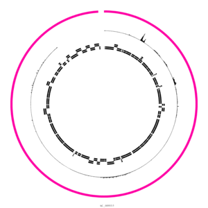

Once you're comfortable with [Circos in Galaxy](), you might want to explore some real world use cases with Circos such as making a simple Genome Annotation plot, like one might want to publish alongside their genome annotation publication

> <agenda-title></agenda-title>
>
> In this tutorial, we will cover:
>
> 1. TOC
> {:toc}
>
{: .agenda}

There are a few common data formats and potentially required transformations for working with genome annotation data in Galaxy:

Data type | Transformations | Visualisation Options
--- | --- | ---
Genome Annotations | Circos Interval to Tiles, Circos Interval to Text Labels | Tiles (classic gene box-type viz), Text labels (used for annotating the important genes names), or a histogram (feature density)
Sequencing | BAM Coverage → Circos BigWig to Scatter | Histogram is probably the most common visualisation option
Variants | From BAM + variant calling, cut tool | Select specific columns of the VCF file (i.e. chromosome, position, position, quality)

## Get data

> <hands-on-title>Data Upload</hands-on-title>
>
> 1. Create and name a new history for this tutorial.
>
>    
>
> 2. Import the datasets we will visualize:
>
>    ```
>    https://zenodo.org/record/3591856/files/genome.fa
>    https://zenodo.org/record/3591856/files/dna%20sequencing%20coverage.bw
>    https://zenodo.org/record/3591856/files/RNA-Seq%20coverage%201.bw
>    https://zenodo.org/record/3591856/files/RNA-Seq%20coverage%202.bw
>    https://zenodo.org/record/3591856/files/genes%20(NCBI).gff3
>    https://zenodo.org/record/3591856/files/variants.vcf
>    ```
>
>    
>
{: .hands_on}

This is a subset[^1] of *Escherichia coli str. K-12 substr. MG1655*, and associated sequencing data.

[^1]: reduced for faster plotting and faster data download

And we'll be using that data to make the following plot:


## Fast Option: Using a Workflow

If you would like to try the 'fast' option, once you've imported the datasets, you can run the following workflow:

> <hands-on-title>Run workflow</hands-on-title>
>
> 1. **Import the workflow** into Galaxy
>
>    
>
> 2. Run the workflow  using the following parameters:
>
>    -  *"Genome"*: `genome.fa`
>    -  *"Genes"*: `genes (NCBI).gff3`
>    -  *"RNA Seq Coverage (1)"*: `RNA-Seq Coverage 1.bw`
>    -  *"RNA Seq Coverage (2)"*: `RNA-Seq Coverage 2.bw`
>    -  *"DNA Sequencing Coverage"*: `dna sequencing coverage.bw`
>    -  *"Variants"*: `variants.vcf`
>
>    
>
{: .hands_on}

Alternatively you can run the pre-processing steps and configure Circos manually as follows:

## Manual Configuration

We'll calculate the GC skew first from the genome sequence:

> <hands-on-title>GC Skew</hands-on-title>
>
> 1.  with the following parameters:
>    - *"Source for reference genome"*: `Use a genome from history`
>        -  *"Select a reference genome"*: `genome.fa` (Input dataset)
>    - *"Window size"*: `200`
>
>    > <comment-title>Window size</comment-title>
>    > The optimal window size is sometimes a process of trial and error to find the right balance between too many datapoints, and the expected smooth curve that should appear indicating forward or reverse strand genes.
>    {: .comment}
>
{: .hands_on}

### Preparing BigWig Files

With that file available, we're ready to convert these into a format Circos can understand. Natively we store the files in BigWig because it's a very space efficient format, however Circos only processes text files, and expects a dataset with the following structure:

Column | Value
--- | ---
1 | Chromosome name
2 | Start
3 | End
4 | value

so we'll use a tool to convert them into the Circos-preferred format.

> <hands-on-title>Dataset Pre-processing</hands-on-title>
>
> 1.  with the following parameters:
>    -  *"Data file"*:
>      - output of **GC Skew** 
>      - RNA-Seq coverage 1.bw (Uploaded Dataset)
>      - RNA-Seq coverage 2.bw (Uploaded Dataset)
>      - DNA sequencing coverage.bw (Uploaded Dataset)
>
>    > <comment-title>Multi-select to automate processing</comment-title>
>    > Multi-select allows you to easily process several datasets at once in Galaxy
>    {: .comment}
>
{: .hands_on}

> <comment-title>Creating BigWig files from coverage</comment-title>
> You can use a tool like  to create a bigWig file from a BAM or CRAM sequencing dataset.
{: .comment}


### Preparing Variant Calls

Variant calls in a `vcf` format can easily be transformed into the same format as we converted the BigWigs to.

> <hands-on-title>Dataset Pre-processing</hands-on-title>
>
> 1.  with the following parameters:
>    - *"Cut columns"*: `c1,c2,c2,c6`
>    -  *"From"*: `variants.vcf` (Uploaded dataset)
>
>    > <question-title></question-title>
>    >
>    > 1. Why these columns? What do they represent?
>    > 1. Why is `c2` selected twice?
>    >
>    > > <solution-title></solution-title>
>    > >
>    > > 1. `c1` is the chromosome name, `c2` is the position of the variant, and `c6` is the quality column.
>    > > 2. `c2` is used twice because in Circos there are no 'point' values, everything has a start and end. So here we re-use the start position to represent a 1 base long feature.
>    > >
>    > {: .solution}
>    >
>    {: .question}
>
{: .hands_on}

### Preparing Gene Annotations

Gene annotations (gff3, bed, gtf), known as "intervals" in the Circos world, can be converted into a couple different formats, namely [text labels](http://circos.ca/documentation/tutorials/quick_start/text/) and [tiles](http://circos.ca/documentation/tutorials/quick_start/tiles/).

> <hands-on-title>Prepare gene calls</hands-on-title>
>
> 1.  with the following parameters:
>    - *"Data Format"*: `GFF3`
>        -  *"GFF3 File"*: `genes (NCBI).gff3` (Input dataset)
>        - *"GFF3 Attribute to pull value from"*: `Name`
>
> 1.  with the following parameters:
>    -  *"Convert this dataset"*: `genes (NCBI).gff3` (Input dataset)
>
> 1.  with the following parameters:
>    - *"Data Format"*: `BED6+`
>        -  *"BED File (BED6+ only)"*: output of **GFF-to-BED** 
>
>
{: .hands_on}


### Making the Plot

With our:

- gene calls
- variant calls
- and sequencing depth

We're ready to run Circos! As this is a 'near-final' circos plot it's requires complicated configuration. Normally you would reach configuration like this with a lot of iterations. It took the tutorial author around 20 executions of the Circos tool to produce this plot.

> <hands-on-title>Circos</hands-on-title>
>
> 1.  with the following parameters:
>    - In *"Karyotype"*:
>        - *"Reference Genome Source"*: ` FASTA File from History (can be slow, generate a length file to improve execution time.)`
>            -  *"Source FASTA Sequence"*: `genome.fa` (Uploaded dataset)
>    - In *"Ideogram"*:
>        - *"Chromosome units"*: `Kilobases`
>        - *"Spacing Between Ideograms (in chromosome units)"*: `0.3`
>        - *"Thickness"*: `10.0`
>        - In *"Labels"*:
>            - *"Label Font Size"*: `48`
>    - In *"2D Data Tracks"*:
>        - In *"2D Data Plot"*:
>            -  *"Insert 2D Data Plot"*
>                - *"Outside Radius"*: `0.98`
>                - *"Inside Radius"*: `0.92`
>                - *"Plot Type"*: `Histogram`
>                    -  *"Histogram Data Source"*: output of **Circos: bigWig to Scatter**  on RNA Seq Coverage 2 
>                    - In *"Plot Format Specific Options"*:
>                        - *"Fill Color"*: `#f08fa4`
>
>            -  *"Insert 2D Data Plot"*
>                - *"Outside Radius"*: `0.92`
>                - *"Inside Radius"*: `0.86`
>                - *"Plot Type"*: `Histogram`
>                    -  *"Histogram Data Source"*: output of **Circos: bigWig to Scatter**  on RNA Seq Coverage 1 
>                    - In *"Plot Format Specific Options"*:
>                        - *"Fill Color"*: `#8ff0a4`
>
>            -  *"Insert 2D Data Plot"*
>                - *"Outside Radius"*: `0.86`
>                - *"Inside Radius"*: `0.8`
>                - *"Plot Type"*: `Histogram`
>                    -  *"Histogram Data Source"*: output of **Circos: bigWig to Scatter**  on DNA sequencing coverage 
>                    - In *"Plot Format Specific Options"*:
>                        - *"Fill Color"*: `#ffbe6f`
>
>            -  *"Insert 2D Data Plot"*
>                - *"Outside Radius"*: `0.79`
>                - *"Inside Radius"*: `0.6`
>                - *"Z-index"*: `10` (This is used to plot *over* the genes which are added later.)
>                - *"Plot Type"*: `Scatter`
>                    -  *"Scatter Data Source"*: output of **cut**  on variants.vcf 
>                    - In *"Plot Format Specific Options"*:
>                        - *"Glyph"*: `Triangle`
>                        - *"Glyph Size"*: `6`
>                        - *"Fill Color"*: `#dc8add`
>                        - *"Stroke Thickness"*: `0`
>                - In *"Axes"*:
>                    - In *"Axis"*:
>                        -  *"Insert Axis"*
>                            - *"Radial Position"*: `Absolute position (values match data values)`
>                                - *"Spacing"*: `5000.0`
>                            - *"y1"*: `40000.0`
>                            - *"Color"*: `#1a5fb4`
>                            - *"Color Transparency"*: `0.4`
>
>            -  *"Insert 2D Data Plot"*
>                - *"Outside Radius"*: `0.6`
>                - *"Inside Radius"*: `0.55`
>                - *"Plot Type"*: `Text Labels`
>                    -  *"Text Data Source"*: output of **Circos: Interval to Text**  on genes (NCBI).gff 
>                    - In *"Plot Format Specific Options"*:
>                        - *"Label Size"*: `18`
>                        - *"Show Link"*: `No`
>                        - *"Snuggle Labels"*: `Yes`
>
>            -  *"Insert 2D Data Plot"*
>                - *"Outside Radius"*: `0.7`
>                - *"Inside Radius"*: `0.6`
>                - *"Plot Type"*: `Tiles`
>                    -  *"Tile Data Source"*: output of **Circos: Interval to Tiles**  on genes (NCBI).gff 
>                    - In *"Plot Format Specific Options"*:
>                        - *"Fill Color"*: `#1c71d8`
>                        - *"Overflow Behavior"*: `Hide: overflow tiles are not drawn`
>                - In *"Rules"*:
>                    - In *"Rule"*:
>                        -  *"Insert Rule"*
>                            - In *"Conditions to Apply"*:
>                                -  *"Insert Conditions to Apply"*
>                                    - *"Condition"*: `Based on qualifier value (when available)`
>                                        - *"Qualifier name"*: `strand`
>                                        - *"Condition"*: `Less than (numeric)`
>                                        - *"Qualifier value to compare against"*: `0`
>                            - In *"Actions to Apply"*:
>                                -  *"Insert Actions to Apply"*
>                                    - *"Action"*: `Change Visibility`
>            -  *"Insert 2D Data Plot"*
>                - *"Outside Radius"*: `0.53`
>                - *"Inside Radius"*: `0.45`
>                - *"Plot Type"*: `Tiles`
>                    -  *"Tile Data Source"*: output of **Circos: Interval to Tiles**  on genes (NCBI).gff 
>                    - In *"Plot Format Specific Options"*:
>                        - *"Overflow Behavior"*: `Hide: overflow tiles are not drawn`
>                - *"Orient Inwards"*: `Yes`
>                - In *"Rules"*:
>                    - In *"Rule"*:
>                        -  *"Insert Rule"*
>                            - In *"Conditions to Apply"*:
>                                -  *"Insert Conditions to Apply"*
>                                    - *"Condition"*: `Based on qualifier value (when available)`
>                                        - *"Qualifier name"*: `strand`
>                                        - *"Condition"*: `Greater than (numeric)`
>                                        - *"Qualifier value to compare against"*: `0`
>                            - In *"Actions to Apply"*:
>                                -  *"Insert Actions to Apply"*
>                                    - *"Action"*: `Change Visibility`
>                        -  *"Insert Rule"*
>                            - In *"Conditions to Apply"*:
>                                -  *"Insert Conditions to Apply"*
>                                    - *"Condition"*: `Apply to Every Point`
>                            - In *"Actions to Apply"*:
>                                -  *"Insert Actions to Apply"*
>                                    - *"Action"*: `Change Fill Color for all points`
>                                        - *"Fill Color"*: `#99c1f1`
>            -  *"Insert 2D Data Plot"*
>                - *"Outside Radius"*: `0.45`
>                - *"Inside Radius"*: `0.35`
>                - *"Plot Type"*: `Histogram`
>                    -  *"Histogram Data Source"*: output of **Circos: bigWig to Scatter** on the GC Skew Plot 
>                    - In *"Plot Format Specific Options"*:
>                        - *"Fill Color"*: `#ff5757`
>                - In *"Rules"*:
>                    - In *"Rule"*:
>                        -  *"Insert Rule"*
>                            - In *"Conditions to Apply"*:
>                                -  *"Insert Conditions to Apply"*
>                                    - *"Condition"*: `Based on value (ONLY for scatter/histogram/heatmap/line)`
>                                        - *"Points below this value"*: `0.0`
>                            - In *"Actions to Apply"*:
>                                -  *"Insert Actions to Apply"*
>                                    - *"Action"*: `Change Fill Color for all points`
>                                        - *"Fill Color"*: `#5092f7`
>    - In *"Ticks"*:
>        - *"Skip first label"*: `Yes`
>        - In *"Tick Group"*:
>            -  *"Insert Tick Group"*
>                - *"Tick Spacing"*: `10.0`
>                - *"Tick Size"*: `20.0`
>                - *"Show Tick Labels"*: `Yes`
>            -  *"Insert Tick Group"*
>                - *"Tick Size"*: `15.0`
>                - *"Show Tick Labels"*: `No`
>            -  *"Insert Tick Group"*
>                - *"Tick Spacing"*: `0.25`
>                - *"Color"*: `#9a9996`
>                - *"Show Tick Labels"*: `No`
>
>    > <comment-title>Circos is complicated</comment-title>
>    > Please check your parameters carefully, and expect that mistakes can be made. Just re-run the tool and modify your parameters!
>    > And while this example is probably very overwhelming, when you create a
>    > Circos plot from scratch, it will be less overwhelming; it'll be your
>    > data which you know better, and you'll add one track at a time.
>    >
>    > 
>    {: .comment}
>
{: .hands_on}

Congratulations on plotting a microbial genome subset in Circos!

## Conclusion

Plotting with Circos is essentially infinitely customisable but here we offer suggestions for a default plotting workflow.
