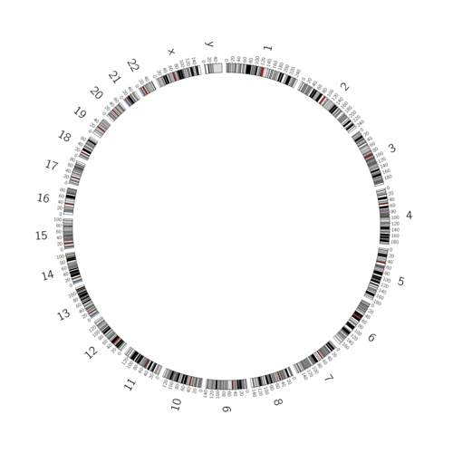

# Introduction
{:.no_toc}

e have identified several Circos plots which cover a wide gamut of possibilities; from more artistic renderings of data, to converted Circster plots, to reproducing plots that are output by unconfigurable, purpose specific circos wrappers.

In this tutorial we will show you how to reproduce these plots and hopefully you can draw inspiration from these for developing your own plots.

> ### Agenda
>
> In this tutorial, we will deal with:
>
> 1. TOC
> {:toc}
>
{: .agenda}


# Circos is an Iterative Process

Publication quality circos plots are *rarely* produced on the first try. Developing a quality Circos plot involves a lot of trial and error to find the best way to convey specific pieces of your data to your audience.



And while the Circos tool covers a huge range of scenarios, it does not support every option. When you've created the best possible plot, you will likely be only 90% of the way to a true, production-quality plot. As a result, the Circos tool lets you download the configuration files it uses, and you can immediately continue from where you were in Galaxy.

# Nature Cover ENCODE Diagram

Here we will reproduce the output of the [Circos tutorial](http://circos.ca/documentation/tutorials/recipes/nature_cover_encode/lesson) for producing an image like that which was used on Nature's Cover:


The official Circos tutorial goes into detail on how to use rules and variables and automagic counting to help automate the production of such an image.

```
<plot>
r1   = dims(ideogram,radius_inner)
         - conf(plot_padding)*eval(remap(counter(plot),0,conf(num_plots),1,0.9))
         - eval((conf(plot_width)+conf(plot_padding))*counter(plot)*eval(remap(counter(plot),0,conf(num_plots),1,0.9)))
r0   = conf(.,r1)
         - conf(plot_width)*eval(remap(counter(plot),0,conf(num_plots),1,0.9))
post_increment_counter = plot:1
<<include rules.conf>>
</plot>
```

Due to the Circos Galaxy tool being a simplified interface and more user-friendly interface, we cannot make use of these advanced features like using Perl's math or `eval`uating code snippets to generate our image. <!-- TODO(hxr): fix the wording, this is gross -->

## Data Formats

<!-- TODO(hxr): document it all -->

The Circos Galaxy tool mostly accepts `tabular` files. These always have at least three columns:

1. Chromosome
2. Start
3. End

## Get data

> ###  Hands-on: Data upload
>
> 1. Create a new history for this tutorial
> 2. Import the files from [Zenodo]() or from the shared data library
>
>    - [Chromosome File](../../files/chrom.tab)
>    - [Highlights](../../files/highlights.tab)
>
>    
>
> 3. Rename the datasets
> 4. Check that the datatype
>
>    
>
{: .hands_on}

- what is required for a plot (karyotype)
- outputs
- plot options
- ideogram
- ticks
- highlights
- 2d
- links


> ###  Hands-on: Circos
>
> We will now run the Circos tool. In terms of tool interface, it is one of the most complex extant Galaxy tools.
>
> > ###  Tip: Interface Complexity
> > The interface looks deceptively simple when all of the sections are collapsed, but as you start adding tracks it can be easy to get lost and become overwhelmed, so just go slowly. Do not worry if your plot does not look exactly like the expected output.
> {: .tip}
>
> 1. **Circos**  with the following parameters:
>    - In *"Reference Genome and Cytogenetic Bands"*:
>        - *"Reference Genome"*: `Karyotype`
>            -  *"Karyotype Configuration"*: `chrom.tab`
>    - In *"Plot Options"*:
>        - *"Plot Format"*: `Color`
>            - *"Background Color"*: `#000000` <span style="background: #000000">&nbsp;&nbsp;&nbsp;&nbsp;&nbsp;&nbsp;</span>
>    - In *"Ideogram Configuration (Genome/Chromosomes)"*:
>        - *"Thickness"*: `0.0`
>        - In *"Labels"*:
>            - *"Show Label"*: `Yes`
>    - In *"Highlights"*:
>        - In *"Highlight"*:
>            - Click on *"Insert Highlight"*:
>            - In *"1: Highlight"*:
>                - *"Outside Radius"*: `0.99`
>                - *"Inside Radius"*: `0.9`
>                -  *"Highlight Data Source"*: `highlights.tab`
>            - Click on *"Insert Highlight"*:
>            - In *"2: Highlight"*:
>                - *"Outside Radius"*: `0.89`
>                - *"Inside Radius"*: `0.8`
>                -  *"Highlight Data Source"*: `highlights.tab`
>                - In *"Rules"*:
>                    - In *"Rule"*:
>                        - Click on *"Insert Rule"*:
>                        - In *"1: Rule"*:
>                            - In *"Conditions to Apply"*:
>                                - Click on *"Insert Conditions to Apply"*:
>                                - In *"1: Conditions to Apply"*:
>                                    - *"Condition"*: `Randomly`
>                                        - *"Percentage of bins"*: `0.1`
>                            - In *"Actions to Apply"*:
>                                - Click on *"Insert Actions to Apply"*:
>                                - In *"1: Actions to Apply"*:
>                                    - *"Action"*: `Change Fill Color for all points`
>                                        - *"Fill Color"*: `#8064a2` <span style="background: #8064a2">&nbsp;&nbsp;&nbsp;&nbsp;&nbsp;&nbsp;</span>
>                            - *"Continue flow"*: `Yes`
>                        - Click on *"Insert Rule"*:
>                        - In *"2: Rule"*:
>                            - In *"Conditions to Apply"*:
>                                - Click on *"Insert Conditions to Apply"*:
>                                - In *"1: Conditions to Apply"*:
>                                    - *"Condition"*: `Randomly`
>                                        - *"Percentage of bins"*: `0.1`
>                            - In *"Actions to Apply"*:
>                                - Click on *"Insert Actions to Apply"*:
>                                - In *"1: Actions to Apply"*:
>                                    - *"Action"*: `Change Fill Color for all points`
>                                        - *"Fill Color"*: `#ffff00` <span style="background: #ffff00">&nbsp;&nbsp;&nbsp;&nbsp;&nbsp;&nbsp;</span>
>                            - *"Continue flow"*: `Yes`
>            - Click on *"Insert Highlight"*:
>            - In *"3: Highlight"*:
>                - *"Outside Radius"*: `0.79`
>                - *"Inside Radius"*: `0.7`
>                -  *"Highlight Data Source"*: `highlights.tab`
>                - In *"Rules"*:
>                    - In *"Rule"*:
>                        - Click on *"Insert Rule"*:
>                        - In *"1: Rule"*:
>                            - In *"Conditions to Apply"*:
>                                - Click on *"Insert Conditions to Apply"*:
>                                - In *"1: Conditions to Apply"*:
>                                    - *"Condition"*: `Randomly`
>                                        - *"Percentage of bins"*: `0.2`
>                            - In *"Actions to Apply"*:
>                                - Click on *"Insert Actions to Apply"*:
>                                - In *"1: Actions to Apply"*:
>                                    - *"Action"*: `Change Fill Color for all points`
>                                        - *"Fill Color"*: `#8064a2` <span style="background: #8064a2">&nbsp;&nbsp;&nbsp;&nbsp;&nbsp;&nbsp;</span>
>                            - *"Continue flow"*: `Yes`
>                        - Click on *"Insert Rule"*:
>                        - In *"2: Rule"*:
>                            - In *"Conditions to Apply"*:
>                                - Click on *"Insert Conditions to Apply"*:
>                                - In *"1: Conditions to Apply"*:
>                                    - *"Condition"*: `Randomly`
>                                        - *"Percentage of bins"*: `0.2`
>                            - In *"Actions to Apply"*:
>                                - Click on *"Insert Actions to Apply"*:
>                                - In *"1: Actions to Apply"*:
>                                    - *"Action"*: `Change Fill Color for all points`
>                                        - *"Fill Color"*: `#ffff00` <span style="background: #ffff00">&nbsp;&nbsp;&nbsp;&nbsp;&nbsp;&nbsp;</span>
>
>
> 2. View the output PNG file
>
{: .hands_on}

When this has complete, your output should look similar to the following;


<!--

What question could we ask about this plot?
***TODO***: *Consider adding a question to test the learners understanding of the previous exercise*

> ###  Questions
>
> 1. Question1?
> 2. Question2?
>
> > ###  Solution
> >
> > 1. Answer for question1
> > 2. Answer for question2
> >
> {: .solution}
>
{: .question}


-->

# Conclusion
{:.no_toc}

Sum up the tutorial and the key takeaways here. We encourage adding an overview image of the
pipeline used.
