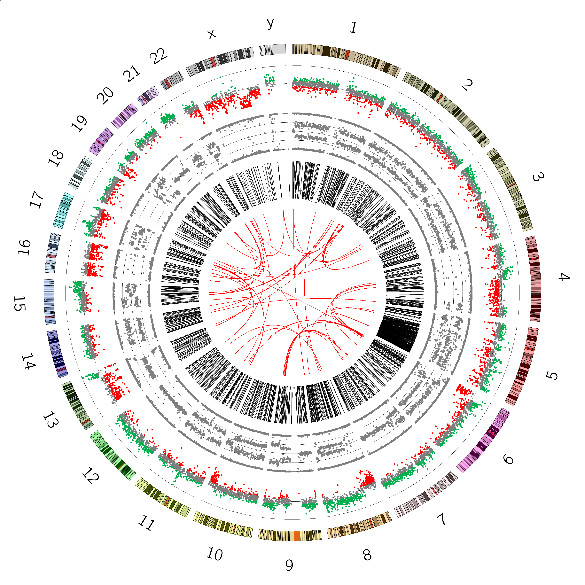
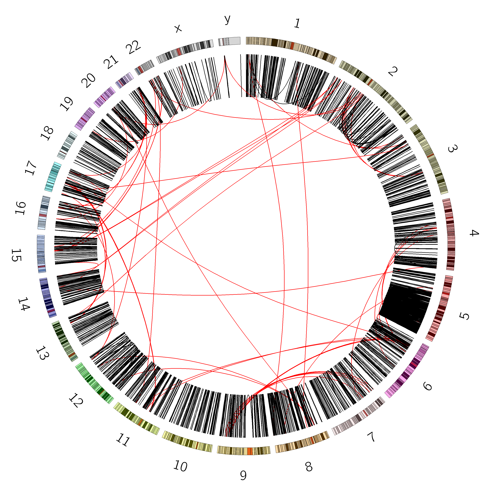
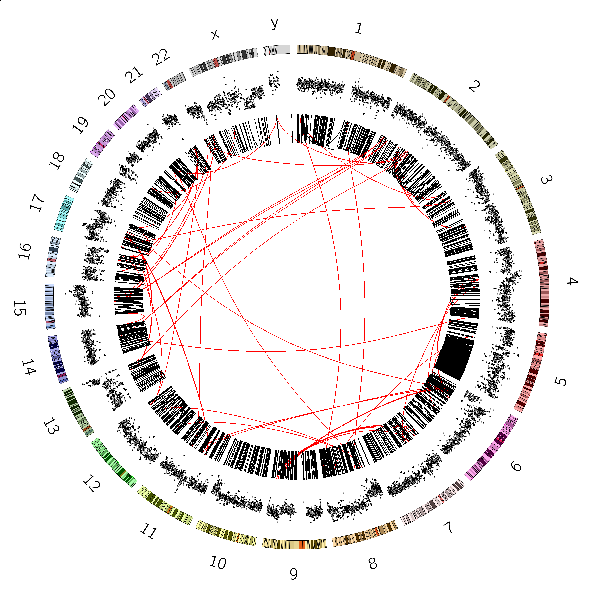

# Introduction


Circos () is a software package for visualizing data in a circular layout. This makes Circos ideal for exploring relationships between objects or positions. Circos plots have appeared in thousands of scientific publications. Although originally designed for visualizing genomic data, it can create figures from data in any field.


In this tutorial you will learn how to create such publication-ready Circos plots within Galaxy, and hopefully you can draw inspiration from these for developing your own plots.

> <agenda-title></agenda-title>
>
> In this tutorial, we will deal with:
>
> 1. TOC
> {:toc}
>
{: .agenda}


# Background

Circos supports various different plot types, such as histograms, scatter plots and heat maps. Each Circos plot may contain multiple tracks containing different sub-plots, making it ideal for visualisation of high-dimensional data.


## Circos is an Iterative Process

Publication quality circos plots are *rarely* produced on the first try. Developing a quality Circos plot involves a lot of trial and error to find the best way to convey specific pieces of your data to your audience. Usually you will build up the circos plot one track at a time, and play around with different parameter settings until the plot looks exactly like you want it to:


Circos is an extremely flexible but also very complex tool. The Galaxy Circos tool covers the most commonly used Circos features, but in order to avoid becoming too complex, it does not expose every single configuration option available in Circos. However, the Galaxy Circos tool allows you to download the full set of configuration files it uses, allowing you to manually tweak the plot further.


> <comment-title>Circos tutorials</comment-title>
>
> To learn more about using Circos outside of Galaxy (e.g. for tweaking the
> Circos configuration output by the Galaxy tool), there are a wide range
> of tutorials available from the [Circos website](http://circos.ca)
{: .comment}


# Circos Basics

## Ideogram

The ideogram depicts your major data classes. For genomics data this is usually chromosomes, but could also be species, or genes, or another resolution level depending on what relationships you want to show. For non-genomic data this could be individuals in a population, countries, or any other major facet of your data that you want to use for grouping.

{: width="70%"}


## Data Tracks

Within this ideogram, we can plot *data tracks*. There are different plot types available, such as scatterplots, histograms, heatmaps, and link tracks. Below is a list of the main track types with example images:

<table style="table-layout: fixed">
	<thead>
		<tr>
			<th width="300">Example</th>
			<th>Description</th>
		</tr>
	</thead>
	<tbody>
		<tr>
			<td></td>
			<td>
				<b>Scatter plot</b> track type. All data points are indicated by a glyph (shape).
				<br /><br />

				<u>Data format</u>: four or five columns, tab separated. While Circos accepts space or tab separated, to use Galaxy's data manipulation tools you will need tab separated data. The attributes colum is completely optional but can be used to override colours, or provide extra context like "strand" or something else on which it might be diserable to filter. The format is <code>key=value,key2=value2,...</code>
				<table>
					<thead><tr><th>Chromosome</th><th>Start</th><th>End</th><th>Value</th><th>Attributes (optional)</th></tr></thead>
						<tbody>
						<tr>
							<td>chrX</td><td>0</td><td>7499999</td><td>50</td><td></td>
						</tr>
						<tr>
							<td>chrX</td><td>7500000</td><td>14999999</td><td>100</td><td>fill_color=red</td>
						</tr>
						<tr>
							<td>chrX</td><td>15000000</td><td>22499999</td><td>-25</td><td>fill_color=(140,104,137)</td>
						</tr>
					</tbody>
				</table>
			</td>
		</tr>
		<tr>
			<td></td>
			<td><strong>Line plot</strong> track type. Data points are connected by a line. <br/><br/><u>Data format</u>: identical to scatter plot.</td>
		</tr>
		<tr>
			<td></td>
			<td><strong>Histogram</strong> track type. Data points are connected to form a step-like trace. <br/><br/><u>Data format</u>: identical to scatter plot.</td>
		</tr>
		<tr>
			<td></td>
			<td><strong>Heatmap</strong> track type. <br/><br/><u>Data format</u>: identical to scatter plot.</td>
		</tr>
		<tr>
			<td></td>
			<td>
				<strong>Tile</strong> track type. This is useful to indicate a range of the chromosome, for example to show genes, <span class="notranslate">reads</span>, repeat regions, etc.
				<br /><br />

				<u>Data format</u>: four or five columns, similar to scatter plot but instead of a value or a score, we have a text label that can be displayed.
				<table>
					<thead><tr><th>Chromosome</th><th>Start</th><th>End</th><th>Label</th><th>Attributes (optional)</th></tr></thead>
						<tbody>
						<tr>
							<td>chr1</td><td>10119128</td><td>10345073</td><td>C_994</td><td>id=Conrad_994</td>
						</tr>
						<tr>
							<td>chr1</td><td>10171406</td><td>10415218</td><td>M_1535</td><td>id=McCarroll_1535</td>
						</tr>
						<tr>
							<td>chr1</td><td>103351772</td><td>103448763</td><td>M_5507</td><td>id=Mills_5507</td>
						</tr>
					</tbody>
				</table>
			</td>
		</tr>
		<tr>
			<td></td>
			<td><strong>Text</strong> track type. Text may also be added to a plot, for instance to indicate names of impacted genes. <br/><br/><u>Data format</u>: identical to tiles plot.</td>
		</tr>
		<tr>
			<td></td>
			<td>
				<strong>Link</strong> track type. Relationship between objects can be indicated by a line between them.
				<br /><br />

				<u>Data format 1</u>: six or seven columns, including the optional attribute column.
				<table>
					<thead>
						<tr>
							<th>Chromosome 1</th><th>Start 1</th><th>End 1</th>
							<th>Chromosome 2</th><th>Start 2</th><th>End 2</th>
							<th>Attributes (optional)</th>
						</tr>
					</thead>
					<tbody>
						<tr>
							<td>chrX</td><td>87655109</td><td>107655109</td><td>chr12</td><td>109275831</td><td>129275831</td><td>color=blue,value=0</td>
						</tr>
						<tr>
							<td>chrX</td><td>73701156</td><td>93701156</td><td>chr22</td><td>26513447</td><td>46513447</td><td>color=green,value=1</td>
						</tr>
						<tr>
							<td>chr12</td><td>121879007</td><td>132349534</td><td>chr7</td><td>43840633</td><td>63840633</td><td>color=red,value=2</td>
						</tr>
					</tbody>
				</table>

				<u>Data format 2</u>: four or five columns, including the optional attribute column.
				<table>
					<thead>
						<tr>
							<th>Link ID</th><th>Chromosome</th><th>Start</th><th>End</th><th>Attributes (optional)</th>
						</tr>
					</thead>
					<tbody>
						<tr>
							<td>link_0</td><td>chrX</td><td>87655109</td><td>107655109</td><td>color=red</td>
						</tr>
						<tr>
							<td>link_0</td><td>chr12</td><td>109275831</td><td>129275831</td><td>color=blue</td>
						</tr>
						<tr>
							<td>link_1</td><td>chrX</td><td>73701156</td><td>93701156</td><td>color=green</td>
						</tr>
						<tr>
							<td>link_1</td><td>chr22</td><td>26513447</td><td>46513447</td><td>color=black</td>
						</tr>
					</tbody>
				</table>
			</td>
		</tr>
		<tr>
			<td></td>
			<td><strong>Ribbons</strong> are a type of link track. These can be coloured and twisted as desired. <br/><br/><u>Data format</u>: identical to links.</td>
		</tr>
	</tbody>
</table>

Tracks can be customized a lot, some relevant concepts are:
  - **Radius** of the track determines its location between the center (0) and the ideogram (1).
  - **Rules** can be defined to change for example the color of data points depending on the value of the data points.
  - **Axes and backgrounds** can be drawn on a data track


There are a *lot* of further customizations available within Circos, but in this tutorial, we will start with the basics.


# Tutorial Overview

We will now illustrate Circos further with a number of example plots. Each of these can be run independently of each other, so feel free to pick an example that suits your interest. If this is your first time using Circos, we suggest doing the examples in order.

| Link to Section     | Preview       | Note                                  |
| ------------------- |:-------------:| :------------------------------------ |
| [Cancer Genomics](#example-cancer-genomics) | {: width="45%"} | Create a plot using data from a cancer cell line. This tutorial will guide you through the iterative process of building your first Circos image, and covers some cancer background as well. |
| [Presidential Debate](#example-presidential-debate) | {: width="45%"} | To show that Circos can be used for non-genomics data as well, this example recreates a plot that appeared in the New York times, visualizing data of the presidential debates. |
| [ENCODE cover](#example-nature-cover-encode) | {: width="30%"} | Recreate a Nature Cover! |


# Example: Cancer Genomics

In this section, we will recreate a Circos plot of the VCaP cancer cell line presented in . In this study, data from various sources were combined into a single integrative Circos plot.


This plot has 4 tracks:
 - Structural variants (2 tracks, data obtained from whole-genome NGS sequencing data)
 - B-allele Frequency (obtained from SNP array data)
 - Copy Number (obtained from SNP array data)


In this section we will reproduce this Circos plot step by step.

## Data upload


> <hands-on-title>Obtaining our data</hands-on-title>
>
> 1. Make sure you have an empty analysis history. Give it a name.
>
>    
>
> 2. 
>    - Import the sample data files to your history, either from a shared data library (if available), or from Zenodo using the following URLs:
>
>    ```
>    https://zenodo.org/record/4494146/files/VCaP_Copy-Number.tsv
>    https://zenodo.org/record/4494146/files/VCaP_B-allele-Frequency.tsv
>    https://zenodo.org/record/4494146/files/VCaP-highConfidenceJunctions.tsv
>    https://zenodo.org/record/4494146/files/hg18_karyotype_withbands.txt
>    ```
>
>    
>
>    
>
{: .hands_on}


## Ideogram

As the first step to this Circos plot, let's configure the ideogram (set of chromosomes to draw). You can use one of the built-in genomes, or you can supply your own karyotype file.

> <hands-on-title>Set ideogram configuration</hands-on-title>
>
> 1.  visualizes data in a circular layout with the following parameters:
>    - In *"Karyotype"*:
>        - *"Reference Genome Source"*: `Custom Karyotype`
>            -  *"Karyotype Configuration"*: `hg18_karyotype_withbands.txt`
>    - In *"Ideogram"*:
>        - *"Spacing Spacing Between Ideograms (in chromosome units)"*: `50`
>        - *"Radius"*: `0.85`
>        - *"Thickness"*: `45`
>        - In *"Labels"*:
>            - *"Label Font Size"*: `64`
>        - In *"Cytogenic Bands"*:
>            - *"Bands transparency"*: `2`
>            - *"Band Stroke Thickness"*: `1`
>
> 2. **Rename**  the output `Circos Plot ideogram`
>
>    
>
{: .hands_on}

You should now have a plot that looks like this:

{: width="50%"}

We will use this as the basis for our plot, and add data tracks one at a time.


> <comment-title>Advanced info: defining your karyotype file</comment-title>
>
> Since our data uses `hg18` reference genome, we supply a corresponding karyotype file:
>
> ```
> chr - chr1 1 0 247249719 chr1
> chr - chr2 2 0 242951149 chr2
> chr - chr3 3 0 199501827 chr3
> chr - chr4 4 0 191273063 chr4
> chr - chr5 5 0 180857866 chr5
> chr - chr6 6 0 170899992 chr6
> chr - chr7 7 0 158821424 chr7
> chr - chr8 8 0 146274826 chr8
> chr - chr9 9 0 140273252 chr9
> chr - chr10 10 0 135374737 chr10
> chr - chr11 11 0 134452384 chr11
> chr - chr12 12 0 132349534 chr12
> chr - chr13 13 0 114142980 chr13
> chr - chr14 14 0 106368585 chr14
> chr - chr15 15 0 100338915 chr15
> chr - chr16 16 0 88827254 chr16
> chr - chr17 17 0 78774742 chr17
> chr - chr18 18 0 76117153 chr18
> chr - chr19 19 0 63811651 chr19
> chr - chr20 20 0 62435964 chr20
> chr - chr21 21 0 46944323 chr21
> chr - chr22 22 0 49691432 chr22
> chr - chrX x 0 154913754 chrx
> chr - chrY y 0 57772954 chry
> ```
>
> Chromosome definitions are formatted as follows: `chr - ID LABEL START END COLOR`
>
> - The first two fields are always `chr`, indicating that the line defines a chromosome, and `-`. The second field defines the parent structure and is used only for band definitions.
> - The `ID` is the identifier used in data files whereas the `LABEL` is the text that will appear next to the ideogram on the image.
> - The `start` and `end` values define the size of the chromosome. The karyotype file should store the entire chromsome size, not just the region you wish to draw.
> There are other parameters we can use to draw only a subset of the data (e.g. just one chromosome).
> - The `color` parameter is optional, to use built-in color scheme, use `chr1, chr2. etc` again in this column
>
> More information about this format (including karyotype definitions for several species) can be found on the [Circos website](http://circos.ca/documentation/tutorials/ideograms/karyotypes/)
>
> > <question-title></question-title>
> >
> > 1. Why didn't we use the `hg18` built-in genome (using the `Locally Cached` option)?
> >
> > > <solution-title></solution-title>
> > >
> > > 1. These built-in definitions often include more than the canonical chromosomes (chr1-chr22, chrX, chrY), which we might not want to plot. For example, using
> > >    The full definition of `hg18` built-in to Galaxy, we get the following ideogram:
> > >
> > >    {: width="85%"}
> > >
> > >    We could still use this karyotype, but we would have to limit the chromosomes to be drawn in the Circos settings (we will cover this later). In this example however, we supply our own karyotype file defining only the canonical chromosomes.
> > {: .solution}
> {: .question}
>
{: .comment}


## Structural Variations

The first data track we will configure, will be the structural variants (SVs) using the *link* track type in Circos. We will colour the links differently depending on whether the SVs are intrachromosomal (within a single chromosome) or interchromosomal (between different chromosomes).


> <comment-title>Background: Structural Variants</comment-title>
>
> Structural variants (SVs) are large-scale genomic rearrangements. SVs involve large segments of DNA (>50 bp) that are deleted, duplicated, translocated or inverted.
>
> 
>
> Image Credit: 
>
> One of the first observations of SVs in the human genome is known as the [Philadelphia Chromosome](https://en.wikipedia.org/wiki/Philadelphia_chromosome), a SV observed in leukemia. In this mutation, a translocation of genetic material  occurs between chromosomes 9 and 22, resulting in a fusion between genes *BCR* and *ABL1*, causing the production of a hybrid protein, impairing various signalling pathways and causing the cell to divide uncontrollably.
>
> {: width="70%"}
>
> In cancer analyses it is therefore often useful to examine SVs and look for potential fusion genes that may affect cell function.
>
{: .comment}


SVs are usually described in terms of the SV **breakpoints** (or **junctions**); sets of genomic locations which are separated by a large distance on the reference genome, but have become adjacent in the sample through the occurrence of structural variants. Unfortunately, there is no standard file format for SV data, with different SV callers outputting different formats. Therefore, our first step will be to transform our input dataset to the Circos format for link tracks.


**SV File Format:**

```
#ASSEMBLY_ID	GS000008107-ASM
#SOFTWARE_VERSION	2.0.2.22
#GENERATED_BY cgatools
#GENERATED_AT	2012-Mar-07 19:33:32.930656
#FORMAT_VERSION	2.0
#GENOME_REFERENCE	NCBI build 36
#SAMPLE	GS00669-DNA_D02
#TYPE	JUNCTIONS
#DBSNP_BUILD	dbSNP build 130
#GENE_ANNOTATIONS	NCBI build 36.3
>Id	LeftChr	LeftPosition	LeftStrand	LeftLength	RightChr	RightPosition	RightStrand	RightLength	StrandConsistent	Interchromosomal	Distance	DiscordantMatePairAlignments	JunctionSequenceResolved	TransitionSequence	TransitionLength	LeftRepeatClassification	RightRepeatClassification	LeftGenes	RightGenes	XRef	DeletedTransposableElement	KnownUnderrepresentedRepeat	FrequencyInBaselineGenomeSet	AssembledSequence	EventId	Type	RelatedJunctions
3872	chr1	815629	-	155	chr1	5649523	-	822	Y	N	4833894	13	Y		0	AluS:SINE:Alu;SegDup;Self chain	AluSx:SINE:Alu;Self chain						0.92	gcaaccaaaatgactattctttctaccctcCTAGTTCAGACATAGCCTGAGACTTTTTTTTTTTTGAGATGAAGTCTCACTCTGTCACTCAGGCTGGAGTGCAGTGGCATGGTCTCGGCTCATTGCAATCTCTACCTCCCGGGTTCAAGTGATTCTCCTGCCTCAGCCTCCCAAGTAGCTGGGGCTACAGGCGTGCACCACCACACCTGGCTAATTTTCATATTATTAGTAGAGATGGGGTTTCACCATGTTGGTCAGACTGGTCTTGAACTCCTGACCTCAGGTGATCTGCCCGCCTCTGCCTCCCAAAATGCTGAGATTACAGATGTGAGCCACTGtgcccggccgcctgagacattttggacgac	490	complex	6269;6270;8575;8577;8578
8577	chr1	816163	+	449	chr1	5650075	+	435	Y	N	4833912	21	Y		0	SegDup;Self chain	Self chain						1.00	gactgcagggggcaggagctctctggctggGCCTTGATCGTGTTCAAGCCACAACCACAGACCTAGGCGTGGTCCCTCAGCCACCTTGTAGCCTTGGCTTGCAACATCTCGACATGGAAACCAAAATGCAGCAGGGCCAATGTGATCTGAAGTTTCCTGAAAAGTTTCTCAGACCCcctcttttaccccttgtgcaacctgcacac	490	complex	3872;6269;6270;8575;8578
8578	chr1	816176	+	363	chr1	5650768	+	228	Y	N	4834592	12	Y	CTTTTGTAACCTGCACACAGTGACCTGTATTCTAGAGGGTCCACACAGAGCTGCCATTCCTTCTGCCAGACCCTGCGGGACTCAGGCATTCTGGAGGCTTCCTGCCCTACAAAGGCAGCCAGACTCCCGCCATGCATCCCTGCACCAGCGGCTCACGGCCAGCTCCCTCACCTGCACCAGCGGCTCACGGCTAGCTCCCTCATCTGCATTCCAGTGGCTCATGGCCAGCTCCCTCACCTGCACCAGCGGCTCTCGGCCGGCTCCCTCCCCTGCACTCCAGCGGC	284	Self chain	Self chain;Tandem period 100;Tandem period 34;Tandem period 66						1.00	aaaccaaaacgcagcagagcccatgtgatcTGAAAGTTCCTGAAAAGTTGCCCAGACCCCCTCTTGTACCCCTTTTGTAACCTGCACACAGTGACCTGTATTCTAGAGGGTCCACACAGAGCTGCCATTCCTTCTGCCAGACCCTGCGGGACTCAGGCATTCTGGAGGCTTCCTGCCCTACAAAGGCAGCCAGACTCCCGCCATGCATCCCTGCACCAGCGGCTCACGGCCAGCTCCCTCACCTGCACCAGCGGCTCACGGCTAGCTCCCTCATCTGCATTCCAGTGGCTCATGGCCAGCTCCCTCACCTGCACCAGCGGCTCTCGGCCGGCTCCCTCCCCTGCACTCCAGCGGCtcaccgccggctccctcacctgcactccag	490	complex	3872;6269;6270;8575;8577
```


**Circos Input Format:**

```
chromosome - start - end - chromosome - start - end
```

So in order to convert this to Circos format, we need to
- Remove header lines (lines starting with `#`)
- Select the columns containing the chromosomes and positions of the breaks (junctions)




> <hands-on-title>Prepare input data</hands-on-title>
>
> 1.  lines that match an expression with the following parameters:
>    -  *"Select lines from"*: `VCaP highConfidenceJunctions.tsv`
>    - *"that"*: `NOT Matching`
>    - *"the pattern"*: `^[#><]`
>
> 2.  columns from a table with the following parameters:
>    - *"Cut columns"*: `c2,c3,c3,c6,c7,c7`
>    -  *"From"*: output of **Select** 
>
> 3. **Rename**  this output to `SVs Circos.tsv`
>
{: .hands_on}

Now that we have the correct format, we can plot our data in Circos. We will plot the SVs as links; showing which parts of genome have been fused together in our sample.

Given that Circos is a very complex with dozens of parameters to set, we re-run previous circos runs to build on the existing configuration we have done, without losing the progress and having to re-specify parameters every time.

> <hands-on-title>Add Circos link track for SVs</hands-on-title>
>
> 1. Click **Re-run**  on the previous Circos  run (`Circos Plot ideogram`)
>
> 2. Add a new Link Track for the SV data, colouring by SV type:
>    - In *"Link Tracks"*:
>       - In *"Link Data"*:
>           -  *"Insert Link Data"*
>               - *"Inside Radius"*: `0.95`
>               -  *"Link Data Source"*: `SVs Circos.tsv`
>               - *"Link Type"*: `basic`
>               - *"Thickness"*: `3.0`
>               - *"Bezier Radius"*: `0.5`
>               - In *"Rules"*:
>                   - In *"Rule"*:
>                       -  *"Insert Rule"*
>                           - In *"Conditions to Apply"*:
>                               -  *"Insert Conditions to Apply"*
>                                   - *"Condition"*: `Interchromosomal`
>                           - In *"Actions to Apply"*:
>                               -  *"Insert Actions to Apply"*
>                                   - *"Action"*: `Change Fill Colour`
>                                   - *"Change fill Color"*:  (red)
>
> 2. **Rename**  the output `Circos Plot SVs`
>
{: .hands_on}


Your output should look something like this:

{: width="60%"}

> <question-title></question-title>
>
> 1. Are there more interchromosomal or intrachromosomal SVs?
> 2. Which chromosome appears to have the most SVs?
>
> > <solution-title></solution-title>
> >
> > 1. Interchromosomal SVs (between different chromosomes) are coloured red in this
> >    plot, while SVs within a single chromosome are coloured black. By plotting the data with Circos, you can now easily see
> >    at a glance that there are more intrachromosomal SVs (black) than interchromosomal SVs (red).
> > 2. Chromosome 5 appears to have a lot more SVs than the other chromosomes (it looks almost completely black!)
> >
> {: .solution}
{: .question}

We see from this image that chromosome 5 has an unusually large number of SVs, let's look at that chromosome more closely, by limiting the chromosomes Circos should draw:


> <hands-on-title>Plot only Chromosome 5</hands-on-title>
>
> 1. Hit **Rerun**  on the previous Circos  run
>
> 2. **Change** the following tool parameters:
>    - In *"Ideogram"*:
>       - *"Limit/Filter Chromosomes"*: `chr5`
>       - *"Spacing Between Ideograms (in chromosome units)"*: `0.5`
>
{: .hands_on}

You should see a plot like:

">q arm</a> of this chromosome appears to be affected by an unusually large number of SVs"){: width="50%"}


> <question-title></question-title>
>
> 1. Are there indeed significantly more SVs on chromosome 5 than on the other chromosomes? (hint: plot some of the other chromosomes as well)
> 2. Are the SVs equally distributed over chromosome 5? Can you think of an explanation for this?
>
> > <solution-title></solution-title>
> >
> > 1. Yes, plotting for example only chromosome 1 (left) and comparing this with the chromosome 5 plot (right), reveals that chr5 has abnormally high number of SVs compared to the other chromosomes
> >
> >    {: width="40%"}
> >    {: width="40%"}
> >
> >
> > 2. No, only part of chromosome 5 appears to be affected. It turns out that this region is exactly one arm of the chromosome.
> >    This could be caused by a phenomenon known as *chromothripsis* (see next box).
> >
> >    {: width="50%"}
> >
> {: .solution}
{: .question}


> <comment-title>Background: Chromothripsis</comment-title>
>
> **Chromothripsis** is a phenomenon whereby (part of) a chromosome is shattered in a single catastrophic event, and subsequently imprecisely stitched
together by the cell's repair mechanisms. This leads to a huge number of SV junctions.
>
> {: width="60%"}
>
> > **Characteristics of chromothripsis:**
> >
> > 1. **Large numbers of complex rearrangements** in localised regions of single chromosomes or chromosome arms (showed by high density and clustered breakpoints) which suggests that chromosomes need to be condensed e.g. in mitosis for chromothripsis to occur.
> > 2. Low **copy number states- alternation between 2 states** (sometimes 3) suggesting that rearrangements occurred in a short period of time.
> > 3. In chromothriptic areas you get **alternation of regions which retain heterozygosity-two copy (no loss or gain), with regions that have loss of heterozygosity- one copy** (heterozygous deletion). This suggest that the rearrangements took place at a time that both parental copies of the chromosome were present and hence early on the development of the cancer cell.
> >
> > *from [https://en.wikipedia.org/wiki/Chromothripsis](https://en.wikipedia.org/wiki/Chromothripsis)*
> {: .quote}
>
{: .comment}

By visualizing the SVs, we have observed characteristic 1 of the list above; large number of complex rearrangements in a localised regon of a single chromosome arm, one of the main features of chromothripsis. In order to confirm we are indeed dealing with chromothripsis, we will next look plot copy number data and B-allele frequency data (both obtained from microarrays) to ascertain whether we observe the expected patterns in copy number states and heterozygosity.


## Copy Number Variation

Next, we will create a track displaying copy number. This data comes from Affymetrix SNP arrays.


> <comment-title>Background: Copy Number Variation (CNV)</comment-title>
>
> The human genome is a *diploid* genome, meaning there are 2 copies of each chromosome, one paternal, and one maternal. This means that for any given gene, humans have two different copies of it in our genome.
>
> <br>
>
> Some structural variants will lead to a change in this copy number, for example duplications and deletions. Other SVs (such as inversions and translocations) do not result in a change in copy number, since the piece of DNA is just moved, but the number of copies of it remains the same.
>
> 
>
> In a healthy diploid genome, we expect the copy number to be around 2 in most places, with occasional duplications and deletions which are part of
> the normal variation within the human population. In highly rearranged genomes such as cancer we expect to see a lot more copynumber variation.
>
{: .comment}


> <comment-title>Background: DNA Microarrays</comment-title>
>
> **Microarrays** are used to measure the expression levels of large number of genes simultaneously, or to genotype multiple regions of a genome. In this example in our tutorial, we have data from a **SNP array**. This type of microarray detects the presence and proportion (homozyogous/heterozygous) of a
> wide range of SNPs (Single Nucleotide Polymorphisms) known to exist within the population. A set of **probes** targeting positions of a large number of known SNPs
> are used to detect the presence or absence of the SNPs in the sample.
>
> <br>
> Each SNP location is covered by 2 probes (one for the reference allele, and one for the variant allele). By comparing their combined intensity to the expected intensity (e.g. the sample average), a measure known as the **Log R ratio**, we can learn something about copy number. The resulting plots often look something like this:
>
>   {: width="50%"}
>
> With a value of 0 indicating the normalized copy number (2 in the case of a diploid genome), and significant diversions from this expected value
> point to copy number gains or losses (the figure above shows 1 region with a copy number loss).
>
{: .comment}


Let's look at our file format (VCaP-copynumber.txt`):

```
Chromosome	Start	End	Value	Array
chr1	10004	10004	0.07110633	0
chr1	28663	28663	0.2057637	0
chr1	46844	46844	0.2016204	0
chr1	59415	59415	0.1775235	0
chr1	72017	72017	-0.1353417	0
```

The `Value` column indicates the copy number state, and is always between -1 and 1. the position has expected copy-number (`0`), indicating 2 copies in the case of diploid genomes, or whether it has a copy number loss (negative values) or a gain in copy number (positive values).

This is pretty close to the format expected by Circos for 2D data tracks (`chr - start - end - value`), all we need to do to prepare this file is remove the first header line, and remove column 5. Furthermore, because this file is quite large, we do a subsampling down to 25000 lines; this is enough to get a genome-level overview of the data, but small enough that Circos will complete plotting quickly.


> <hands-on-title>Prepare CNV input file</hands-on-title>
>
> 1.  of a file with the following parameters:
>    - *"Remove first"*: `1`
>    -  *"from"*: `VCaP copy number.tsv`
>
> 2.  columns from a table  with the following parameters:
>    - *"Cut columns"*: `c1,c2,c3,c4`
>    -  *"From"*: output of **Remove beginning** 
>
> 3.  with the following parameters:
>    - *"Randomly select"*: `25000`
>    -  *"from"*: output of **Cut** 
>
> 4. **Rename**  the output file `cnv-circos.txt`
>
{: .hands_on}


Now that our file is prepared, we can add a track to our Circos image. We will create a scatterplot, and colour each data point depending on copy number state (green=gain, red=loss)


> <hands-on-title>Add Copy Number track to Circos</hands-on-title>
>
> 1. Hit **Rerun**  on the Circos plot containing the SV track  run (`Circos Plot SVs`)
>
> 2. Add a new scatterplot track to the image
>    - In *"2D Data Tracks"*:
>        -  *"Insert 2D Data Plot"*
>            - *"Outside Radius"*: `0.95`
>            - *"Inside Radius"*: `0.8`
>            - *"Plot Type"*: `Scatter`
>                - *"Scatter Plot Data Source"*: `cnv-circos.txt`
>                - In *"Plot Format Specific Options"*:
>                    - *"Glyph Size"*: `4`
>                    - *"Fill Color"*:  (gray)
>                    - *"Stroke Thickness"*: `0`
>            - *"Minimum / maximum options"*: `Supply min/max values`
>                - *"Minimum value"*: `-1.0`
>                - *"Maximum value"*: `1.0`
>
> 3. **Examine**  the resulting plot
>
>    > <question-title></question-title>
>    >
>    > 1. Examine the resulting plot, what do you see?
>    > 2. How could we solve this?
>    >
>    > > <solution-title></solution-title>
>    > >
>    > > 1. We see the new track, but it overlaps with the SV track. This is because we used the same `radius` parameter.
>    > >    This parameter determines the position of the track within the plot.
>    > >
>    > >    {: width="80%"}
>    > >
>    > >
>    > > 2. To fix this, we can rerun the Circos tool, and change the radius of the link track (SVs) to be inside the new copynumber track (<`0.8`).
>    > >    We will do this in the next step. This is what we mean by Circos being an iterative process; the tool is too complex to define a multitrack plot
>    > >    all at once, rather, you build it up step by step and frequently check the output.
>    > >
>    > {: .solution}
>    {: .question}
>
> 4. **Rerun**  the tool, changing the following parameters.
>    - In *"Link Tracks"*:
>        - In *"1: Link Data"*:
>            - *"Inside Radius"*: `0.75`
>
>
{: .hands_on}

You should see a plot that looks like:

{: width="75%"}


Now that we are happy with the placement of our track, let's tweak it a bit more. Let's colour positions showing a significant copy number loss (< `-0.15`) red, and positions with a copy number gain (> `0.15`) green, leaving everything inbetween gray (expected copy number):


> <hands-on-title>Colour data points by copy number state</hands-on-title>
>
> 1. Hit **Rerun**  on the previous Circos  run
>
> 2. In the **2D data track** of the CNV track we just created, add the following rules:
>    - In *"Rules"*:
>        -  *"Insert Rule"*
>            - In *"Conditions to Apply"*:
>                -  *"Insert Conditions to Apply"*
>                    - *"Condition"*: `Based on value (ONLY for scatter/histogram/heatmap/line)`
>                        - *"Points above this value"*: `0.15`
>            - In *"Actions to Apply"*:
>                -  *"Insert Actions to Apply"*
>                    - *"Action"*: `Change Fill Color for all points`
>                        - *"Fill Color"*:  (green)
>        -  *"Insert Rule"*
>            - In *"Conditions to Apply"*:
>                -  *"Insert Conditions to Apply"*
>                    - *"Condition"*: `Based on value (ONLY for scatter/histogram/heatmap/line)`
>                       - *"Points below this value"*: `-0.15`
>            - In *"Actions to Apply"*:
>                -  *"Insert Actions to Apply"*
>                    - *"Action"*: `Change Fill Color for all points`
>                        - *"Fill Color"*:  (red)
>
{: .hands_on}

You should now see a plot like this:

{: width="75%"}

Sometimes it can also be nice to see the axes of the plot, to more accurately judge the values of the different data points.
We can do this as follows:

> <hands-on-title>Add plot axes</hands-on-title>
>
> 1. Hit **Rerun**  on the previous Circos  run
>
> 2. In the **2D data track** of the CNV track we just created, add plot axes as follows:
>    - In *"Axes"*:
>        - In *"Axis"*:
>            -  *"Insert Axis"*
>                - *"Spacing"*: `0.25`
>                - *"Color"*:  (gray)
>                - *"y0"*: -1
>                - *"y1"*: 1
> 3. **Rename**  the output `Circos Plot CopyNumber`
>
{: .hands_on}


You should now see a plot with axes:

{: width="75%"}

<!-- TODO: update image when axes are fixed (should be able to go to -1) -->


## B-allele Frequency

Next, we will visualize the B-allele frequency (also known as minor allele frequency)

> <comment-title>Background: B-allele Frequency (BAF)</comment-title>
>
> The B-allele frequency is closely related to copy number. There are many nuances to the measurement of B-allele frequency,
> but roughly speaking it indicates the frequency (ratio) of the non-reference allele of the SNP within the sample
>
> This can be used to estimate copy number changes; in a diploid genome we expect to observe 3 states:
>  1. SNP is present in 100% of the probes (**homozygous variant**)
>  2. SNP is present in 0% of the probes (**homozygous reference**)
>  3. SNP is present in 50% of the probes (**heterozygous**)
>
> <br>
>
> By plotting this percentage, we get our B-allele frequency plot:
>
>  and Log R ratio plot (bottom) for different copy number states")
>
> When these SNPs are detected at different ratios, it may indicate copy number variation. For example, a region displaying SNP ratios of 33% and 66% may indicate a copy number of 3 for that region (see image above).
>
{: .comment}


Now we will add such a B-allele frequency plot as track in our Circos visualization.
The data we will use for this is also obtained from SNP array data, and looks like this:

```
Chromosome	Start	End	Value
chr1	10004	10004	0.9956236
chr1	28663	28663	0.005509489
chr1	46844	46844	0.488594
chr1	59415	59415	0.570193
chr1	72017	72017	0.006410222
chr1	97215	97215	0.0
chr1	110905	110905	0.9918569
[..]
```

Note that the B-allele frequency value is always between 0 and 1.

We will make another scatterplot, so our data should be in the same format as the copynumber track: `chr - start - end - value`. Luckily, this data is already in the correct format, all we have to do is remove the header line! We will also subset the data again by selecting lines randomly from the file.


> <hands-on-title>Prepare the B-allele frequency table</hands-on-title>
>
> 1.  with the following parameters:
>    - *"Remove first"*: `1`
>    -  *"from"*: `VCaP_B-allele frequence.tsv`
>
> 2.  with the following parameters:
>    - *"Randomly select"*: `25000`
>    -  *"from"*: output of **Remove** 
>    - *"Set a random seed"*: `Don't set seed`
>
> 3. **Rename**  this file to `baf-circos.tsv`
>
{: .hands_on}

Now are data is ready to be plotted in Circos. We will plot this track directly inside the CNV track, which means we will have to change the radius of the SV link track again as well.

> <hands-on-title>Add B-allele Frequency track to Circos</hands-on-title>
>
> 1. Hit **Rerun**  on the previous Circos  run (`Circos Plot CopyNumber`)
>
> 2. Add a new scatterplot track to the image
>    - In *"2D Data Tracks"*:
>        -  *"Insert 2D Data Plot"*
>            - *"Outside Radius"*: `0.75`
>            - *"Inside Radius"*: `0.6`
>            - *"Plot Format"*: `Scatter`
>                -  *"Scatter Plot Data Source"*: `baf-circos.tsv` (output of **Select random lines** )
>                - In *"Plot Format Specific Options"*:
>                    - *"Glyph Size"*: `4`
>                    - *"Fill Color"*:  (gray)
>                    - *"Stroke Thickness"*: `0`
>            - *"Minimum / maximum options"*: `Supply min/max values`
>                - *"Minimum value"*: `0.0`
>                - *"Maximum value"*: `1.0`
>            - In *"Axes"*:
>                - In *"Axis"*:
>                    -  *"Insert Axis"*
>                        - *"Spacing"*: `0.25`
>    - In *"Link Tracks"*:
>        - In *"1: Link Data"*:
>            - *"Inside Radius"*: `0.55`
>
> 3. **Rename**  this plot to `Circos Plot BAF`
>
{: .hands_on}

You should see a plot that looks like this:

{: width="60%"}


Great! we can see our B-allele frequency plot track added.


> <question-title></question-title>
>
> 1. Look at the B-allele frequency track, try to identify chromosome(s) having a copy number of:
>    1. `CN=2` (diploid)
>    2. `CN=1` (haploid)
>    3. `CN=3` (triploid)
>
>    Hint: 
>
> 2. Do you see anything other than these states?
>
> > <solution-title></solution-title>
> >
> > 1. Compare the B-allele frequency plot to the expected plot shown above for the different copynumber states.
> >    1. Chromosome 12 appears completely diploid
> >    2. Chromosomes 16 and X appear to have only 1 copy (no heterozygosity and a loss in copynumber as shown by the CNV track)
> >    3. Chromosomes 1,2, and 3 show a pattern consistent with `CN=3`
> >
> > 2. Chromosome 5 shows a lot of changes in B-allele frequency. Chromosome 19 displays a pattern that could potentially indicate 4 copies (B-allele frequencies of 0, 0.25, 0.5, 0.75 and 1)
> {: .solution}
{: .question}


## Optional: Final Tweaking of Circos plot

You may have noticed, that by moving the link track closer to the center repeatedly, the track of intrachromosomal links has become rather narrow.
There is a parameter of the link track type called *Bezier*, which controls how tightly the links arc (i.e. how close to the center they reach. By playing around with this parameter, we can fine a more pleasing

> <hands-on-title>Change Bezier radius</hands-on-title>
>
> 1. Hit **Rerun**  on the previous Circos  run (`Circos Plot BAF`)
>
> 2. Change the Bezier parameter of the SV track:
>    - In *"Link Tracks"*:
>        - In *"1: Link Data"*:
>            - *"Bezier Radius"*: `0.25`
>
{: .hands_on}

{: width="60%"}


Another thing you may have noticed, is that in the original image we showed at the start of this section, the red links (interchromosomal SVs) were displayed as a completely different track. To do this, instead of creating a single track with a rule to change the colour of a subset of the data, we can make 2 separate tracks, with rules to only plot a subset of the data.

> <question-title>Exercise: Split SV track into two</question-title>
>
> 1. Try to split the link track in two so that it matches the original image. This may take some trial and error. The full configuration is shown in the answer box below, but we provede some hints if you want to try it yourself first:
>    1. **Change the existing link track:**
>       1. instead of a rule to change the colour of *interchromosomal* SVs, change their visibility (hide them)
>    2. **Add a new link track**
>       1. Choose an appropriate radius
>       2. Set the link colour to red
>       3. Add a rule to hide the *intrachromosomal* SVs
>
>   {: width="40%"}
>
> > <solution-title></solution-title>
> >
> > The full configuration  of the two link tracks is:
> >
> > > <hands-on-title>Hands on: Two link tracks</hands-on-title>
> > >
> > > 1. Hit **Rerun**  on the previous Circos  run
> > >
> > > 2. Configure two separate link tracks:
> > >    - In *"Link Tracks"*:
> > >        - In *"Link Data"*:
> > >            -  *"Insert Link Data"*
> > >                - *"Inside Radius"*: `0.55`
> > >                -  *"Link Data Source"*: `SVs Circos.tsv`
> > >                - *"Link Type"*: `basic`
> > >                - *"Thickness"*: `1.0`
> > >                - *"Bezier Radius"*: `0.25`
> > >                - In *"Advanced Settings"*:
> > >                    - *"Bezier Radius Purity"*: `1.0`
> > >                    - *"Perturb links?"*: `no`
> > >                - In *"Rules"*:
> > >                    - In *"Rule"*:
> > >                        -  *"Insert Rule"*
> > >                            - In *"Conditions to Apply"*:
> > >                                -  *"Insert Conditions to Apply"*
> > >                                    - *"Condition"*: `Interchromosomal`
> > >                            - In *"Actions to Apply"*:
> > >                                -  *"Insert Actions to Apply"*
> > >                                    - *"Action"*: `Change Visibility`
> > >                                    - *"Show"*: `No`
> > >            -  *"Insert Link Data"*
> > >                - *"Inside Radius"*: `0.3`
> > >                -  *"Link Data Source"*: `SVs Circos.tsv`
> > >                - *"Link Type"*: `basic`
> > >                - *"Link Color"*:  (red)
> > >                - *"Thickness"*: `2.0`
> > >                - *"Bezier Radius"*: `0.0`
> > >                - In *"Rules"*:
> > >                    - In *"Rule"*:
> > >                        -  *"Insert Rule"*
> > >                            - In *"Conditions to Apply"*:
> > >                                -  *"Insert Conditions to Apply"*
> > >                                    - *"Condition"*: `Intrachromosomal`
> > >                            - In *"Actions to Apply"*:
> > >                                -  *"Insert Actions to Apply"*
> > >                                    - *"Action"*: `Change Visibility`
> > >                                    - *"Show"*: `No`
> > >
> > {: .hands_on}
> >
> {: .solution}
{: .question}


Awesome! You have now created a publication-quality Circos plot within Galaxy! There are more example plots in the sections below if you would like to get some more practice with the tool.


# Example: Presidential Debate

Circos was originally developed for genomics data, and a lot of the terminology in the tool is reminiscent of genomics (karyotype, ideogram, chromosome), but Circos can be used to plot any type of data. To illustrate this, the next example involves recreating a plot that appeared in [an article in the New York Times](http://www.nytimes.com/interactive/2007/12/15/us/politics/DEBATE.html), visualizing the 2008 presidential debates.

{: width="80%"}


> <comment-title>Note</comment-title>
>
> This tutorial is based on one of the [tutorials on the Circos website](http://circos.ca/documentation/tutorials/recipes/naming_names/).
>
{: .comment}


Since we could not obtain the original datasets used to generate this image, we will re-create a similar plot using an artificial dataset:

{: width="60%"}


## Get Data

First, let's get the data we need for this plot:

> <hands-on-title>Obtaining our data</hands-on-title>
>
> 1. Make sure you have an empty analysis history. Give it a name.
>
>    
>
> 2. **Import Data.**
>    - Import the sample data files to your history, either from a shared data library (if available), or from Zenodo using the following URLs:
>
>    ```
>    https://zenodo.org/record/4494146/files/debate_karyotype.txt
>    https://zenodo.org/record/4494146/files/debate_links.tab
>    https://zenodo.org/record/4494146/files/debate_slices.tab
>    ```
>
>    
>
>    
>
{: .hands_on}


## Ideogram

Ideograms can be used to depict any axes, not just a stretch of genomics sequence like a chromosome. In this example, each segment corresponds to a candidate's total word count during all the debates.

The karyotype file (`debate_karyotype.tab`) defines these segments:

```
chr - obama OBAMA 0 2000 dem
chr - richardson RICHARDSON 0 1000 dem
chr - clinton CLINTON 0 1500 dem
chr - mccain MCCAIN 0 1000 rep
chr - romney ROMNEY 0 1750 rep
chr - huckabee HUCKABEE 0 1250 rep
```

In this example, Obama spoke 2000 words, Richardson spoke a total of 1000 words, etc. These are not the real values, but we are using them as an example.
The last column indicates the party of each candidate (democratic or republican), and will be used for the color of the segments.

Let's start by creating the ideogram for our plot:


> <hands-on-title>Set ideogram configuration</hands-on-title>
>
> 1.  with the following parameters:
>    - In *"Karyotype"*:
>        - *"Reference Genome Source"*: `Custom Karyotype`
>            -  *"Karyotype Configuration"*: `debate_karyotype.tab`
>    - In *"Ideogram"*:
>        - *"Chromosome units"*: `bases`
>        - *"Spacing Between Ideograms (in chromosome units)"*: `20`
>        - In *"Labels"*:
>            - *"Label Font Size"*: `40`
>
> 2. **Rename**  the output `Circos Plot karyotype`
>
>    
>
{: .hands_on}

The resulting file should look something like this:

{: width="50%"}

That looks right, but we want to colour each candidate's segment according to their party. We will do this using a *highlights* track.

## Highlights track

This highlights track shows a highlight for each debate, in the color of their party (blue for democrat, red for republican). The size of each highlight indicates the number of words spoken by the candidate in each debate. The file `debate_slices.tab` contains this information and looks like this:

```
obama       0    300    stroke_thickness=5,stroke_color=white
obama       301  750    stroke_thickness=5,stroke_color=white
obama       751  950    stroke_thickness=5,stroke_color=white
obama       951  1250   stroke_thickness=5,stroke_color=white
obama       1251 1500   stroke_thickness=5,stroke_color=white
obama       1501 2000   stroke_thickness=5,stroke_color=white
richardson  0    250    stroke_thickness=5,stroke_color=white
richardson  251  750    stroke_thickness=5,stroke_color=white
[..]
```

It is of format `segment - start - end`, with an optional 4th column, which can contain some additional Circos parameter settings.

Now, let's use this file to create our highlights track

> <hands-on-title>Add Highlights track to Circos Plot</hands-on-title>
>
> 1. Hit **Rerun**  on the previous Circos  run (`Circos Plot karyotype`)
>
> 2. Add highlights to the ideogram:
>    - In "2D Data Tracks":
>        - In "2D Data Plots":
>            - *"Outside Radius"*: `1`
>            - *"Inside Radius"*: `0.9`
>            - *"Plot Type"*: `Highlight`
>            -  *"Highlight Data Source"*: `debate_slices.tab`
>            - In "Plot Format Specific Options":
>                - *"Fill Color"*:  (light red)
>        - In "Rules":
>            -  Insert Rule
>                - In *"Conditions to Apply"*:
>                    -  *"Insert Conditions to Apply"*
>                        - *"Condition"*: `Check for presence/absence per chromosome`
>                        - *"Contig IDs"*: `obama|richardson|clinton`
>                - In *"Actions to Apply"*:
>                    -  *"Insert Actions to Apply"*
>                        - *"Action"*: `Change Fill Color for all points`
>                        - *"Fill Color"*:  (light blue)
>
> 3. **Rename**  the output `Circos Plot highlights`
>
{: .hands_on}


{: width="50%"}

Great! All that is left to do now is add a link track. One line will be drawn for each time a candidate mentioned another candidate's name.

## Link Track

The data is stored in the file named `debate_links.tab`:

```
obama	150	150	clinton	750	750
mccain	875	875	clinton	750	750
huckabee	525	525	clinton	750	750
```

The format is `segment start end segment start end`. The first line indicates that Obama mentioned Clinton in a debate.

Let's add it to our plot:

> <hands-on-title>Add Highlights track to Circos Plot</hands-on-title>
>
> 1. Hit **Rerun**  on the previous Circos  run (`Circos Plot highlights`)
>
> 2. Add a link track:
>    - In *"Link Tracks"*:
>       - In *"Link Data"*:
>           -  *"Insert Link Data"*
>               - *"Inside Radius"*: `0.89`
>               -  *"Link Data Source"*: `debate_links.tab`
>               - *"Link Type"*: `basic`
>               - *"Thickness"*: `5.0`
>
{: .hands_on}

{: width="50%"}


> <question-title>Exercise: Focus on a single</question-title>
>
> 1. As an exercise, try to add rules to the link track to colour the links red or blue depending on party of the person who spoke (`from_chromosom`)
>    - The link should be blue for Obama, and red for McCain and Huckabee
>    - Hint 1: since two of the links should be red, and one blue, it is easiest to make red the default colour, and use a rule to change the colour for Obama
>    - Hint 2: use `Chromosome` as the condition for the rule
>
>   {: width="40%"}
>
> > <solution-title></solution-title>
> >
> > The full configuration  of the rules for the link tracks is:
> >
> > > <hands-on-title>Hands on: Two link tracks</hands-on-title>
> > >
> > > 1. Hit **Rerun**  on the previous Circos  run
> > >
> > > 2. Add rules to the link track:
> > >    - In *"Link Tracks"*:
> > >        - *"Link Color"*:  (light red)
> > >        - In *"Rules"*:
> > >            -  *"Insert Rule"*
> > >                - In *"Conditions to Apply"*:
> > >                    -  *"Insert Conditions to Apply"*
> > >                        - *"Condition"*: `Chromosome`
> > >                            - *"Comparison"*: `from chromosome`
> > >                            - *"Chromosome"*: `obama`
> > >                    - In *"Actions to Apply"*:
> > >                        -  *"Insert Actions to Apply"*
> > >                             - *"Action"*: `Change Link Color`
> > >                             - *"Link Color"*:  (light blue)
> > {: .hands_on}
> >
> {: .solution}
{: .question}

Great work! You have now created a Circos plot with non-genomics data!

The next example will show you how to recreate a Nature cover, if you would like to keep going.

# Example: Nature Cover ENCODE

Here we will reproduce the output of the [Circos tutorial](http://circos.ca/documentation/tutorials/recipes/nature_cover_encode/lesson) for producing an image like that which was used on Nature's Cover:


## Data Formats

<!-- TODO(hxr): document it all -->

The Circos Galaxy tool mostly accepts `tabular` files. These always have at least three columns `chromosome start end`.

## Get data

> <hands-on-title>Data upload</hands-on-title>
>
> 1. Create a new history for this tutorial
> 2. Import the files from Zenodo or from the shared data library
>
>    ```
>    https://zenodo.org/record/4494146/files/chrom.tab
>    https://zenodo.org/record/4494146/files/highlights.tab
>    ```
>    
>
> 3. Rename the datasets
> 4. Check that the datatype is `tabular` for both files
>
>    
>
{: .hands_on}


## Create Plot

We will now create the plot all at once. Normally, this would be a more iterative step-by-step process. The previous examples show how this stepwise approach is normally used, here we just give you all the configuration to create this plot all at once.

> <tip-title>Interface Complexity</tip-title>
> The interface looks deceptively simple when all of the sections are collapsed, but as you start adding tracks it can be easy to get lost and become overwhelmed, so just go slowly. Do not worry if your plot does not look exactly like the expected output.
{: .tip}

> <hands-on-title>Circos</hands-on-title>
>
> 1.  with the following parameters:
>    - In *"Karyotype"*:
>        - *"Reference Genome Source"*: `Custom Karyotype`
>            -  *"Karyotype Configuration"*: `chrom.tab`
>    - In *"Ideogram"*:
>        - *"Thickness"*: `0.0`
>        - In *"Labels"*:
>            - *"Show Label"*: `Yes`
>    - In *"General"*:
>        - *"Plot Background"*: `Solid Color`
>            - *"Background Color"*: 
>    - In *"2D Tracks"*:
>        - In *"2D Data Plot"*:
>            -  *"Insert 2D Data Plot"*
>            - In *"1: 2D Data Plot
>                - *"Outside Radius"*: `0.99`
>                - *"Inside Radius"*: `0.9`
>                - *"Plot Type"*: `Highlight`
>                -  *"Highlight Data Source"*: `highlights.tab`
>            -  *"Insert 2D Data Plot"*
>            - In *"2: 2D Data Plot
>                - *"Outside Radius"*: `0.89`
>                - *"Inside Radius"*: `0.8`
>                - *"Plot Type"*: `Highlight`
>                -  *"Highlight Data Source"*: `highlights.tab`
>                - In *"Rules"*:
>                    - In *"Rule"*:
>                        - Click on *"Insert Rule"*:
>                        - In *"1: Rule"*:
>                            - In *"Conditions to Apply"*:
>                                - Click on *"Insert Conditions to Apply"*:
>                                - In *"1: Conditions to Apply"*:
>                                    - *"Condition"*: `Randomly`
>                                        - *"Percentage of bins"*: `0.1`
>                            - In *"Actions to Apply"*:
>                                - Click on *"Insert Actions to Apply"*:
>                                - In *"1: Actions to Apply"*:
>                                    - *"Action"*: `Change Fill Color for all points`
>                                        - *"Fill Color"*:  (light purple)
>                            - *"Continue flow"*: `Yes`
>                        - Click on *"Insert Rule"*:
>                        - In *"2: Rule"*:
>                            - In *"Conditions to Apply"*:
>                                - Click on *"Insert Conditions to Apply"*:
>                                - In *"1: Conditions to Apply"*:
>                                    - *"Condition"*: `Randomly`
>                                        - *"Percentage of bins"*: `0.1`
>                            - In *"Actions to Apply"*:
>                                - Click on *"Insert Actions to Apply"*:
>                                - In *"1: Actions to Apply"*:
>                                    - *"Action"*: `Change Fill Color for all points`
>                                        - *"Fill Color"*:  (yellow)
>                            - *"Continue flow"*: `Yes`
>            -  *"Insert 2D Data Plot"*
>            - In *"3: 2D Data Plot
>                - *"Outside Radius"*: `0.79`
>                - *"Inside Radius"*: `0.7`
>                - *"Plot Type"*: `Highlight`
>                -  *"Highlight Data Source"*: `highlights.tab`
>                - In *"Rules"*:
>                    - In *"Rule"*:
>                        - Click on *"Insert Rule"*:
>                        - In *"1: Rule"*:
>                            - In *"Conditions to Apply"*:
>                                - Click on *"Insert Conditions to Apply"*:
>                                - In *"1: Conditions to Apply"*:
>                                    - *"Condition"*: `Randomly`
>                                        - *"Percentage of bins"*: `0.2`
>                            - In *"Actions to Apply"*:
>                                - Click on *"Insert Actions to Apply"*:
>                                - In *"1: Actions to Apply"*:
>                                    - *"Action"*: `Change Fill Color for all points`
>                                        - *"Fill Color"*:  (light purple)
>                            - *"Continue flow"*: `Yes`
>                        - Click on *"Insert Rule"*:
>                        - In *"2: Rule"*:
>                            - In *"Conditions to Apply"*:
>                                - Click on *"Insert Conditions to Apply"*:
>                                - In *"1: Conditions to Apply"*:
>                                    - *"Condition"*: `Randomly`
>                                        - *"Percentage of bins"*: `0.2`
>                            - In *"Actions to Apply"*:
>                                - Click on *"Insert Actions to Apply"*:
>                                - In *"1: Actions to Apply"*:
>                                    - *"Action"*: `Change Fill Color for all points`
>                                        - *"Fill Color"*:  (yellow)
>
>
> 2. View  the output PNG file
>
{: .hands_on}

When this has complete, your output should look similar to the following;


# Further Editing

Sometimes the plots you create will be very close to what you want for a final image, but might be missing something, or the slightly wrong colour, or something else you want to tweak. We will look at an example of taking the final microbe graphic from above and making some additional changes. This is *not* a hands-on as installing Circos on your local system is outside of the scope of this tutorial, but if you have Circos [installed locally](http://circos.ca/software/download/circos/), you're welcome to follow along.

Re-running the final step of the cancer genomics example:

1. In outputs, enable the **Configuration Archive**
2. You can download this `.tar.gz` archive, and unpack it.
3. You should see files like:

   ```
   .
    circos
        conf
           circos.conf
           data.conf
           galaxy_test_case.json
           highlight.conf
           ideogram.conf
           karyotype-colors.conf
           karyotype.txt
           links.conf
           ticks.conf
        data
            data-0.txt
            data-1.txt
            links-0.txt
   ```

4. In this directory, you can run the `circos` command to rebuild the image locally.

    ```
    $ circos -conf circos/conf/circos.conf
    debuggroup summary 0.16s welcome to circos v0.69-6 31 July 2017 on Perl 5.026001
    debuggroup summary 0.17s current working directory /tmp/tmp.LqWqFc7RNW
    debuggroup summary 0.17s command /home/hxr/arbeit/circos/circos-0.69-6/bin/circos -conf circos/conf/circos.conf
    debuggroup summary 0.17s loading configuration from file circos/conf/circos.conf
    debuggroup summary 0.17s found conf file circos/conf/circos.conf
    debuggroup summary 0.30s debug will appear for these features: output,summary
    debuggroup summary 0.30s bitmap output image ./circos.png
    debuggroup summary 0.30s parsing karyotype and organizing ideograms
    debuggroup summary 0.39s karyotype has 24 chromosomes of total size 3,080,419,504
    debuggroup summary 0.40s applying global and local scaling
    debuggroup summary 0.41s allocating image, colors and brushes
    debuggroup summary 7.03s drawing 24 ideograms of total size 3,080,419,504
    debuggroup summary 7.03s drawing highlights and ideograms
    debuggroup summary 7.33s found conf file /home/hxr/arbeit/circos/circos-0.69-6/bin/../etc/tracks/link.conf
    debuggroup summary 7.33s process track_0 link circos/conf/../data/links-0.txt
    debuggroup summary 7.85s drawing link track_0 z 0
    debuggroup summary 9.42s found conf file /home/hxr/arbeit/circos/circos-0.69-6/bin/../etc/tracks/scatter.conf
    debuggroup summary 9.42s found conf file /home/hxr/arbeit/circos/circos-0.69-6/bin/../etc/tracks/scatter.conf
    debuggroup summary 9.42s processing track_0 scatter circos/conf/../data/data-0.txt
    debuggroup summary 23.98s processing track_1 scatter circos/conf/../data/data-1.txt
    debuggroup summary 31.57s drawing track_0 scatter z 0 data-0.txt orient out
    debuggroup summary 32.48s found conf file /home/hxr/arbeit/circos/circos-0.69-6/bin/../etc/tracks/axis.conf
    debuggroup summary 38.92s drawing track_1 scatter z 0 data-1.txt orient out
    debuggroup summary 39.84s found conf file /home/hxr/arbeit/circos/circos-0.69-6/bin/../etc/tracks/axis.conf
    debuggroup output 46.53s generating output
    debuggroup output 47.02s created PNG image ./circos.png (1004 kb)
    debuggroup summary,timer 47.02s image took more than 30 s to generate. Component timings are shown above. To always show them, use -debug_group timer. To adjust the time cutoff, change debug_auto_timer_report in etc/housekeeping.conf.
    ```

Looking at the extracted files, where possible the configuration files within the archive are annotated with their specific inputs, e.g.:

```
<plot>
    file        = data/data-1.txt # baf-circos.tsv
    r1          = 0.75r
    r0          = 0.6r
    orientation = out
    min         = 0.0
    max         = 1.0
```

Hopefully this helps you take your Circos plots from 90% to 100% publication ready! If there are any changes you find yourself making manually very often, please [let the tool authors know](https://github.com/galaxyproject/tools-iuc/issues/new) and maybe they can add that configuration to the Galaxy tool.


# Conclusion


Congratulations on finishing this tutorial! You have now seen how you can create Circos plots within Galaxy. Circos is a very flexible tool, but this flexibility also comes with a certain degree of complexity and a steep learning curve. When you are making your own plots, remember that Circos is an iterative process, don't try to do too much at once, but build your plot up step by step, and check the output often.
