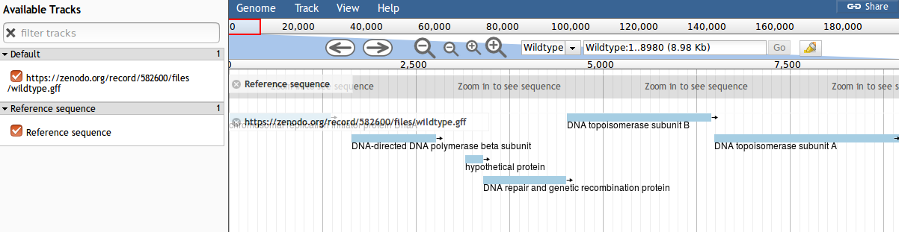

# Introduction
{:.no_toc}

> JBrowse is a fast, embeddable genome browser built completely with JavaScript
> and HTML5, with optional run-once data formatting tools written in Perl.

The Galaxy tool accepts data in many formats:

- Intervals/Feature Tracks (GFF/GFF3, BED, GenBank)
- BAM Pileups
- Blast XML results
- Wig/BigWig
- VCF files

and executes the "run-once data formatting tools" mentioned in its description. The JBrowse tool has an incredibly extensive number of options, more than anyone needs most of the time. We'll go through them in detail but feel free to skip the sections that don't apply to the data types you use. Not everyone has Blast XML results to visualise.

> ### Agenda
>
> In this tutorial, we will deal with:
>
> 1. TOC
> {:toc}
>
{: .agenda}

# Preparation

## Tool Installation

This tutorial covers versions 0.7.0.3 or greater of the JBrowse tool.

## Data Upload

The data for today is a subset of a real dataset from a Staphylococcus aureus bacteria.
We have a closed genome sequence and an annotation for our "wildtype" strain.
We have used a whole genome shotgun approach to produce a set of short sequence reads on an Illumina DNA sequencing instrument for our mutant strain.

- The reads are paired-end
- Each read is on average 150 bases
- The reads would cover the original wildtype genome to a depth of 19x

The files we will be using are:

- `mutant_R1.fastq` & `mutant_R2.fastq` - the read files in fastq format.
- `wildtype.fna` - The sequence of the reference strain in fasta format.
- `wildtype.gbk` - The reference strain with gene and other annotations in genbank format.
- `wildtype.gff` - The reference strain with gene and other annotations in gff3 format.

This data is available at Zenodo using the following [link](https://doi.org/10.5281/zenodo.582600).
> ###  Hands-on: Get the data
>
> 1.  Import all of the following files into a new history:
>     - [mutant_R1.fastq](https://zenodo.org/record/582600/files/mutant_R1.fastq)
>     - [mutant_R2.fastq](https://zenodo.org/record/582600/files/mutant_R2.fastq)
>     - [wildtype.fna](https://zenodo.org/record/582600/files/wildtype.fna)  
>     - [wildtype.gbk](https://zenodo.org/record/582600/files/wildtype.gbk)
>     - [wildtype.gff](https://zenodo.org/record/582600/files/wildtype.gff)
> 
>     ```
>     https://zenodo.org/record/582600/files/mutant_R1.fastq
>     https://zenodo.org/record/582600/files/mutant_R2.fastq
>     https://zenodo.org/record/582600/files/wildtype.fna
>     https://zenodo.org/record/582600/files/wildtype.gbk
>     https://zenodo.org/record/582600/files/wildtype.gff
>     ```  
>
>     > ###  Tip: Importing data via links
>     >
>     > * Copy the link location
>     > * Open the Galaxy Upload Manager
>     > * Select **Paste/Fetch Data**
>     > * Paste the link into the text field
>     > * Press **Start**
>     {: .tip}
>
{: .hands_on}


# Simple Gene Tracks

We will start by adding a single track containing the genes from the wildtype.gff file.

> ###  Hands-on: Build the JBrowse
>
> 1. *Reference Genome to display*: `Use a genome from History`
> 2. *Select the reference genome*: `wildtype.fna`
> 3. *Insert Track Group*
>    1. *Insert Annotation Track*
>         1. *Track Type*: `GFF/GFF3/BED/GBK Features`
>         2. *GFF/GFF3/BED/GBK Data*: `wildtype.gff`
> 4. Execute
> 5. View the contents of the file
>
> > 
{: .hands_on}

If you are not familiar with the operation of JBrowse there are some important points:

- "Tracks" are shown on the left. Clicking the checkboxes will make the tracks visible or invisible
- You can use your mouse scrollwheel to move around the genome view area, or you can click and drag to move.
- Double clicking will zoom in on the genome, or you can use the magnifying glass icons to zoom in our out

> ###  Tip: Naming Tracks
>
> * The JBrowse tool takes track names directly from file names
> * If you want to rename tracks: **Click** on the **pencil** icon, edit the **Name** and click **Save**.
> * You can now re-run the JBrowse tool and it will produce a new JBrowse instance with corrected names.
{: .tip}

# Complex Gene Tracks

All of the track types in the JBrowse tool support a wide array of features. We've only looked at a simple track with default options, however there are more tools available to us to help create user-friendly JBrowse instances that can embed rich data.

> ###  Hands-on: Build the JBrowse
>
> 1. *Reference Genome to display*: `Use a genome from History`
> 2. *Select the reference genome*: `wildtype.fna`
> 3. *Insert Track Group*
>    1. *Insert Annotation Track*
>         1. *Track Type*: `GFF/GFF3/BED/GBK Features`
>         2. *GFF/GFF3/BED/GBK Data*: `wildtype.gff`
>         3. *Index this Track*: `Yes`
>         4. *JBrowse Styling Options*
>             1. *JBrowse style.label*: `name`
>             2. *JBrowse style.description*: `product`
>         5. *JBrowse Contextual Menu Options*
>             1. *Menu Action*: `iframeDialog`
>             2. *Menu Label*: `{Locus_tag} on NCBI`
>             3. *Menu title*: `NCBI Protein {id}`
>             4. *Menu url*: `https://www.ncbi.nlm.nih.gov/protein/{Locus_tag}`
>             5. *Menu Icon*: `Search`
>         2. 
>         2. 
>         2. 
>         2. 
> 4. Execute
> 5. View the contents of the file
>
> > 
{: .hands_on}

If you are not familiar with the operation of JBrowse there are some important points:

- "Tracks" are shown on the left. Clicking the checkboxes will make the tracks visible or invisible
- You can use your mouse scrollwheel to move around the genome view area, or you can click and drag to move.
- Double clicking will zoom in on the genome, or you can use the magnifying glass icons to zoom in our out


## General Options

### Reference Genome to Display

JBrowse features a standard reference genome / genome from history selector used by most other tools. [TODO]

Sequence files with multiple sequences can be provided, JBrowse will allow you to select between the sequences during viewing. Up to 30 will be shown from the dropdown selector within JBrowse (this is a [known issue](https://github.com/GMOD/jbrowse/issues/349).)


### Produce Standalone Instance

The JBrowse web app loads data from a "data directory," a directory of files processed in the way JBrowse expects them to be. JBrowse natively displays some data types (bam, tabix, support for others will come in the future) while it requires converting other formats to JSON that it can load (fasta, gff3, etc.)

In orer to have a complete, viewable JBrowse instance we need to have an entire copy of the JBrowse source code (~12 Mb.) This is a lot of extra data to duplicate every time we want to build a JBrowse instance, so sometimes it is useful to not include the JBrowse source code, and instead only include the processed data. When the JBrowse tool is used in concert with the Galaxy-Apollo integration, the data directory is extremely useful as you won't be visualising the results in JBrowse, but instead sending them to Apollo which only needs the processed data.

### Genetic Code

Multiple genetic codes are supported in JBrowse, if your organism uses something other than the standard genetic code, then setting this correctly will affect display of start and stop codons in the genomic sequence.


### JBrowse-in-Galaxy Action

JBrowse allows you to update previously built instances. This is a less common operation for normal JBrowse usage (summarisation of an analysis workflow,) but much more common when JBrowse is used with the Galaxy-Apollo integration. In Apollo users can interactively make annotation based on the JBrowse evidence tracks, before pulling these new features back to Galaxy for re-analysis.

## Track Groups and Tracks

Tracks form the basis of data in JBrowse. Tracks can be organised into nested groups which can help users mentally organise the large amounts of data that can be displayed. For genomic annotation this often took the form of splitting data into Structural and Functional evidence tracks, and then below each of these categories splitting out the data further, e.g. in "Structural / Naive ORF Calls" and "Structural / Model based ORF Calls."


The `/` character allows nesting of categories. In newer versions of JBrowse (0.7.0+) you can also use `#date#` to insert the current date in the track group name. For analyses that might change over time (e.g. blasting against an always-updating NR database), it can be very helpful to organise these runs by date.

### GFF/GFF3/BED/GBK Features

These are your standard feature tracks. They usually show genes, mRNAs and other features of interest along a genomic region. This input allows selecting multiple tracks, doing so will cause them to all be styled identically. There is no separate option to rename the tracks, the Galaxy datasets will be brought into the JBrowse instance with the same name that they had in Galaxy.

#### `match`/`match_part` data

For hierarchical GFF/GFF3 data (i.e. with parent, child relationships,) the data may be match/match part data. If your features have a top level feature like `match` with a child `match_part` feature, then this option applies to those datasets. Sometimes those parent matches are under a different sequence ontology term, so you will need to supply the correct parent term there. Implementing sequence ontology traversal which would remove the need to specify this is a non-trivial feature and has not been implemented.

#### Track indexing

JBrowse provides a search functionality which will search over all indexed features. The indexing covers feature just the `Name` attributes. This feature is made optional due to bugs in the past with the indexing feature on JBrowse's side.

#### Track Type

JBrowse supports two rendering modes for tracks, HTML features and Canvas features. From an end user perspective they are mostly identical.


